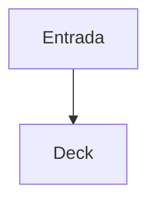

# Visão geral

Uma apresentação acessível com **Markdown**, tabela e nota de rodapé.[^source]

| Recurso | Projeção |
| --- | --- |
| Mermaid | SVG estático |
| Charts | SVG e dados exatos |

[^source]: Fixture local do perfil Margo Marpit-compatible v0.0.1.



```goshtosochart
schemaVersion: 1
type: bar
title: Cobertura
categories: [Markdown, Mermaid]
series:
  - name: Recursos
    values: [8, 5]
```

---

<!-- class: columns -->
<!-- layout: columns -->
<!-- slot: left -->
## Conteúdo

Texto na coluna esquerda.

<!-- slot: right -->
## Evidência

Texto na coluna direita.

<!-- /layout -->

---

<!-- class: timeline -->
<!-- layout: timeline -->
<!-- slot: step-1 -->
## Parse

Diretivas e separadores são normalizados.

<!-- slot: step-2 -->
## Render

Cada slide conserva a ordem de leitura.

<!-- slot: step-3 -->
## PDF

O MediaBox é comparado com tolerância física.

<!-- /layout -->
