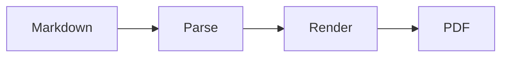

<!-- header: MARGO DECKS / REFERENCE DECK -->
<!-- footer: Gerado pelo margo deck - contrato Marpit-compatible -->
<!-- paginate: true -->

<!-- class: lead invert -->
<!-- composition: hero -->
<!-- backgroundImage: gradient-blue -->
<!-- backgroundDecorative: true -->
<!-- backgroundAlt: none -->
# Margo Decks

## Reference deck

Composicoes, layouts, extensoes, limites e roadmap em uma saida real do `margo deck`.

---

<!-- backgroundImage: none -->
<!-- class: none -->
<!-- composition: content -->
# O que este deck demonstra

Este nao e um mockup HTML: e Markdown compilado pelo perfil Margo Marpit-compatible.

| Camada | O que aparece aqui |
| --- | --- |
| Entrada | Markdown, GFM, diretivas, fences e slots |
| Catalogo | nove composicoes R1 fechadas e versionadas |
| Projecao | HTML semantico, CSS bounded, navegacao e print |
| Evidencia | identidade de runtime, PDF, acessibilidade e limites |

---

<!-- class: none -->
<!-- composition: steps -->
<!-- slot: step-1 -->
### Parse

Separadores, frontmatter, diretivas herdadas e marcadores de slot.

<!-- slot: step-2 -->
### Normalize

Classes, familias, variantes, cardinalidade e ordem de leitura.

<!-- slot: step-3 -->
### Project

HTML, tela, PDF, runtime digest e diagnosticos estaveis.

---

<!-- class: none -->
<!-- composition: agenda -->
<!-- slot: item-1 -->
### Fundamentos

Lead, section, quote, content e chrome do deck.

<!-- slot: item-2 -->
### Layouts

Columns, sidebar, compare, metrics, timeline e demo.

<!-- slot: item-3 -->
### Composicoes R1

Agenda, media, steps, highlight, grids e hero.

<!-- slot: item-4 -->
### Plataforma

Markdown, Mermaid, charts, imagens, runtime, PDF e acessibilidade.

---

<!-- class: none -->
<!-- composition: compare-grid -->
<!-- slot: item-1 -->
### Foundations

`content`, `hero`, `highlight` e os estilos `lead`, `section`, `chapter`, `quote`.

<!-- slot: item-2 -->
### Narrative

`agenda`, `steps`, `media-split` e leitura linear por slots nomeados.

<!-- slot: item-3 -->
### Structural

`columns`, `sidebar`, `compare`, `metrics`, `timeline`, `demo` e `grid`.

<!-- slot: item-4 -->
### Evidence

Catalogo `r1`, hashes, PDF MediaBox, overflow e contratos de acessibilidade.

---

<!-- class: none -->
<!-- composition: content -->
# Content - curto e denso

Uma composition de corpo preserva a leitura linear e deixa a densidade ser uma decisao editorial, nao um acidente de CSS.

- curto: uma tese, um suporte, uma evidencia;
- denso: tabela ou lista controlada, sem transformar Markdown em canvas livre;
- fallback: texto continua legivel quando a projecao visual nao esta disponivel.

---

<!-- class: none -->
<!-- composition: none -->
<!-- class: lead -->
# Lead / impact

Uma frase dominante para abrir uma narrativa, separar uma secao ou sintetizar uma decisao.

---

<!-- class: none -->
<!-- composition: none -->
<!-- class: section -->
# Section divider

## Uma nova pergunta

O slide de secao restabelece contexto antes de introduzir densidade.

---

<!-- class: none -->
<!-- composition: none -->
<!-- class: quote -->
# Quote / statement

> Uma apresentacao forte transforma uma escolha de layout em uma escolha de leitura.

Fonte: principio editorial do deck de referencia.

---

<!-- class: none -->
<!-- composition: none -->
<!-- class: columns -->
<!-- layout: columns -->
<!-- slot: left -->
## Margo

Catalogo finito, HTML semantico, PDF deterministico e diagnosticos explicitos.

<!-- slot: right -->
## Marpit-compatible

Markdown continua sendo a entrada. O perfil aceita somente o subconjunto documentado.

<!-- /layout -->

---

<!-- class: none -->
<!-- composition: none -->
<!-- class: sidebar -->
<!-- layout: sidebar -->
<!-- slot: main -->
## Main + rail

O conteudo principal recebe a tese, a evidencia e o fluxo de leitura.

<!-- slot: rail -->
### Rail

Definicoes, contexto e chamadas auxiliares ficam em uma regiao estavel.

<!-- /layout -->

---

<!-- class: none -->
<!-- composition: none -->
<!-- class: compare -->
<!-- layout: compare -->
<!-- slot: left -->
## Opcao A

Mais controle de autoria, menos liberdade de posicionamento.

<!-- slot: right -->
## Opcao B

Mais compatibilidade Marpit, sem prometer compatibilidade universal.

<!-- /layout -->

---

<!-- class: none -->
<!-- composition: none -->
<!-- class: metrics -->
<!-- layout: metrics -->
<!-- slot: metric-1 -->
### 9

composicoes R1

<!-- slot: metric-2 -->
### 3

temas fechados

<!-- slot: metric-3 -->
### 2

tarefas de layout

<!-- slot: metric-4 -->
### 0

assets externos importados

<!-- /layout -->

---

<!-- class: none -->
<!-- composition: none -->
<!-- class: timeline -->
<!-- layout: timeline -->
<!-- slot: step-1 -->
### Input

Markdown e diretivas fechadas.

<!-- slot: step-2 -->
### Screen

Canvas logico e HTML acessivel.

<!-- slot: step-3 -->
### Print

PDF com MediaBox e overflow verificados.

<!-- /layout -->

---

<!-- class: none -->
<!-- composition: none -->
<!-- class: demo -->
<!-- layout: demo -->
<!-- slot: code -->
### Fonte

```markdown
<!-- composition: media-split -->
<!-- slot: media -->

<!-- slot: content -->
## Decisao
Texto em ordem de origem.
```

<!-- slot: result -->
### Resultado

O mesmo input produz uma arvore semantica, uma tela navegavel e uma pagina PDF.

<!-- /layout -->

---

<!-- class: none -->
<!-- composition: media-split -->
<!-- slot: media -->


Asset local, alt informativo e nenhum recurso externo.

<!-- slot: content -->
### Media split

Texto e evidencia visual vivem em tracks controladas. Crop, focal point e safe area permanecem enumerações do contrato.

---

<!-- class: none -->
<!-- composition: media-stage -->
<!-- slot: media -->


Stage visual dominante.

<!-- slot: content -->
### Media stage

Uma chamada curta acompanha o visual, sem transformar o slide em device mockup de shapes.

---

<!-- class: none -->
<!-- composition: image-grid -->
<!-- slot: image-1 -->


Identidade

<!-- slot: image-2 -->


Proporcao

---

<!-- class: none -->
<!-- composition: highlight -->
# Body + highlight

Contexto suficiente para sustentar uma conclusao, com uma afirmacao dominante e curta.

**Regra:** destaque nao e decoracao; ele muda a decisao do leitor.

---

<!-- class: none -->
<!-- composition: hero -->
<!-- class: invert -->
<!-- backgroundImage: gradient-violet -->
<!-- backgroundDecorative: true -->
<!-- backgroundAlt: none -->
# Full-bleed hero

Uma imagem, tese ou mudanca de capitulo pode ocupar o campo visual sem exigir posicionamento absoluto em Markdown.

---

<!-- backgroundImage: none -->
<!-- class: none -->
<!-- composition: content -->
# Markdown, GFM e notas

**Texto forte**, *enfase*, links, listas, tabelas, footnotes e blocos de codigo continuam sendo conteudo.

- source order permanece source order;
- headings mantem IDs deterministicos;
- notas do apresentador nao vazam para o palco;
- HTML inseguro e CSS arbitrario falham fechados.

Nota de apresentador para esta lamina: revisar leitura sem JavaScript.[^note]

[^note]: Nota local do fixture demonstrativo.

---

<!-- class: none -->
<!-- composition: none -->
<!-- class: columns -->
<!-- layout: columns -->
<!-- slot: left -->
## Mermaid



<!-- slot: right -->
## Limite

Mermaid e uma extensao controlada, com SVG normalizado, IDs deterministas e familias fechadas.

<!-- /layout -->

---

<!-- class: none -->
<!-- composition: none -->
<!-- class: columns -->
<!-- layout: columns -->
<!-- slot: left -->
## Bar chart

```goshtosochart
schemaVersion: 1
type: bar
title: Cobertura por camada
categories: [Input, Layout, Evidence]
series:
  - name: Slides
    values: [12, 9, 6]
```

<!-- slot: right -->
## Chart story

Um chart deve responder uma pergunta e manter tabela de dados exatos, nao ser um ornamento.

<!-- /layout -->

---

<!-- class: none -->
<!-- composition: none -->
<!-- class: demo -->
<!-- layout: demo -->
<!-- slot: code -->
## Code

```go
result, err := deck.Render(ctx, compiler, input)
descriptor, _ := result.RuntimeDescriptor(instance)
```

<!-- slot: result -->
## Result

Descriptor, screen task, print task e PDF evidence carregam a mesma identidade canonica.

<!-- /layout -->

---

<!-- class: none -->
<!-- composition: content -->
# Images, backgrounds e alt

| Recurso | Regra Margo |
| --- | --- |
| Imagem informativa | alt obrigatorio e ordem de leitura preservada |
| Imagem como backdrop | `backgroundImage` em camada unica atras do conteudo semantico |
| Fundo decorativo | `backgroundDecorative: true` e alt vazio |
| Fundo informativo | asset local, posicao, repeticao e crop finitos |
| Fonte externa | bloqueada por padrao |
| Asset externo | nao importado nem versionado |

---

<!-- class: none -->
<!-- composition: none -->
<!-- class: invert -->
<!-- backgroundImage: gradient-forest -->
<!-- backgroundDecorative: true -->
<!-- backgroundAlt: none -->
# Themes e modos

O catalogo fecha `modern`, `goshtoso` e `minimal`, cada um em `light` e `dark`, com tokens, tipografia, fontes e contraste versionados.

---

<!-- backgroundImage: none -->
<!-- class: none -->
<!-- composition: compare-grid -->
<!-- slot: item-1 -->
### Modern

Editorial teal, sans para corpo e heading.

<!-- slot: item-2 -->
### Goshtoso

Contraste frio, ritmo compacto e tokens de produto.

<!-- slot: item-3 -->
### Minimal

Superficie neutra, serif controlada e borda reduzida.

<!-- slot: item-4 -->
### Dark

Modo de cor separado, com pares AA e fontes identicas.

---

<!-- class: none -->
<!-- composition: content -->
# Geometry, screen e print

| Perfil | Canvas logico | PDF esperado |
| --- | --- | --- |
| 16:9 | 1280 x 720 CSS px | 960 x 540 pt |
| 4:3 | 960 x 720 CSS px | 720 x 540 pt |
| custom | 320-7680 px, ratio 1:4 a 4:1 | MediaBox equivalente |

Screen scaling altera a apresentacao no viewport, nunca a identidade logica ou a ordem de leitura.

---

<!-- class: none -->
<!-- composition: steps -->
<!-- slot: step-1 -->
### Screen task

Overflow, canvas, stage e fontes observadas.

<!-- slot: step-2 -->
### Print DOM task

Mesma geometria sem depender de screenshot.

<!-- slot: step-3 -->
### PDF artifact

Pagina, quatro bordas MediaBox, hash e catalogo.

---

<!-- class: none -->
<!-- composition: none -->
<!-- class: sidebar -->
<!-- layout: sidebar -->
<!-- slot: main -->
## Accessibility contract

Headings, listas, tabelas, alt, labels localizados, foco visivel, teclado e reduced motion sao parte da saida, nao um pos-processamento.

<!-- slot: rail -->
### Reading order

Source order vence qualquer aparencia de grid.

<!-- /layout -->

---

<!-- class: none -->
<!-- composition: content -->
# Support matrix - foundations

| Capability | Status | Representation |
| --- | --- | --- |
| 16:9, 4:3, custom e PDF | Suporta | `size` + validator |
| Theme, light/dark, tokens | Suporta | catalogo fechado |
| Lead, section, chapter, quote | Suporta | `class` + chrome |
| Markdown, GFM, code, imagens | Suporta | compiler existente |
| Header, footer, paginacao, notas | Suporta | diretivas locais |

---

<!-- class: none -->
<!-- composition: content -->
# Support matrix - layout e extensoes

| Capability | Status | Proximo passo |
| --- | --- | --- |
| Columns, sidebar, compare | Suporta | variantes de densidade |
| Metrics, timeline, demo | Suporta | fit tests por preset |
| Mermaid e Goshtoso Charts | Suporta | chart-story |
| Agenda e lista temporal | R1 | schema de items |
| Media split e stage | R1 | crop/focal point |

---

<!-- class: none -->
<!-- composition: content -->
# Support matrix - partial e adicionar

| Capability | Status | Contrato planejado |
| --- | --- | --- |
| Image grid 2-4 | R1 | item + caption + alt |
| Steps 3-6 | R1 | cardinalidade finita |
| Highlight e hero | R1 | variant + safe area |
| Compare grid 3-4 | R1 | schema repetido |
| Chart story | Parcial | body + chart + takeaway |

---

<!-- class: none -->
<!-- composition: content -->
# Support matrix - deferir

| Capability | Status | Motivo |
| --- | --- | --- |
| Merged table / data grid | Parcial | GFM nao expressa merge/emphasis |
| Gauge / radial progress | Adicionar | familia chart ausente |
| Cycle / ring process | Parcial | topologia exige boundary |
| Video playback | Deferir | PDF precisa poster + link |
| Watermark image + opacity | Deferir | furniture de host, sem sobreposicao |
| Selo de sigilo + ordinal | Deferir | Goshtoso Badge antes do ordinal inferior |
| PPTX round-trip | Deferir | fora do contrato HTML/PDF |

---

<!-- class: none -->
<!-- composition: none -->
<!-- class: columns -->
<!-- layout: columns -->
<!-- slot: left -->
## Marpit-compatible

Markdown, heading dividers, theme, size, class, notes, layout e slot continuam na entrada.

<!-- slot: right -->
## Marpit boundary

O perfil nao promete todos os plugins, CSS livre, posicionamento absoluto ou object model PPTX.

<!-- /layout -->

---

<!-- class: none -->
<!-- composition: compare-grid -->
<!-- slot: item-1 -->
### Expressar em Markdown

Texto, listas, links, tables, charts, Mermaid, slots e assets locais.

<!-- slot: item-2 -->
### Expressar por enums

Theme, color mode, class, composition, variant, crop e focal point.

<!-- slot: item-3 -->
### Manter como asset

Mascotes, fotografias, SVGs compostos, posters e vetores aprovados.

<!-- slot: item-4 -->
### Manter fora

Pixels absolutos, masks, ribbons, motion paths e animacao por objeto.

---

<!-- class: none -->
<!-- composition: steps -->
<!-- slot: step-1 -->
### R0 - Base

Fechar o perfil v0.0.1 e preservar compatibilidade.

<!-- slot: step-2 -->
### R1 - Foundations

Composicoes fechadas para intencoes recorrentes. Entregue neste ciclo.

<!-- slot: step-3 -->
### R2 - Data

Chart story, multi-chart, KPI, data-table, cycle e timeline-fit.

<!-- slot: step-4 -->
### R3 - Media

Crop, focal point, safe area, icon refs, GIF e poster/video.

<!-- slot: step-5 -->
### R4 - Motion

Transition/reveal semantico, reduced motion e keyboard order.

---

<!-- class: none -->
<!-- composition: content -->
# R2 - Data storytelling

Planejado, nao fingido como suporte atual:

- `chart-story`: body + chart + takeaway;
- `data-table`: schema, rows, notes e fallback semantico;
- `cycle`: quatro a oito fases com centro opcional;
- `timeline-fit`: sete passos somente apos teste de densidade.

---

<!-- class: none -->
<!-- composition: content -->
# R3 - Media system

Planejado para assets previsiveis, nao para copiar o template corporativo:

- aspect ratio, crop mode, focal point e safe area;
- registry de assets vendor-neutral;
- icon refs com `:icon-name-here`, poster e video link;
- exemplo inline: `Mês/ano :icon-name-here`;
- `icon-name-here` resolve contra o catalogo Goshtoso embutido ou iconpack declarado;
- ordinal + icon: cluster bottom-right, `before` / `after`, posicao explicita;
- alt, decorative e provenance em cada asset informativo.

---

<!-- class: none -->
<!-- composition: content -->
# R4 - Motion boundary

Somente depois da estabilidade estatica:

- `transition` como enum de slide;
- `reveal` por bloco ou slot;
- `prefers-reduced-motion` e ordem de teclado;
- nenhum motion path ou animacao arbitraria de objeto.

---

<!-- class: none -->
<!-- composition: none -->
<!-- class: section -->
# O que foi implementado

O deck acima e a demonstracao completa do contrato atualmente entregue. O que esta marcado como R2, R3, R4 ou Deferir permanece conscientemente fora da implementacao.

---

<!-- class: none -->
<!-- composition: none -->
<!-- class: lead invert -->
<!-- backgroundImage: gradient-sunset -->
<!-- backgroundDecorative: true -->
<!-- backgroundAlt: none -->
# Conteudo primeiro

Margo transforma intencao em composicao finita, preserva a leitura e deixa os limites visiveis.
