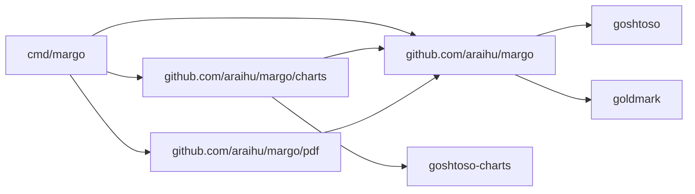
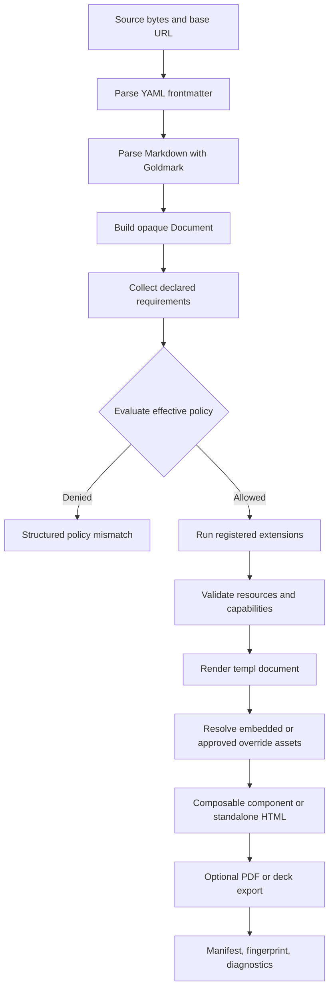

# Goshtoso Markdown

> **HISTORICAL RECORD. SUPERSEDED.** This proposal is retained for historical
> context only. It is not the current CLI, package, or release contract. See
> the [Margo README](https://github.com/araihu/margo#readme) and
> [ADR 0001](decisions/0001-unified-module-and-cli.md) for the current contract.

Status: proposed for v0.0.1
Release stage: pre-v0.1.0
Date: 2026-08-06
Target repository and root module: `github.com/araihu/margo`

## Summary

Goshtoso Markdown is a new repository and importable Go module for compiling
Markdown into Goshtoso-styled documents, standalone HTML, PDFs, and static slide
decks. It is built on Goldmark and supplies the rendering primitives needed by
blogs, documentation pages, command-line conversions, and a future GitOps-native
documentation system.

It is not a Goshtoso Composition. Document compilation, policy enforcement,
asset management, charts, browser lifecycle, and export formats are a product
boundary of their own. The root package depends on Goshtoso; Goshtoso must not
depend on this module.

The first release deliberately avoids adding Markdown-specific components to
Goshtoso. It reuses semantic HTML and existing Goshtoso components. The only
prerequisite change in the Goshtoso repository is a client-side sorting mode for
`components/table`, because recreating an interactive table inside the Markdown
renderer would duplicate an existing component.

## Goals

Version v0.0.1 must provide:

- an importable Go API for compiling and rendering one Markdown document;
- CommonMark, selected GFM extensions, footnotes, deterministic heading IDs,
  and YAML frontmatter;
- Goshtoso themes, tokens, CodeBlock, and Table integration;
- Mermaid enabled by default in its restrictive mode, using embedded assets;
- statically rendered Goshtoso Charts from validated YAML or JSON fences;
- composable templ output and complete standalone HTML;
- whitelabel headers, footers, logos, icons, watermarks, fonts, theme tokens,
  and bounded design-token overrides;
- native-first PDF generation, with user-installed Chromium as an explicit
  opt-in engine;
- static Marpit-compatible slide decks, activated only by a flag or metadata;
- a thin CLI that exercises the same library pipeline;
- deterministic manifests, fingerprints, diagnostics, transactional file
  outputs, and fully spooled stdout;
- offline operation at render time.

The design favors a small default binary and an embeddable library. Pixel-perfect
cross-platform output is an opt-in Chromium concern, not a promise of the native
engine.

## Non-goals for v0.0.1

The first release does not include:

- a site generator, navigation tree, search index, feed, deployment controller,
  or Git provider integration;
- batch or glob source discovery;
- interactive deck navigation, presenter mode, transitions, or fragments;
- arbitrary markdown-it plugins or complete Marpit engine compatibility;
- arbitrary JavaScript execution;
- raw HTML passthrough or document-authored arbitrary CSS;
- server-backed table pagination, filtering, lazy loading, or actions;
- all Goshtoso chart types;
- automatic Chromium download or bundling;
- byte-identical or pixel-identical PDFs across native engines.

Batch rendering is the first planned feature after a working v0.0.1. The root
interfaces must avoid preventing it, but v0.0.1 remains a single-document tool.

## Repository and module boundaries

The repository is a Go multi-module repository:

```text
margo/
├── go.mod
├── deck/
├── charts/
│   └── go.mod
├── pdf/
│   └── go.mod
└── cmd/margo/
    └── go.mod
```

The module paths are `github.com/araihu/margo`,
`github.com/araihu/margo/charts`, `github.com/araihu/margo/pdf`, and
`github.com/araihu/margo/cmd/margo`. `deck` is a package in the root
module.

The root module is lightweight. It contains parsing, the document model,
policy evaluation, base rendering, themes, Mermaid integration, asset
descriptors, diagnostics, standalone HTML assembly, and the static deck
compiler. It depends on Goldmark, Goshtoso, templ, and a YAML parser. It does
not depend on Goshtoso Charts, browser bindings, Chromium, or CGO.

The optional modules have one-way dependency edges:



No optional module may be imported by the root module. Every module must build
and test independently with `GOWORK=off`. Releases are sequenced root first,
then `charts/vX.Y.Z`, `pdf/vX.Y.Z`, and `cmd/margo/vX.Y.Z`.

### Repository bootstrap gate

`araihu/margo` is a public repository. Before module code is published, its
bootstrap must establish:

- `main` as the default branch;
- pull requests and required CI checks before merging to `main`;
- blocked force-pushes and branch deletion;
- the MIT license, `README.md`, `SECURITY.md`, `CODEOWNERS`, and
  `.gitignore`;
- minimal Go multi-module CI capable of testing every discovered module with
  `GOWORK=off`;
- repository topics and ownership matching the AraiHu organization.

Repository creation and settings verification are a delivery gate of their own.
They are not bundled into root-module implementation.

## Compilation pipeline

All consumers use the same staged pipeline:



Parsing is separated from rendering so the same normalized document can be
validated, inspected, rendered to HTML, or handed to an exporter. A failed
stage produces no partial final artifact.

### Core API

The public API is centered on a reusable compiler:

```go
type Source struct {
    Name    string
    Content []byte
    BaseURL string
}

type Compiler struct {
    // unexported state
}

func New(options ...Option) *Compiler

func (c *Compiler) Compile(
    ctx context.Context,
    source Source,
) (*Document, error)

func (c *Compiler) Render(
    ctx context.Context,
    document *Document,
    options ...RenderOption,
) (*RenderResult, error)

type RenderResult struct {
    // unexported immutable state
}

func (r *RenderResult) Content() templ.Component
func (r *RenderResult) Metadata() Metadata
func (r *RenderResult) Assets() AssetSet
func (r *RenderResult) Diagnostics() []Diagnostic
```

`Document` is opaque. It carries the normalized AST, metadata, declared
requirements, referenced assets, and diagnostics without exposing Goldmark's
AST as a stable Goshtoso Markdown API.

`New` computes an immutable `CompilerConfigFingerprint`:

```text
SHA-256("margo/compiler-config/v1\n" || RFC8785(compiler-config-preimage))
```

The preimage contains compiler/parser/sanitizer versions, the normalized policy
ceiling, theme and token registry, asset identities, and every extension's
stable name, version, configuration hash, fence ownership, and render
capabilities. Unknown or duplicate extension identity fields are construction
errors.

`Compile` stores that fingerprint in `Document` and freezes an immutable render
plan containing the already evaluated effective policy, normalized extension
nodes, required extension identities, runtime tasks, and selected asset
identities. `Render` compares the receiving compiler's configuration fingerprint
with the document's before creating sessions, resolving assets, or invoking any
hook. A mismatch fails with `compiler.document_config_mismatch`. Equivalent
compiler instances with the same fingerprint may render the document.

Rendering uses the frozen effective policy and render plan. It never re-evaluates
document authority under a more permissive compiler. A policy, registry, theme,
or asset change creates a different compiler fingerprint and requires
recompilation.

`Compile` snapshots `Source.Content` before returning and parses `BaseURL` from
its immutable string value; it never retains the caller's slice or a mutable URL
object. `Document` owns that snapshot and all normalized state. It is immutable
after successful compilation and safe for concurrent `Render` calls. Accessors
for bytes, slices, maps, metadata, assets, and diagnostics return immutable
views or defensive copies.

The caller grants read ownership of `Source.Content` for the duration of
`Compile` and must not mutate it concurrently with that call. Once `Compile`
returns, the caller may mutate or release the original slice without affecting
the document, output, or fingerprints. `RenderResult` and the templ component it
returns capture immutable values and are safe for concurrent rendering.

`New` deep-copies mutable option values and freezes its registry. A `Compiler`
is safe for concurrent `Compile` and `Render` calls and cannot be reconfigured
after construction. Each extension is registered as a factory. Factory
invocation is serialized by the compiler and must return an independent
per-operation session; extension work then runs without shared mutable state.
No session is retained in `Document`. Compile-time extension results are frozen
into immutable document nodes, and each `Render` receives a fresh render session.
An extension that needs a cache must provide its own race-free,
content-addressed cache whose values cannot affect semantic output.

Each `Render` assigns a `RenderInstanceID` through its options as described by
the runtime protocol. A `RenderResult` is immutable and safe for concurrent
serialization into separate HTML documents. Within one HTML document, each
placement must come from a distinct render instance. Rendering the same
`Document` twice therefore means two `Render` calls with distinct instance IDs.

The standalone HTML helper accepts a `RenderResult` plus document and brand
options. Applications can instead embed `RenderResult.Content()` inside their
own Goshtoso App Shell, blog layout, or documentation route.

Inputs accept `fs.FS` where practical. Outputs use an explicit `ArtifactSink`
contract because `fs.FS` is read-only and cannot express atomic commit.
The CLI uses `AtomicFileSink` or a spooled stdout sink. Context cancellation is
honored by compilation, extension rendering, asset resolution, validation, and
exporters.

### Extension registry

Extensions register bounded behavior through an explicit registry. Registration
may cover fenced block handlers, AST transforms, validation, assets, and render
hooks. Registrations are deterministic, duplicate names are errors, and late
registration after `New` is impossible.

The reserved fence `goshtosochart` belongs to the charts module. When a document
uses that fence without the charts integration registered, compilation fails
with an actionable diagnostic instead of rendering the block as plain code.

The registry is a Go API, not a mechanism for loading arbitrary runtime plugins.

## Markdown profile

The default profile is:

- CommonMark through Goldmark;
- GFM tables, strikethrough, autolinks, and task lists;
- footnotes;
- deterministic heading IDs;
- YAML frontmatter;
- raw HTML disabled unless both declared and allowed;
- no pagination and no slide semantics.

Ordinary headings, paragraphs, lists, quotes, links, and images render as
semantic HTML styled through Goshtoso-derived document tokens. Code fences use
Goshtoso `components/codeblock` with Chroma highlighting.

### Tables

Markdown tables render through Goshtoso `components/table`. The adapter disables
server-only features:

- no HTMX endpoint;
- no pagination;
- no remote filters or search;
- no lazy loading or infinite scroll;
- no row actions, selection, or expandable rows.

Client-side sorting is optional document behavior. It sorts only already
rendered rows, preserves the rendered cell components, uses accessible native
buttons in headers, updates `aria-sort`, supports keyboard activation, compares
natural text and numbers, and restores source order for initial and print
rendering. Sort affordances are hidden in print output.

This requires an additive Goshtoso Table API:

```go
type SortMode string

const (
    SortModeAuto   SortMode = ""
    SortModeNone   SortMode = "none"
    SortModeServer SortMode = "server"
    SortModeClient SortMode = "client"
)

type Config struct {
    // Existing fields remain.
    SortMode SortMode
}

type Cell struct {
    // Existing fields remain.
    SortValue string
}
```

`SortModeAuto` is the backward-compatible zero value. It resolves to server
sorting only when the existing contract is present: at least one
`Column.Sortable` and a non-empty HTMX endpoint. Otherwise it resolves to none.
`SortModeNone` is an explicit inert state even if columns remain marked
sortable.

Resolved combinations are validated before rendering:

- server requires an HTMX endpoint and at least one sortable column;
- client requires at least one sortable column and rejects an HTMX endpoint,
  pagination, remote filters/search, lazy loading, and infinite scroll;
- `Cell.SortValue` is permitted only for a sortable column in client mode;
- none and server reject non-empty `Cell.SortValue` as a configuration error;
- client cells without `SortValue` use normalized rendered text as their stable
  comparison value.

Client sorting emits no HTMX attributes or requests. Every row receives an
immutable source index. A header control cycles source, ascending, descending,
then source order. `beforeprint` temporarily restores source order and
`afterprint` restores the user's active order; both transitions preserve focus
and `aria-sort`. A requested Markdown table capability that needs a server fails
validation.

## Frontmatter and configuration

Goshtoso-specific metadata is namespaced under `goshtoso`. `marp: true` remains
top-level for source compatibility.

```yaml
---
title: Quarterly review
marp: true
goshtoso:
  theme: minimal
  security:
    rawHTML: sanitized
    mermaid: strict
  tables:
    sort: client
  page:
    size: A4
    orientation: landscape
  brand:
    logo: ./brand/logo.svg
    watermark: Internal
---
```

Configuration precedence for presentation choices is:

1. explicit API or CLI options;
2. document frontmatter;
3. project configuration;
4. built-in defaults.

Security does not use ordinary last-writer-wins precedence. It uses capability
intersection as described below.

The v0.0.1 frontmatter schema is versioned with the compiler. Unknown
`goshtoso` fields are errors. Generic unknown frontmatter fields remain
available to host applications as metadata.

## Security and policy

Frontmatter declares document requirements; it never grants authority.

The effective capability set is the intersection of:

- the host application or CLI ceiling;
- the project policy;
- the document's declared requirements.

Evaluation first computes the most restrictive candidate allowed by those
inputs, then verifies that the candidate still satisfies every declared
document requirement. A document requesting `sanitized` raw HTML under a
`deny` host ceiling therefore fails; it is not silently downgraded.

The rules are fail-closed:

- a document that requests a capability denied by the host fails with a policy
  mismatch and a non-zero CLI exit;
- content that uses a guarded capability without declaring it fails;
- a host allowing a capability does not enable it when the document does not
  request it;
- a more restrictive document declaration wins;
- no engine, sanitizer, or content mode silently falls back to a more permissive
  or less faithful behavior.

Baseline capabilities do not require repetitive declarations. CommonMark,
Goshtoso styling, restrictive Mermaid rendering, and embedded tested assets are
enabled by the default profile. Declarations are required when content asks for
a guarded capability such as sanitized raw HTML or remote assets.

Raw HTML has only two levels in v0.0.1:

- `deny`, the default;
- `sanitized`, using the versioned `margo-html-v1` profile.

There is no passthrough mode. The sanitized path parses HTML into a DOM,
validates it, fails on any disallowed node or attribute, and then sanitizes the
accepted tree as defense in depth. The same profile applies to standalone and
embedded output.

`margo-html-v1` permits only these elements:

```text
a abbr b blockquote br cite code dd del details dfn dl dt em
h1 h2 h3 h4 h5 h6 hr i kbd li mark ol p pre q s samp small
span strong sub summary sup table tbody td tfoot th thead tr u ul var
```

The global attribute allowlist is `title`, `lang`, and `dir`, with `dir` limited
to `ltr`, `rtl`, or `auto`. Element-specific attributes are `href` on `a`;
`open` on `details`; `start`, `reversed`, and `type` on `ol`; `value` on `li`;
and `abbr`, `colspan`, `headers`, `rowspan`, and `scope` on table cells. No
`id`, `name`, `class`, `style`, namespace declaration, `srcdoc`, `target`, or
event-handler attribute is accepted.

Link URLs are decoded and canonicalized before policy evaluation. Fragments,
relative URLs, and the `http`, `https`, `mailto`, and `tel` schemes are
structurally eligible; origin policy still applies. `javascript`, `vbscript`,
`data`, `file`, `blob`, ambiguous control-character forms, and every unlisted
scheme fail validation. SVG and MathML namespaces and every unlisted element,
including `script`, `style`, `iframe`, `object`, `embed`, `link`, `meta`,
`base`, and `form`, fail validation.

Arbitrary document-authored CSS is unsupported in v0.0.1. No stylesheet text is
accepted from frontmatter, a source-tree project file, the CLI, or the Go API.
Whitelabel styling is expressed through a versioned map of supported document
tokens. Each token is parsed against its own bounded grammar: colors, finite
lengths, enumerations, or references to already approved embedded fonts. Token
values cannot contain selectors, declarations, `var()`, `url()`, `@import`, or
other at-rules. Applications embedding `RenderResult.Content()` may style their
own outer shell, but untrusted document content cannot supply host CSS.

Script execution is unsupported for arbitrary document content in v0.0.1.
Mermaid executes only the embedded, pinned Mermaid runtime through a controlled
integration.

Policy also constrains:

- allowed local roots and symlink traversal;
- remote asset access and approved origins;
- data URI kinds and sizes;
- navigation and subresource requests during export;
- token names, token value grammars, and approved embedded fonts;
- total document bytes, AST nodes, fence count, chart points, image bytes, and
  render duration;
- YAML aliases, depth, and expansion;
- raw HTML sanitizer behavior.

Diagnostics identify the capability, request source, governing policy, and a
safe remediation. There is no broad `--trusted` switch; CLI permissions are
fine-grained.

## Mermaid

Mermaid is a first-class, default-enabled fenced block renderer. Version
`mermaid@11.16.1`, its license, and the Muamba-recorded asset digest are pinned
as one runtime identity. The ES module is vendored at build time and embedded in
the binary. Runtime rendering is local and does not require Node.js, npm, or a
CDN. A different Mermaid version or asset digest is a profile upgrade, not a
transparent dependency update.

The v0.0.1 mode uses a module-authored, deep-frozen Mermaid base configuration.
It fixes `securityLevel: "strict"`, `startOnLoad: false`, global and
diagram-specific `htmlLabels: false`, `themeCSS: ""`,
`deterministicIds: true`, `look: "classic"`, `layout: "dagre"`, an approved
embedded font, and module-owned theme variables. Link/click callbacks and
external icon packs are disabled. Every diagram-type configuration object is
created by the module; document data is never merged into it.

For each Mermaid task, the runtime creates a deep-frozen copy that differs only
by the module-derived `deterministicIDSeed`. Because Mermaid configuration is
process-global, a runtime-owned queue serializes initialize-and-render calls;
two render instances never reconfigure Mermaid concurrently. The only
document-level Mermaid policy value accepted by Goshtoso frontmatter is the
literal mode `strict`. A `mermaid.config` object or any sibling configuration
key is an unknown-field error.

A Mermaid fence that starts with Mermaid YAML frontmatter is rejected in
v0.0.1, whether it contains `config`, `title`, or an unknown key. A token-level
preflight also rejects every legacy `%%{init: ...}%%` or
`%%{initialize: ...}%%` directive, including case and whitespace variants,
before Mermaid receives the source. The pinned Mermaid `secure` list contains
every fixed top-level key and every nested diagram configuration as defense in
depth. Upgrade tests fail if a new Mermaid configuration channel or key appears
without an explicit module decision. Loose or antiscript modes are unsupported.
Sandbox mode can be evaluated later.

Core records each Mermaid source hash, deterministic block ID, configuration,
pinned runtime version, runtime integrity hash, and validator-profile identity.
It does not claim to know the generated SVG. Browser execution configures
Mermaid deterministic IDs with a seed derived from `DocumentFingerprint`,
`RenderInstanceID`, and block ID. Mermaid first renders to a detached document.
The integration does not invoke Mermaid `bindFunctions`; no later step may add
nodes or event behavior to the accepted SVG.

The ID passed to `mermaid.render` is
`"msrc-" + hex(SHA-256("margo/mermaid-source-root/v1\n" || RenderInstanceID ||
"\n" || eight-digit-decimal-block-ordinal))`. This transient `SourceRootID` is
structurally distinct from the final `margo-` root namespace and must not survive
normalization.

Mermaid's caller-supplied root ID does not establish an ID namespace for all
diagram families. The runtime therefore performs deterministic normalization
while the result is still detached, before applying the security validator or
inserting any node:

1. Parse the result as SVG/XML and parse every stylesheet, inline declaration,
   selector, and `url()` token with a CSS parser. Require the root `<svg>` to
   carry the decoded ID supplied to `mermaid.render` and snapshot it as
   `OriginalRootID` before mutating the tree. Duplicate detection covers the
   root and every descendant; a descendant using `OriginalRootID` fails the
   task. A parse error, missing or unexpected root ID, unsupported reference
   site, or external reference also fails the task.
2. Compute `NormalizedRootID` as
   `margo-<RenderInstanceID>-mermaid-<eight-digit-decimal-block-ordinal>`.
   Create the distinct root map `{OriginalRootID: NormalizedRootID}`, then set
   the root attribute to `NormalizedRootID`. Enumerate all descendant elements
   carrying an ID in document order and create a separate map from their decoded
   source IDs to
   `<root-id>--id-<eight-digit-decimal-document-order-ordinal>`. Ordinals are
   zero-based; overflow is a resource-limit failure. Set each descendant ID to
   its mapped value. A normalized target never incorporates source-ID bytes.
3. Rewrite every same-SVG reference through the union of the root map and the
   descendant map. Their source-key sets must be disjoint. The versioned profile
   enumerates all eligible reference sites, including fragment
   `href`/`xlink:href`, presentation attributes containing `url(#...)`, marker
   attributes, whitespace-separated ARIA IDREF lists, CSS ID selectors, and CSS
   `url(#...)` values. A parsed CSS selector such as
   `#<OriginalRootID> .default` therefore becomes
   `#<NormalizedRootID> .default` before selector matching. Unknown source IDs,
   references outside the parsed SVG, and reference-bearing attributes not
   declared by the profile fail the task.
4. Normalize each permitted CSS selector branch. Host selectors and forbidden
   grammar fail immediately. Step 3 has already rewritten each decoded ID
   selector token through the appropriate map. If a branch already begins with
   `#<NormalizedRootID>`, retain that single anchor and do not prefix it again;
   the root ID is forbidden anywhere else in the branch. For an unanchored
   branch, emit `#<NormalizedRootID>` if it matches the root and emit
   `#<NormalizedRootID> <branch>` if it matches descendants. A branch with no
   match is removed. Re-evaluate every emitted branch against the detached SVG;
   it may address only the root or its existing descendants.
5. Serialize the normalized detached SVG canonically, parse it again, and scan
   all IDs and reference sites. Every descendant ID must now begin with the root
   ID, every reference must resolve inside that SVG, and neither
   `OriginalRootID` nor an original descendant ID may remain in an ID slot,
   reference token, CSS selector, or CSS `url()` value.

Only after normalization does the structural validator run. It rejects scripts,
`foreignObject`, event attributes, external `href`/`xlink:href`, and unknown
namespaces. A real CSS parser validates every `style` element and inline `style`
attribute. Every selector branch must begin with the exact unique SVG ID for
that render instance and may address only that root or its descendants. After
the root, the selector grammar permits type, class, and normalized ID selectors;
descendant and child combinators; and `:first-child`, `:last-child`, or
`:nth-child(<integer>)`. `html`, `body`, `:root`, `:host`, `:has()`,
attribute/universal/sibling selectors, unscoped branches, custom properties,
and every at-rule are rejected.

The machine-readable profile `margo-mermaid-svg/v1` is the normative validator
contract. It is committed with the source and embedded with the runtime. Its
preimage contains the exact Mermaid version, Muamba asset digest, normalization
algorithm version, supported-family manifest, positive-fixture hashes, allowed
SVG elements and namespaces, allowed attributes, the complete IDREF-site
registry, selector grammar, CSS properties, and typed value/function grammars.
The runtime never learns or widens this profile from a document or from Mermaid
output.

`ValidatorProfileFingerprint` is
`SHA-256("margo/mermaid-svg-profile/v1\n" || RFC8785(profile))`. Core records
that fingerprint, and the runtime rejects an embedded profile, Mermaid asset,
or descriptor whose recorded identity differs before executing a diagram.

An audit generator may propose a profile diff from the pinned positive corpus,
but it cannot update the committed profile automatically. The v1 corpus must
account for every declaration emitted by its supported fixtures. In particular,
the profile includes the pinned flowchart output's `background-color`,
`text-align`, and `cursor` declarations in addition to its other audited
properties. Values use bounded color, finite number, length, keyword, and
same-SVG local-fragment grammars. Functions are rejected unless the profile
explicitly admits their typed form; local `url()` must resolve to a normalized
ID in the same SVG.

The supported-family manifest is closed. Each listed family has a basic
fixture, an ID/reference-heavy fixture, and a style-heavy fixture, plus fixtures
for every family-specific conditional output admitted by the profile. A Mermaid
diagram whose resolved family is absent fails with
`mermaid.family_unsupported`. Flowchart conformance proves the three declarations
named above survive normalization and validation. Sequence conformance includes
upstream-style IDs such as `actor1`, `root-1`, and `actor-man-torso1` and proves
that none survives while every rewritten reference still resolves.

A Mermaid version, Muamba asset digest, family manifest, normalization rule, or
observed SVG-shape change fails the upgrade gate. The positive corpus must
normalize and validate for every claimed family, the negative security corpus
must still fail, and a human-reviewed versioned profile diff is required before
release. A new selector, declaration, function, element, attribute, namespace,
or reference site never widens the runtime policy implicitly.

The accepted SVG is inserted, serialized with `XMLSerializer`, and reported
with its SHA-256 and byte length. Resource limits reject pathological diagrams.

## Runtime execution and readiness protocol

The root module has no browser. It emits HTML plus a `RuntimeDescriptor` and an
embedded, pinned bootstrap. An exporter or embedding host executes that
descriptor and collects a terminal `RuntimeReport`. Standalone HTML that has not
been executed contains source/runtime provenance only; it never claims
post-runtime SVG or layout identity.

The protocol version is `margo-runtime/v1` and separates three identities:

- `DocumentFingerprint` identifies immutable compiled meaning;
- `RenderInstanceID` identifies one placement inside one HTML document;
- `ExecutionID` routes one live browser execution of that placement.

The standalone assembler assigns the deterministic instance ID `ri-00000000`
for its single v0.0.1 document. An embedding host must pass a
`RenderInstanceID` or allocate one from a page-owned `InstanceAllocator`.
The allocator emits deterministic ordinals in render order. IDs must match
`ri-[0-9a-z]{8,32}` and cannot come from document frontmatter. The page
assembler rejects duplicate IDs before serialization; a global runtime registry
repeats that check and reports `runtime.instance_duplicate` before starting any
task.

`ExecutionID` is unique within the live runtime registry and is supplied by the
exporter or host immediately before execution. It is routing state, not document
meaning. Wrapper, task, DOM, SVG, and report keys are namespaced by
`RenderInstanceID`; live state is keyed by the
`(RenderInstanceID, ExecutionID)` pair.

Each expected task has an ID such as
`<render-instance-id>:mermaid:<source-ordinal>:<source-sha256>`. The runtime
rejects unknown, missing, or duplicate task IDs. A failure terminates only its
own render instance and execution.

Each render-instance state machine transitions monotonically:

```text
pending -> running -> ready
                   -> failed
```

Each task transitions `pending -> running -> succeeded|failed` exactly once.
Any task failure moves only its render instance to `failed`. Calls after a
terminal state, invalid transitions, bootstrap exceptions, protocol/schema
mismatches, and timeouts are terminal failures with stable diagnostic codes.

Expected task descriptors include a sorted `dependsOn` list. Core rejects a
missing dependency or dependency cycle. The runtime starts a task only after
all dependencies succeed. Deck layout declares every content-rendering task as
a dependency and is additionally held until the font checks complete.

`ready` requires all of the following:

1. `DOMContentLoaded` has fired;
2. every expected task has succeeded;
3. `document.fonts.ready` has resolved and every declared embedded font passes
   `document.fonts.check`;
4. no blocked navigation or subresource request attributable to that render
   instance occurred;
5. layout metrics are identical for two consecutive animation frames.

Layout metrics contain the render-instance wrapper's scroll dimensions and, for
every slide within that wrapper, its client and scroll dimensions plus bounding
box. Floating values are quantized to 1/64 CSS pixel before comparison.
Stability gets at most eight animation frames after fonts and tasks complete;
otherwise `runtime.layout_unstable` is terminal for that instance.

The terminal report is a schema-validated immutable value containing:

- protocol version, `DocumentFingerprint`, `RenderInstanceID`, `ExecutionID`,
  terminal status, and terminal diagnostic;
- pinned runtime asset hashes;
- font checks;
- sorted task records with kind, input hash, output hash, and output byte
  length, or a stable error code;
- final quantized layout metrics;
- blocked request attempts.

Exporters read the report through their native bridge or page evaluation,
validate all three expected identities against the descriptor and accept only
`ready`. A Mermaid error, missing task, forged/malformed report, font failure,
overflow failure, or timeout prevents artifact commit.

## Goshtoso Charts

Charts use one new fenced block type and no custom inline syntax:

````markdown
```goshtosochart
schemaVersion: 1
type: bar
title: Revenue
series:
  - name: 2026
    values: [12, 18, 27]
categories: [Q1, Q2, Q3]
```
````

The fence body may be YAML or JSON. It is normalized and validated against an
embedded JSON Schema selected by `schemaVersion` and `type`. Unknown fields are
rejected. Errors include source line and column plus a JSON Pointer when
available. Schema validation is followed by chart-specific semantic validation.

Version v0.0.1 supports:

- bar;
- line;
- pie and doughnut;
- scatter.

Radar, heatmap, and funnel are candidates for later versions. Candlestick and
violin remain deferred because their data contracts and presentation semantics
are less suitable for the first static profile.

Charts render as static, accessible Goshtoso Charts SVG. Interactive controls,
export buttons, and server-dependent features are omitted. The output includes
an accessible name and text alternative. Point counts, series counts, label
lengths, numeric finiteness, and output dimensions are bounded.

The CLI exposes the exact schemas:

```console
margo schema chart bar
margo schema chart bar --output bar.schema.json
```

## Asset supply chain and overrides

External assets are vendored with `github.com/araihu/muamba` during maintenance
and release workflows. The repository commits `muamba.yaml`, its lock data, and
the generated embedded asset package. Strict lock and verification gates ensure
the compiled binary contains the reviewed bytes and license material.

Muamba is a build-time tool and provenance authority, not a runtime dependency.
The renderer never downloads its built-in runtime assets.

Assets support two delivery modes in v0.0.1:

- served by an HTTP handler for embedded applications;
- inlined for standalone HTML, PDF, and deck exports.

Copying an asset tree is deferred to batch/site output. Consequently every
v0.0.1 CLI artifact is one self-contained file; assets and a manifest sidecar
cannot create a partially published output set.

The binary always embeds the tested asset set. Hosts may override assets through
the Go API, CLI, or project configuration:

- no override selects the embedded tested asset;
- a valid override selects the custom asset;
- an invalid override is an error;
- there is no silent fallback from an invalid override to the embedded asset;
- the tested embedded asset remains present even while an override is active.

Runtime-library overrides are not accepted from isolated document frontmatter.
Document metadata may request brand assets only within the host policy. Remote
overrides must first be materialized and integrity-locked through Muamba.
Manifests record the selected source, version, and integrity for every asset.

## CSS, themes, and whitelabel rendering

Rendered content is scoped under `.goshtoso-document`. Decks additionally use
the deck-owned `.margo-deck`, `.margo-deck__slide`, and `.margo-layout` hooks.

Every library-authored reset, component, document, brand, and override selector
starts with the document wrapper selector. No generated rule selects `html`,
`body`, `:root`, or a node outside that wrapper. Standalone output applies page
shell rules in a separate library-owned document; embedded output emits none of
those page-shell selectors.

The stylesheet uses explicit cascade layers:

```css
@layer reset, goshtoso, document, brand, overrides;
```

The reset is a scoped modern CSS reset. It removes inconsistent browser margins
and inherited defaults while preserving semantic behavior, accessibility, and
form controls. It does not globally apply `all: unset`.

Document tokens derive from the selected Goshtoso theme and expose a stable
override surface, including:

- `--document-font-body`;
- `--document-font-heading`;
- `--document-content-width`;
- `--document-line-height`;
- `--document-code-theme`;
- `--document-page-background`.

Whitelabel options include header, footer, logo, icon set, watermark, approved
embedded fonts, theme, and bounded token overrides. The Go API accepts trusted
templ components for headers and footers. CLI and frontmatter use a declarative
subset whose values pass the same asset and token policy. This customization
composes around the document and does not fork the Goshtoso design system.

## PDF export

PDF support lives in the `pdf` module. The CLI defaults to:

```console
margo pdf document.md --engine native
```

`--engine chromium` is explicit. Engines never silently fall back between one
another.

### Native engine

The native engine uses system webviews:

- Windows: WebView2 direct PDF creation;
- macOS: WKWebView direct PDF creation;
- Linux: WebKitGTK where the platform supports the required print path, marked
  best effort.

Wails v3 is a reference for platform bindings, window lifecycle, and system
webview behavior, not a dependency and not the PDF abstraction itself. Native
output aims for structurally and visually consistent documents on Windows and
macOS, but small layout differences are expected and documented.

### Chromium engine

Chromium is the opt-in path for pixel-sensitive and more reproducible output.
The CLI locates a user-configured or already installed executable and controls
it through the Chrome DevTools Protocol from Go. It does not bundle or download
Chromium. The executable path and browser version are recorded in provenance.

### Page model and readiness

Both engines receive the same standalone HTML, print CSS, headers, footers,
watermark, and page options. Header and footer behavior is implemented in the
document HTML/CSS rather than proprietary engine templates. Version v0.0.1
supports A4 and Letter, portrait and landscape, margins, page number, and the
same header/footer on each page.

Export loads the exact core HTML and accepts it only after the
`margo-runtime/v1` report reaches `ready` with the expected document,
render-instance, and execution identities. Static charts are already complete
in core; Mermaid, fonts, layout stability, and deck overflow are browser tasks.
A timeout, task error, blocked request, protocol mismatch, or asset error fails
export. Network navigation and unapproved subresources are intercepted by the
engine and fed into the runtime report. Cancellation closes and reaps browser or
webview resources.

The export report records `DocumentFingerprint`, `ArtifactFingerprint`,
artifact digest, engine and version, runtime report, page configuration,
compiler version, theme, asset hashes, and warnings.

## Slide decks

Deck semantics activate only when either:

- the CLI `deck` command or explicit deck option is used; or
- frontmatter declares `marp: true`.

Without activation, the input is ordinary Markdown and `---` remains
frontmatter or a thematic break. There is no implicit pagination.

The versioned Margo Marpit-compatible v0.0.1 profile supports a closed authoring
surface. Deck mode is activated by the `margo deck` command, the `deck` package
API, or opening frontmatter with `marp: true`; ordinary Markdown rendering is
unchanged. Under explicit deck activation, `marp: false` is a contradiction.

- YAML frontmatter and directive comments for `theme`, `lang`, `colorMode`,
  `headingDivider`, `size`, `paginate`, `header`, `footer`, `class`, colors,
  and local backgrounds;
- scalar `headingDivider: N` with H1 through HN slide starts, or an exact-level
  array such as `[2, 4]`;
- every top-level CommonMark thematic break with 0–3 leading spaces, outside
  fenced code, lists, blockquotes, and other protected regions; Setext H2 takes
  precedence over a ruler on the same block;
- the `_` spot-directive prefix and ordinary unrecognized comments as presenter
  notes, with malformed recognized directives rejected;
- built-in `modern`, `goshtoso`, and `minimal` theme/mode catalogs and the
  structural `columns`, `sidebar`, `compare`, `metrics`, `timeline`, and `demo`
  layouts, plus the `lead`, `section`, `chapter`, `quote`, and `invert` styles.

The Margo `size` and `colorMode` forms are explicit profile extensions; this is
not a claim of universal Marpit or Marp Core compatibility. Arbitrary themes,
markdown-it plugins, author CSS/HTML, remote backgrounds, and unsupported
background projections fail closed. Color/background directives use bounded
tokens and typed values, and informative backgrounds require an alternative.

Each slide renders in source and accessibility order as a semantic `section`:

```html
<article class="margo-deck" data-margo-width="1280" data-margo-height="720">
  <section class="margo-deck__slide" role="region" lang="en"></section>
</article>
```

Slides retain the existing Margo projections for Markdown, tables, code,
images, Mermaid, and supported Goshtoso charts. Structural slots have exact
cardinality and stable names; cross-slide and cross-slot references are
rejected. The responsive visual stage scales a fixed logical 1280x720, 960x720,
or bounded custom canvas without changing layout measurements, and print CSS
restores the logical canvas.

Deck runtime descriptors use `margo-runtime/v2` with profile-bound validation
requests and separate `deck-layout-screen` and `deck-layout-print-dom` tasks.
Canonical CLI validation uses the pinned Chromium deck profile, bundled font
identity, quantized logical coordinates, and deterministic evidence. Embedded
HTML performs only the advisory screen check for its host viewport; it cannot
claim print/PDF validation. Chromium PDF export compares one page per slide and
all four MediaBox edges within 10 micrometres before publication. The native
engine is not a visually validated deck backend.

If the embedded advisory check finds overflow it sets
`data-margo-runtime="failed"` and exposes a visible, keyboard-reachable
diagnostic naming each failing slide; it never silently clips content.
Fullscreen, presenter mode, transitions, and fragments remain outside this
profile.

## CLI

The binary is `margo`. The project explicitly accepts the existing low-adoption
name collision with `github.com/rah-0/margo`; the repository and module path
remain the authoritative installation identity. Its v0.0.1 commands are:

```text
margo render
margo pdf
margo deck
margo validate
margo inspect
margo schema chart
margo doctor
margo version
```

Commands accept a path or standard input. Artifact bytes go to standard output
or an explicit file; diagnostics go to standard error. `--diagnostics json`
uses stable fields:

```json
{
  "code": "policy.raw_html.mismatch",
  "severity": "error",
  "source": "guide.md",
  "line": 18,
  "column": 1,
  "pointer": "",
  "message": "document requests sanitized raw HTML but host policy denies it",
  "hint": "allow sanitized raw HTML in the project policy or remove the requirement"
}
```

`render` and `deck` inspect the `RuntimeDescriptor`. When it contains browser
tasks, the full CLI executes them with `--engine native` by default, or the
explicit Chromium engine, and requires a terminal `ready` report before output.
HTML without browser tasks needs no engine. The artifact report states whether
validation was structural-only or names the engine that executed runtime tasks.

`doctor` reports native engine availability, Chromium discovery, asset
integrity, and platform limitations.

### Output commit contract

Rendering, any required runtime validation, and report construction finish into
a bounded memory buffer or private spool file before any destination is
published.

For a filesystem destination, `AtomicFileSink`:

1. creates a mode-`0600` temporary file in the destination directory;
2. writes, flushes, syncs, and closes the complete artifact;
3. records the prior destination's existence and digest, refusing it by default
   unless `--force` is explicit;
4. enters a non-cancellable critical region;
5. calls a platform atomic no-replace primitive, or atomic replace for
   `--force`;
6. reads back the target, verifies the new artifact digest, and performs the
   platform durability sync.

The successful atomic rename/replace is the visibility linearization point.
Before that point, any failure is `not_committed` and the prior destination is
unchanged. At that point, the complete new artifact becomes visible and the sink
never promises or attempts rollback.

Every sink result carries a `CommitOutcome`:

- `not_committed`: read-back proves the absent or prior destination remains;
- `committed`: read-back proves the new digest and platform durability sync
  succeeded;
- `committed_durability_uncertain`: the new digest is visible, but a later
  directory/volume durability operation failed or is unavailable;
- `state_unknown`: a primitive returned an ambiguous error or read-back cannot
  prove either the prior or new state.

If the rename/replace call reports an error, the sink classifies its outcome by
read-back against the recorded prior digest and new digest. It never maps an
ambiguous result to `not_committed`. A post-linearization sync failure returns a
typed `committed_durability_uncertain` result naming the visible new artifact;
it does not claim that the old destination survived.

Cancellation is honored through staging. Once step 4 begins, cancellation is
deferred until the commit primitive, read-back, and durability classification
finish. A cancellation that arrives in that region is returned together with
the actual `CommitOutcome` and cannot convert committed state into
`not_committed`.

The Go API returns `CommitOutcome` alongside any typed error. The CLI exits
successfully only for `committed`. It emits a distinct non-zero diagnostic for
`committed_durability_uncertain` or `state_unknown` that names the target and
states that new bytes may already be visible; it never automatically retries,
deletes, or rolls back either state.

If the filesystem cannot provide the requested atomic no-replace or replace
operation, the sink fails before entering the critical region rather than
degrading to truncate-and-write. Policy, compile, runtime, and staging failures
therefore preserve the previous destination. No manifest or asset sidecar is
written by default in v0.0.1.

For stdout, the same complete buffer/spool gate applies: policy or render failure
emits zero artifact bytes. Copying the completed spool to stdout is the commit
step. A downstream write failure may observe a prefix that cannot be revoked;
the CLI returns an I/O error and does not describe stdout as atomic.

## Determinism and provenance

Core identity and exported-artifact identity are separate.

`DocumentFingerprint` is:

```text
SHA-256("margo/document/v1\n" || RFC8785(document-preimage))
```

The document preimage contains source snapshot hash, canonical base URL,
normalized frontmatter, `CompilerConfigFingerprint`, effective presentation
configuration, effective policy, and the frozen render plan's selected input
identities. It does not contain a render instance, execution, exporter, browser
engine, generated Mermaid SVG, page settings, runtime report, output path, or
timestamp.

`ArtifactFingerprint` is:

```text
SHA-256("margo/artifact/v1\n" || RFC8785(artifact-preimage))
```

The artifact preimage contains `DocumentFingerprint`, `RenderInstanceID`,
artifact kind, serializer or exporter implementation and version, page/deck
configuration, selected engine name and version or `none`, and the SHA-256 of a
canonical terminal runtime-result projection when execution occurred.

That projection includes document and render-instance identities, terminal
status, task input/output hashes, font checks, blocked requests, and layout
metrics. It excludes `ExecutionID`, registry slots, wall-clock values, and
transport-only diagnostics. Thus a live execution can use a unique routing ID
without destabilizing the artifact fingerprint. The same document keeps one
`DocumentFingerprint` across placements and engines; a different render
instance, engine, or runtime output produces a different artifact fingerprint.

`ArtifactDigest` is a separate SHA-256 over the exact emitted bytes. It is not
part of either fingerprint and is not embedded into those bytes. This avoids a
circular preimage and preserves an exact transport-integrity value even when a
native PDF engine writes nondeterministic container metadata.

RFC 8785 canonical JSON and the literal domain-separation prefixes above are
part of the v1 contract. Any preimage schema change requires a new prefix.
Manifests and runtime reports omit timestamps by default. Optional external
build metadata is carried outside all three identities.

Core HTML may embed `DocumentFingerprint` because it is known before execution.
The post-render artifact report is returned by the API or CLI after validation;
v0.0.1 does not create a default sidecar file. Repeated renders with identical
inputs, deterministic standalone `RenderInstanceID`, pinned runtime,
configuration, and engine version must reproduce the same document and artifact
fingerprints even though `ExecutionID` changes. Exact native PDF byte digests
are reported but are not promised stable.

## First backlog: batch and glob rendering

The first post-v0.0.1 increment adds repository-scale rendering:

```console
margo render ./docs \
  --include '**/*.md' \
  --out-dir ./dist \
  --format pdf
```

Globs are interpreted by the CLI for cross-platform consistency, not by the
shell. Output mapping uses these primitives:

- `--source-root DIR` defines the relative input root;
- `--out-dir DIR` selects a separate destination;
- `--output-layout preserve|flat` controls layout under that destination.

Without `--out-dir`, each artifact is written beside its source. With
`--out-dir`, `preserve` is the default and reproduces the source-relative tree.
`flat` places all outputs directly in the destination and fails on collisions;
it never invents suffixes.

When `--source-root` is omitted, the root is inferred from the directory source,
the non-meta prefix of a glob, or the common ancestor of explicit files. If
inference would resolve to a filesystem root, the command requires an explicit
`--source-root`.

The library exposes the concept through `OutputMapper` implementations:
`AdjacentMapper`, `PreserveMapper`, and `FlatMapper`. Pretty URL layout is a
separate future concern. Batch mode will add aggregated diagnostics, individual
and index manifests, bounded concurrency, per-document caching, and collision
checks before writing.

## Verification strategy

### Core and browser behavior

- parser and renderer unit tests;
- golden semantic HTML and standalone HTML fixtures;
- frontmatter and diagnostic contract tests;
- mutation tests proving changes to the caller's source slice, option maps, and
  registry inputs after `Compile` or `New` do not change output or identity;
- `go test -race` coverage for concurrent `Compile`, concurrent `Render` of one
  document, extension sessions, and cancellation;
- compiler-binding tests proving a document compiled by A is rejected by a
  differently configured B before hooks/assets, equivalent A/B instances
  produce identical bytes and identities, and no render re-evaluates policy
  more permissively;
- Table tests proving zero-value legacy server behavior, explicit none, client
  output without HTMX, invalid combinations, source-order cycling, and
  before/after-print restoration;
- browser tests for themes, light/dark/minimal modes, responsive layout,
  Mermaid, print visibility, and console errors;
- pinned Mermaid conformance tests for every family in the closed
  `margo-mermaid-svg/v1` manifest, with basic, ID/reference-heavy, style-heavy,
  and admitted conditional-output fixtures;
- flowchart conformance proving `background-color`, `text-align`, and `cursor`
  survive the audited profile, and sequence conformance proving unprefixed
  upstream IDs are deterministically remapped with all references intact;
- pinned base-stylesheet conformance proving `#someId .edge-pattern-dashed` and
  `#someId .default` become selectors rooted at `NormalizedRootID` before
  matching, and that `someId` remains in no identifier or reference token after
  canonical reparse;
- Mermaid upgrade tests proving a version, Muamba digest, fixture hash,
  normalization version, or observed-profile diff blocks release until the
  embedded profile is explicitly reviewed and versioned;
- runtime protocol transition, dependency, forged-report, missing-task,
  Mermaid-error, font-error, timeout, and stable-layout tests;
- composition tests rendering one document twice in the same page with distinct
  `RenderInstanceID` and SVG/task/DOM IDs, separate reports, and failure
  isolation; duplicate instance IDs must fail;
- identity tests proving one document fingerprint across engines, changed
  artifact fingerprints for render instance, engine, or runtime-output changes,
  stable repeated standalone fingerprints despite changing `ExecutionID`, and
  exclusion of execution routing fields from the canonical result projection;
- extension registration, freeze, and missing-integration tests.

### Charts and decks

- valid YAML and JSON fixture tests for every chart schema;
- unknown-field, pointer, line/column, semantic, finiteness, and limit failures;
- accessible SVG assertions;
- Marpit compatibility fixtures and unsupported-directive diagnostics;
- one-slide-per-page assertions;
- deliberate horizontal and vertical overflow fixtures that fail in standalone
  HTML validation and every supported native/Chromium engine;
- direct unvalidated HTML behavior asserting the terminal failed marker and
  visible per-slide diagnostic.

### Security

- undeclared and denied raw HTML plus the exact `margo-html-v1` allowlist;
- sanitizer bypass corpus in standalone and embedded modes;
- negative fixtures for `script`, `onerror`, `onload`, `javascript:` and
  obfuscated schemes, SVG/MathML, `iframe`, `object`, `embed`, and DOM-clobbering
  attributes; every case must fail closed;
- frontmatter/Marpit/CSS inputs containing `body`, `:root`, selector escapes,
  `@import`, remote `url()`, attribute selectors, or exfiltration declarations;
  every case must fail as unsupported content, not be rewritten;
- Mermaid fence frontmatter containing `htmlLabels`, `themeCSS`, `layout`,
  `randomize`, or any other key, plus `%%{init:...}%%` and
  `%%{initialize:...}%%` variants; every case must fail before Mermaid executes
  and leave the frozen site-configuration hash unchanged;
- generated Mermaid SVG fixtures with an unscoped selector, `body`/`:root`,
  forbidden at-rule/property/function, or cross-SVG `url(#id)`; every case must
  fail before DOM insertion;
- generated Mermaid SVG fixtures with a descendant duplicating
  `OriginalRootID`, any other duplicate source ID, unresolved IDREFs, an
  undeclared reference-bearing attribute, an external fragment, or an original
  root/descendant ID left after canonical reparse; every case must fail before
  DOM insertion;
- local root escape and symlink traversal;
- remote URL and navigation denial;
- token grammar injection and unapproved font rejection;
- data URI and asset size limits;
- YAML alias and depth attacks;
- Mermaid and chart resource exhaustion;
- cancellation and timeout cleanup.

### PDF and platform matrix

- Windows native WebView2;
- macOS native WKWebView;
- Linux native where supported, explicitly best effort;
- installed Chromium on all supported CI platforms;
- A4 and Letter, portrait and landscape, margins, header/footer, watermark,
  page number, fonts, Mermaid, charts, and long tables;
- readiness timeout and process cleanup;
- failure injection before, at, and after the rename/replace linearization point
  for no-replace and `--force`, including ambiguous primitive errors, read-back,
  cancellation, and parent sync; assertions distinguish `not_committed`,
  `committed`, `committed_durability_uncertain`, and `state_unknown` without
  promising rollback after commit;
- stdout validation failures emit zero artifact bytes, while injected commit
  write failures return an explicit partial-write I/O error.

Every nested module is tested independently with `GOWORK=off`.

## Delivery sequence

```mermaid
flowchart LR
    REPO["Create and protect public araihu/margo"] --> TABLE["Release Goshtoso Table client sorting"]
    TABLE --> CORE["Build root module"]
    CORE --> RUNTIME["Integrate pinned Mermaid"]
    RUNTIME --> CHARTS["Build charts module"]
    CHARTS --> LAYOUT["Build PDF engines and runtime validator"]
    LAYOUT --> DECK["Build and visually validate decks"]
    DECK --> CLI["Build margo CLI"]
    CLI --> RELEASE["Release v0.0.1"]
```



1. Create the public `araihu/margo` repository, establish `main`, protections,
   bootstrap files, ownership, and multi-module CI, then verify those settings.
2. Add and release Goshtoso Table client sorting with accessibility, print, and
   backward-compatibility tests.
3. Build the `github.com/araihu/margo` root module with parsing, policy,
   diagnostics,
   semantic rendering, themes, assets, CodeBlock, Table, and standalone HTML.
4. Vendor and integrate Mermaid through Muamba.
5. Add the charts module and the four v0.0.1 schemas/renderers.
6. Add the PDF module, native platform backends, Chromium backend,
   `margo-runtime/v1` collector, layout validation, whitelabel page model, and
   platform tests.
7. Add static Marpit-compatible deck compilation and validate overflow through
   the completed layout engines.
8. Add the thin CLI, transactional sinks, and release reports.
9. Release v0.0.1 after all module and platform gates pass.
10. Begin the batch/glob backlog using the already defined output mapping
   contracts.

## Acceptance criteria

Version v0.0.1 is complete only when:

- the public, protected `araihu/margo` repository exists with the bootstrap gate
  verified before module publication;
- an application can import `github.com/araihu/margo` without chart or browser
  dependencies and embed a rendered templ component;
- source/options are snapshotted, documents are immutable, and the declared
  compiler concurrency contract passes race tests;
- every document is bound to its originating `CompilerConfigFingerprint` and
  cannot cross into a divergent compiler;
- the standalone renderer works offline with the tested embedded assets;
- Mermaid is enabled by default in restrictive mode and reliably participates
  in `margo-runtime/v1` readiness;
- Mermaid is pinned to `11.16.1` and its Muamba asset digest, and every family
  claimed by `margo-mermaid-svg/v1` passes its positive conformance corpus;
- Mermaid document frontmatter and init/initialize directives are rejected;
  the original root ID, generated descendant IDs, and every same-SVG reference
  are normalized before validation; accepted SVG CSS is parsed, profile-bounded,
  and rooted under its unique instance SVG ID;
- every supported chart fence is schema-validated and rendered as accessible
  static output;
- Markdown tables use Goshtoso Table and `auto|none|server|client` behavior is
  backward-compatible and validated;
- frontmatter cannot elevate host permissions and every mismatch fails closed;
- raw HTML is either denied or accepted only by `margo-html-v1`; passthrough,
  active content, and arbitrary CSS do not exist in v0.0.1;
- native PDF works on supported Windows and macOS runners, Linux behavior is
  explicitly reported, and Chromium remains opt-in;
- whitelabel PDF and deck output uses the same document/theme pipeline;
- ordinary Markdown never becomes a deck without explicit activation;
- repeated placement of one document uses distinct `RenderInstanceID` values,
  isolated runtime/report namespaces, and execution routing that does not alter
  semantic document identity;
- static deck HTML and PDF cover the declared Marpit compatibility profile and
  visual overflow is decided only by an accepted layout engine;
- `DocumentFingerprint` remains core-only and `ArtifactFingerprint` commits to
  the render instance, selected engine, and canonical terminal runtime result
  while excluding `ExecutionID`;
- filesystem output reports the typed pre/post-linearization `CommitOutcome`
  contract and stdout is emitted only after complete validation/spooling;
- CLI and library results carry deterministic fingerprints, exact artifact
  digests, and provenance;
- no render-time npm, Node.js, CDN, or automatic browser download is required;
- all module, browser, security, and platform gates pass.

## References

- [Goldmark](https://github.com/yuin/goldmark)
- [Marpit](https://github.com/marp-team/marpit)
- [Marpit directives](https://marpit.marp.app/directives)
- [Mermaid security levels](https://mermaid.js.org/config/usage.html#securitylevel)
- [Mermaid 11.16.1 flowchart stylesheet](https://github.com/mermaid-js/mermaid/blob/mermaid%4011.16.1/packages/mermaid/src/diagrams/flowchart/styles.ts)
- [Mermaid 11.16.1 sequence SVG renderer](https://github.com/mermaid-js/mermaid/blob/mermaid%4011.16.1/packages/mermaid/src/diagrams/sequence/svgDraw.js)
- [Mermaid 11.16.1 API stylesheet namespace](https://github.com/mermaid-js/mermaid/blob/mermaid%4011.16.1/packages/mermaid/src/mermaidAPI.ts)
- [Mermaid 11.16.1 API namespace fixture](https://github.com/mermaid-js/mermaid/blob/mermaid%4011.16.1/packages/mermaid/src/mermaidAPI.spec.ts)
- [Existing Go `margo` command](https://pkg.go.dev/github.com/rah-0/margo)
- [Wails v3 architecture](https://v3.wails.io/concepts/architecture/)
- [WebView2 printing and PDF](https://learn.microsoft.com/en-in/microsoft-edge/webview2/how-to/print)
- [Muamba](https://github.com/araihu/muamba)
- [Goshtoso Charts](https://github.com/araihu/goshtoso-charts)
