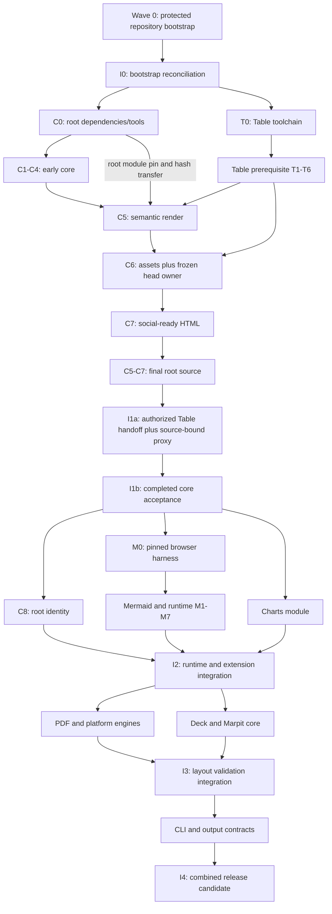

# Margo v0.0.1 roadmap implementation plan

> **For agentic workers:** REQUIRED SUB-SKILL: Use superpowers:subagent-driven-development (recommended) or superpowers:executing-plans to implement this plan task-by-task. Steps use checkbox (`- [ ]`) syntax for tracking.

**Goal:** Deliver `github.com/araihu/margo` v0.0.1 as an importable single-document compiler plus optional charts, PDF, deck, and CLI surfaces without violating module or security boundaries.

**Architecture:** Root module owns immutable compilation, rendering, runtime descriptors, assets, and static deck compilation. Optional `charts`, `pdf`, and `cmd/margo` modules depend inward; Goshtoso Table client sorting lands and releases first. Integration uses two active workers by default, fresh integration workers between waves, and one owner per file.

**Tech Stack:** Go 1.26.5, Goldmark, templ, Goshtoso, Goshtoso Charts, Muamba, YAML, embedded JavaScript/CSS, native webviews, Chrome DevTools Protocol.

## Global constraints

- Normative design: `/private/tmp/gs-goshtoso-markdown-design/docs/GOSHTOSO_MARKDOWN_DESIGN.md` at accepted HEAD `bfcf296db63eb18b5e54d61ceb3156c193b98ecd`.
- Normative file SHA-256: `6b41bc995de83d6835a96fd9e73ddb59d642e87bd6ce13aaac3c0c7852499fc8`; accepted review identity: `426068fae1cf60c95bfd5e7b00b9721958355cf115f58cab32770394a1328366`.
- Repository stays `github.com/araihu/margo`; binary stays `margo`. Existing low-adoption command-name collision is accepted.
- Wave 0 repository bootstrap is already executing in another lane. No task in this plan creates a repository or changes GitHub settings.
- Root module never imports `github.com/araihu/margo/charts`, `github.com/araihu/margo/pdf`, browser bindings, Chromium, or CGO.
- Optional dependency direction is `cmd/margo` to root/charts/pdf, `charts` to root/Goshtoso Charts, `pdf` to root.
- Every module's readonly module or lane scope sets `GOWORK=off GOFLAGS=-mod=readonly`; no acceptance gate relies on a local `go.work`.
- Render time needs no npm, Node.js, CDN, or automatic browser download.
- Security is capability intersection and fails closed. No `--trusted`, raw HTML passthrough, arbitrary CSS, arbitrary JavaScript, or engine fallback exists.
- Mermaid identity is version `11.16.1` plus reviewed Muamba digest plus `margo-mermaid-svg/v1` profile fingerprint.
- Native PDF is default. Chromium runs only after explicit selection and uses an installed or configured executable.
- Tables preserve `auto|none|server|client`; `auto` remains the backward-compatible zero value.
- Filesystem publication returns typed `CommitOutcome`; stdout is fully staged before its first artifact byte.
- Batch/glob discovery stays post-v0.0.1. Only output-mapping interfaces are reserved now.
- Every public standalone HTML or deck route renders route-specific title, description, canonical and `og:url`, full Open Graph image fields, and explicit X Card tags in initial HTML. URLs are authority-approved absolute HTTPS production URLs.
- SG01 requires initial HTML to contain exactly one `<title>`, route-specific `description`, canonical, `og:url`, `og:type`, `og:title`, `og:description`, `og:site_name`, `og:image`, `og:image:type`, `og:image:width`, `og:image:height`, `og:image:alt`, `twitter:card`, `twitter:title`, `twitter:description`, `twitter:image`, and `twitter:image:alt`; preview fetch verifies one 1280x640-ish PNG below 1,000,000 bytes. C6 freezes one `HeadOwnerSelection` before C7: Goshtoso `head`/App Shell metadata owns the set when the accepted Table handoff exposes the documented primitive; otherwise Core C7 owns one matching primitive. I1a verifies that frozen choice against the immutable release and cannot replace it.
- No production-domain authority exists in the accepted design. A bounded pre-site authority gate supplies `CanonicalOrigin` before any public/indexable route is accepted. A proposed or probed hostname grants no authority.
- One intentional `assets/social/margo-v0.0.1.png` preview is exactly 1280 by 640 pixels, `image/png`, below 1,000,000 bytes, and crop-safe. Public URL is `CanonicalOrigin + "/assets/social/margo-v0.0.1.png"` after authority approval. This plan does not generate it.
- Local/private standalone artifacts use `PublicationPrivate`, omit canonical/Open Graph/X URLs, and never synthesize an origin. `PublicationPublic` requires the complete initial-HTML gate.
- Generated `*_templ.go` and Muamba Go inventories are regenerated, checked in, and never hand-edited.
- One worker owns one bounded file set. Shared files change only in named integration tasks after lane work stops; repeated path mentions are serialized successor transfers, never concurrent ownership.
- Every implementation checkpoint uses literal quoted Git pathspecs, never a shell-expanded path array. The checkpoint runs `git add --all -- <literal pathspecs>` so tracked deletions remain staged, then compares three complete cached manifests against independent path-limited manifests generated with the same literal pathspecs: `git diff --cached --name-status --diff-filter=ACDMRT --find-renames --find-copies` (status, deletion, and rename), `git diff --cached --summary --diff-filter=ACDMRT --find-renames --find-copies` (mode/type), and `git diff --cached --raw --diff-filter=ACDMRT --find-renames --find-copies` (raw mode/status/rename records). Any unowned path, deleted path, rename source or destination, type change, mode change, forbidden path, or fixture mutation fails closed. Each task runs a temporary negative fixture that deletes one owned tracked file, renames one owned file across its boundary, and replaces one owned regular file with a directory or symlink; the independent status/raw manifests must reject each mutation before restoration and the final commit gate reruns with clean fixtures.
- Every implementation commit has the literal-pathspec owned manifest and three independent staged-record comparisons defined in the preceding checkpoint rule. Integration workers apply the identical equality check to their declared integration set; no shell existence check or shell-expanded array is accepted.
- Root module ownership is serialized before semantic rendering: C0 is the sole writer of root `go.mod`, `go.sum`, and `tools/toolchain.lock` and owns the exact reviewed Goshtoso `github.com/araihu/goshtoso v0.1.2` pin. C0's accepted checkpoint records `rootModuleToC5.v1` with pre-write and post-write SHA-256 values, C0 commit/tree, destination `C5`, and staged set exactly `go.mod`, `go.sum`, `tools/toolchain.lock`, and `integration/root-module-transfer.v1.json`. C5-C7 consume those files read-only, record before/after hash equality around every generator/test command, and stage no root module path. I1a consumes the C0 pin and final C5-C7 source, verifies the same hashes, and never writes or stages root module files; it stages only its declared integration fixtures plus external proxy artifacts. No concurrent or later root-module writer is permitted.
- Dependency/tool provisioning is an explicit predecessor. `C0` owns root `go.mod`, `go.sum`, and `tools/toolchain.lock`; it executes `go get -tool github.com/a-h/templ/cmd/templ@v0.3.1020` and `go get -tool github.com/araihu/muamba/cmd/muamba@v0.0.3` under the locked proxy and records both tool module sums. C0 also adds the exact direct requirement `github.com/araihu/goshtoso v0.1.2` and records module sum `h1:ymdPVQ+dE0NplYsiqMnUFmDtBT5bOMqtArPohmg2H8g=` and go.mod sum `h1:mY8kbNpqILeQ2MLW1eh14EIaudanLjAs6bf0sv51NXE=` before C5. `C0` also owns the direct normalization dependency `golang.org/x/mod v0.30.1-0.20251115032019-269c237cf350`, its module/go.mod sums, upstream commit, `.info`/`.mod`/`.zip` byte hashes, source manifest digest, and a sorted `moduleSuperset[]` inventory naming every direct/transitive module required by root, charts, pdf, and cmd/margo. I1a reads that immutable inventory to populate the complete proxy; I1b's canonical wrapper may consume only this C0-pinned copy. `T0` owns only Goshtoso's exact templ tool record; the Goshtoso module pin is C0-owned and available to C5-C7; `H1`, `P1`, and `O5` reconcile their module pins against the C0 inventory before consumers run. Exact module sums are recorded before consumers run: Goshtoso `v0.1.2` (`h1:ymdPVQ+dE0NplYsiqMnUFmDtBT5bOMqtArPohmg2H8g=`; go.mod `h1:mY8kbNpqILeQ2MLW1eh14EIaudanLjAs6bf0sv51NXE=`), templ `v0.3.1020` (`h1:ypAT/L5ySWEnZ6Zft/5yfoWXYYkhFNvEFOeeqecg4tw=`; go.mod `h1:A2DlK61v+K+NRoGnhmYbNYVmtYHcFO5/AisMvBdDxTM=`), Goldmark `v1.8.2` (`h1:kEGpgqJXdgbkhcOgBxkC0X0PmoPG1ZyoZ117rDVp4zE=`; go.mod `h1:ip/1k0VRfGynBgxOz0yCqHrbZXhcjxyuS66Brc7iBKg=`), YAML `v3.0.1` (`h1:fxVm/GzAzEWqLHuvctI91KS9hhNmmWOoWu0XTYJS7CA=`; go.mod `h1:K4uyk7z7BCEPqu6E+C64Yfv1cQ7kz7rIZviUmN+EgEM=`), Chroma `v2.24.1` (`h1:m5ffpfZbIb++k8AqFEKy9uVgY12xIQtBsQlc6DfZJQM=`; go.mod `h1:l+ohZ9xRXIbGe7cIW+YZgOGbvuVLjMps/FYN/CwuabI=`), Muamba `v0.0.3` (`h1:oS6nzBbEtJdQsAeuL2utCprMp0OtTHdSK/SOaUmMpaI=`; go.mod `h1:HWgw9kWiYam0Y8Ulmej5aW/AvLd8L2GWUmO6WlYNsVQ=`), Charts YAML `go.yaml.in/yaml/v3 v3.0.5` (`h1:N6y/pJk8buWs9NY5ERU2HSMfm+IuD/OtfdAnq6kESPw=`; go.mod `h1:HVTZu1O7/Vkt2N+BFy8Zza+lnLsABggaTM2ZpNIGuKg=`), and chromedp `v0.14.2` (`h1:r3b/WtwM50RsBZHMUm9fsNhhzRStTHrKdr2zmwbZSzM=`; go.mod `h1:rHzAv60xDE7VNy/MYtTUrYreSc0ujt2O1/C3bzctYBo=`). For x/mod the exact identity is module sum `h1:JGDMsCp8NahDR9HSvwrF6V8tzEf87m7Bo4oZ07vRxdU=`, go.mod sum `h1:lAsf5O2EvJeSFMiBxXDki7sCgAxEUcZHXoXMKT4GJKc=`, upstream `https://go.googlesource.com/mod` commit `269c237cf350ceaea64412cd12374e840b1d9871`, `.info` SHA-256 `f3f5f363b1366a52defb8b3fa4d6e6538dc0019ab4f93fe393a9910671d01080`, `.mod` SHA-256 `8b27ec1214a37527158dd20611e4b684081c0b8c6056959b7cc3ecd7b2570674`, module-zip SHA-256 `fa4032ffac2668238fa332c45049ec03fd2f15b63828b156c2d8871e25a29a81`, and source-manifest SHA-256 `f10ccf05700260d897f17c34a659b9e5174bbbad23f110af69bb1da886b44153`. No ambient tool, GOROOT vendor copy, transitive templ graph, or unconstrained tidy may satisfy this dependency.
- I2, I3, I4, and combined release gates invoke the exact `readonly_module_command` or `readonly_module_gate` scope defined below. Lane-local non-provisioning commands in subsystem plans invoke the exact equivalent `readonly_lane_command` or `readonly_lane_gate` scope defined immediately after it; their displayed `GOWORK=off GOFLAGS=-mod=readonly` prefixes are payload notation, never ambient direct execution. Both scopes clear upper- and lower-case proxy variables before authoritative variables, snapshot `git hash-object go.mod` and `git hash-object go.sum` before each generator, verifier, test, race, or integration command, and prove both hashes unchanged afterward. C0's explicit `GOWORK=off GOFLAGS=-mod=mod` module-requirement and `go get -tool` provisioning step is the only root-module write; its following readonly verification uses the same scope and snapshot assertion. T0 may write only its separate Goshtoso toolchain module files in its named provisioning step. C5-C7, I1a, and every later consumer are read-only for root `go.mod`/`go.sum`; no later task may alter them.
- Mermaid M0 is the sole browser harness owner: Node `v26.5.0`, npm `11.17.0`, Playwright `v1.52.0`, `css-tree v3.1.0` (`sha512-0eW44TGN5SQXU1mWSkKwFstI/22X2bG1nYzZTYMAWjylYURhse752YgbE4Cx46AC+bAvI+/dYTPRk1LqSUnu6w==`), Chromium revision `1169`/version `136.0.7103.25`, and executable-digest `node-toolchain.lock`/`bootstrap-node.sh`. The lock supports exactly `darwin-arm64`, `darwin-x64`, `linux-x64`, and `windows-x64`; it records official Node `SHASUMS256.txt`/signature URLs, npm source `https://registry.npmjs.org/npm/-/npm-11.17.0.tgz` with integrity `sha512-PurxiZexEHDTE4SSaLI3ZrnbAGiZfeyUcQcxcP5D+hfytNAze/D1IzDuInTn9XVLIbAQUnQuSPXJx02LHjLvQw==`, exact archive SHA-256 values (`ee920559aaa2391569cff4d737e3b83963430e3a14dedd91bfe0ff53171b5af9`, `98293394c945a24e64e00b4177bf075ec963ea70b34d1d2e24bd4a71716d334f`, `9f619528f1db5ddc41dccf54211066fb42228d69a156733c69cb9d6cc92e358c`, `d3b2277dbcccfdf24ef6302928f64f484cff1d77a6d3caa3a28f4d20ce9158f6`) and per-runner Chromium archive SHA-256 values (`6755dab7021ac7aeadceab8f3cd183f05f9c20736c456573b937e5e22212db65`, `22c56a4fdc5b9de64a510176bcf8eb930e597c0985964736067ed505cd0109b2`, `1a2f6e3e519049b51c59b2503ecf808af4ff1fcf13ffa1177dacfda4a02d7a59`, `241f8aa5c0fde70fb0cd9fdedfb65ee34e422fef8c30b39bd1158d0e10fcb884`). M0 additionally owns `run-playwright.sh` and `run-playwright.ps1`; `install-browser.sh`/`install-browser.ps1` first write one verified `margo/browser-install/v1` receipt. `bootstrap-node --provision-node`/`-ProvisionNode` and `--check`/`-Check` both consume that receipt and emit the same Chromium path/revision/version/digest fields; provision mode verifies Node/npm without requiring an npm cache, then `populate-npm-cache.mjs --provision` fills one caller-selected absolute cache root. Only after the npm receipt exists does final `bootstrap-node --check --cache-root`/`-Check -CacheRoot` verify the immutable cache and emit the final environment file consumed unchanged by the same-process runner. Each runner imports that final file, rejects any cache-root mismatch or overwrite, verifies the lock-resolved package receipt (whose `receiptSHA256` hashes canonical JSON with that field removed), runs `npm ci --offline --cache "$MARGO_NPM_CACHE"`, and runs the local Playwright CLI with `--no`/no-install semantics while asserting command paths, executable digests, cache integrity, and network denial. M3-M7 invoke only those runners, never bare npm or npm exec; explicit Node/npm/browser/cache provisioning commands are M0-only, and bare Node DOM/test commands and regex XML/CSS fallbacks are forbidden.
- M0 also owns the npm cache boundary. `populate-npm-cache.mjs --provision` resolves every `package-lock.json` package entry with a `resolved` URL and `integrity`, downloads and verifies each exact tarball only during explicit provisioning, imports it into the one absolute cache root selected before checks, and writes `$MARGO_NPM_CACHE/receipt.json` against `npm-cache-receipt.schema.json`; each receipt row records package name/version, lock path, URL, integrity, byte count, SHA-256, cache key, and cache root. The provision command never replaces a caller-selected root. The final `bootstrap-node --check --cache-root` receipt is the only cache state accepted by runners; a missing, extra, stale, tampered, or root-mismatched entry fails before Playwright. Same-process runners consume the emitted environment file without rewriting it, verify lockfile hash, receipt hash, every cached tarball, and absolute cache path, then invoke `"$MARGO_NPM_BIN" ci --offline --cache "$MARGO_NPM_CACHE" --ignore-scripts --no-audit --no-fund`. M1-M7 cannot populate or fetch cache entries.
- Mermaid's signed Node release manifest has a pinned trust anchor in `test/browser/node-toolchain.lock`: fingerprint `C82FA3AE1CBEDC6BE46B9360C43CEC45C17AB93C` (Richard Lau, RSA/SHA256), key source `https://github.com/nodejs/release-keys/raw/refs/heads/main/gpg/pubring.kbx`, source SHA-256 `6030d4e0cd53330acf2ab68acd455b7ca98bb5d5975376f0b7c0892308ba2d57`, and an offline `gpgv --homedir "$KEYRING_DIR" --keyring "$KEYRING_DIR/nodejs-release-keys.kbx" --status-fd 1 "$SHASUMS_SIG" "$SHASUMS_FILE"` check requiring `VALIDSIG` and `GOODSIG` for that fingerprint. Wrong-key, bad-signature, manifest/archive/executable mismatch, and missing-key fixtures fail closed; only explicit provisioning may fetch the keyring or archives.
- Prepublication nested-module resolution uses one I1a-owned frozen local proxy handoff. C0 first freezes the exact Goshtoso pin in the root module files; C5-C7 consume those files read-only and must then finish and receive independent acceptance as the final root source tree. Only after that acceptance may I1a create `$MARGO_MODULE_PROXY` from the exact reviewed module `.info`, `.mod`, and `.zip` files for the complete direct/transitive root/charts/pdf/cmd superset. I1a runs every module with `GOPROXY=file://$MARGO_MODULE_PROXY GOSUMDB=off GOWORK=off GOFLAGS=-mod=readonly`, records source commit/tree, pseudo-version, separate `.info`/`.mod`/`.zip` byte hashes, `margo/go-module-zip-selection/v1` source/zip allowed-file and exclusion manifests under Go 1.26.5, and immutable manifest/environment/network/cleanup/handoff paths and digests. I1a does not edit root `go.mod`/`go.sum` and does not run a root-module replacement transition; it verifies C0's reviewed Goshtoso source/pseudo-version, the C0-to-C5 hash record, and no `replace` directives before freezing the complete handoff. I1b consumes that unchanged handoff, the C0-pinned root module files, and the already-final C5-C7 source; H1/H6, I2, I3, and I4 only verify unchanged handoff bytes. I2 never extends, rewrites, recreates, or deletes the proxy, and I4 performs the sole cleanup before the authoritative proxy gate. Charts pins reviewed commit `297df2f562e816cbe732f3a69d9ad7bf49cc93db` as `v0.0.2-0.20260803224432-297df2f562e8` with sum `h1:+Tr1yxWDGIviWgiEls/HWxlrgZC4vkGlSSR+2DGameQ=`.
- I1a is the sole proxy authority and freezes one complete source-bound superset handoff for the entire release DAG only after C5-C7 final root source acceptance. The handoff uses C0's already-frozen Goshtoso pin and root-module hashes; I1a never writes or stages root `go.mod`, `go.sum`, or `tools/toolchain.lock`. It creates an absolute realpath proxy, populates the complete direct and transitive root/charts/pdf/cmd module inventory from that immutable source, and writes canonical manifest, artifact-set, network, cleanup, and dual-platform environment records before any consumer. The handoff binds `proxyEnvPOSIXPath`/`proxyEnvPOSIXSHA256`, `proxyEnvWindowsPath`/`proxyEnvWindowsSHA256`, and the exact `runnerEnvironmentSelection`; `MARGO_PROXY_ENV` and `MARGO_PROXY_ENV_SHA256` are derived aliases selected only after the runner verifies the corresponding platform file bytes. I1a freezes `MARGO_MODULE_PROXY`, manifest/artifact digests, both environment paths/digests, network/cleanup receipts, and the non-circular handoff digest. I1b consumes the final C5-C7 source, the C0-pinned root module files, and this unchanged handoff; H1/H6, I2, I3, I4, and every root/charts/pdf/cmd consumer verify both platform files and select one unchanged file for their runner; no consumer recreates, extends, rewrites, or deletes the proxy before I4 cleanup. Consumer scopes clear `HTTP_PROXY/http_proxy`, `HTTPS_PROXY/https_proxy`, `ALL_PROXY/all_proxy`, and `NO_PROXY/no_proxy` before setting `GOPROXY=file://$MARGO_MODULE_PROXY GOSUMDB=off GOWORK=off GOFLAGS=-mod=readonly`, with local `go.sum`/`go mod verify` as checksum authority and no network fallback.
- I2, I3, and I4 must paste and execute this exact ambient-cleared readonly scope before any module or generator command; the function is an executable contract, not a prose alias. It clears inherited proxy/workspace/toolchain variables, exports only the supplied authoritative proxy and readonly settings, and snapshots module files around every independent command:

```sh
readonly_module_command() {
  module_dir=$1
  proxy_url=$2
  shift 2
  (
    case "$proxy_url" in file:///*|https://*) ;; *) exit 1 ;; esac
    cd "$module_dir" || exit 1
    unset HTTP_PROXY http_proxy HTTPS_PROXY https_proxy ALL_PROXY all_proxy NO_PROXY no_proxy GOPROXY GOSUMDB GOWORK GOFLAGS GOPRIVATE GONOSUMDB GONOPROXY GOVCS GOTOOLCHAIN GO111MODULE
    cleared_env=$(env | LC_ALL=C sort)
    if [ -n "${MARGO_CLEARED_ENV_RECORD:-}" ]; then
      printf '%s\n' "$cleared_env" > "$MARGO_CLEARED_ENV_RECORD" || exit 1
      printf '%s\n' "$cleared_env" | cmp -s - "$MARGO_CLEARED_ENV_RECORD" || exit 1
    fi
    if printf '%s\n' "$cleared_env" | grep -Eq '^(HTTP_PROXY|http_proxy|HTTPS_PROXY|https_proxy|ALL_PROXY|all_proxy|NO_PROXY|no_proxy)='; then
      exit 1
    fi
    export GOPROXY="$proxy_url" GOSUMDB=off GOWORK=off GOFLAGS=-mod=readonly
    test -f go.mod && test -f go.sum || exit 1
    mod_before=$(git hash-object go.mod)
    sum_before=$(git hash-object go.sum)
    "$@"
    status=$?
    test "$status" -eq 0 || exit "$status"
    test "$(git hash-object go.mod)" = "$mod_before" || exit 1
    test "$(git hash-object go.sum)" = "$sum_before" || exit 1
  )
}

readonly_module_gate() {
  module_dir=$1
  proxy_url=$2
  readonly_module_command "$module_dir" "$proxy_url" go mod verify || return 1
  readonly_module_command "$module_dir" "$proxy_url" go list -m all || return 1
  readonly_module_command "$module_dir" "$proxy_url" go vet ./... || return 1
  readonly_module_command "$module_dir" "$proxy_url" go test ./... -count=1 || return 1
  readonly_module_command "$module_dir" "$proxy_url" go test -race ./... -count=1 || return 1
}

readonly_lane_command() {
  module_dir=$1
  proxy_url=$2
  shift 2
  (
    case "$proxy_url" in file:///*|https://*) ;; *) exit 1 ;; esac
    cd "$module_dir" || exit 1
    unset HTTP_PROXY http_proxy HTTPS_PROXY https_proxy ALL_PROXY all_proxy NO_PROXY no_proxy GOPROXY GOSUMDB GOWORK GOFLAGS GOPRIVATE GONOSUMDB GONOPROXY GOVCS GOTOOLCHAIN GO111MODULE
    cleared_env=$(env | LC_ALL=C sort)
    if [ -n "${MARGO_CLEARED_ENV_RECORD:-}" ]; then
      printf '%s\n' "$cleared_env" > "$MARGO_CLEARED_ENV_RECORD" || exit 1
      printf '%s\n' "$cleared_env" | cmp -s - "$MARGO_CLEARED_ENV_RECORD" || exit 1
    fi
    if printf '%s\n' "$cleared_env" | grep -Eq '^(HTTP_PROXY|http_proxy|HTTPS_PROXY|https_proxy|ALL_PROXY|all_proxy|NO_PROXY|no_proxy)='; then
      exit 1
    fi
    export GOPROXY="$proxy_url" GOSUMDB=off GOWORK=off GOFLAGS=-mod=readonly
    test -f go.mod && test -f go.sum || exit 1
    mod_before=$(git hash-object go.mod)
    sum_before=$(git hash-object go.sum)
    "$@"
    status=$?
    test "$status" -eq 0 || exit "$status"
    test "$(git hash-object go.mod)" = "$mod_before" || exit 1
    test "$(git hash-object go.sum)" = "$sum_before" || exit 1
  )
}

readonly_lane_gate() {
  module_dir=$1
  proxy_url=$2
  readonly_lane_command "$module_dir" "$proxy_url" go mod verify || return 1
  readonly_lane_command "$module_dir" "$proxy_url" go list -m all || return 1
  readonly_lane_command "$module_dir" "$proxy_url" go vet ./... || return 1
  readonly_lane_command "$module_dir" "$proxy_url" go test ./... -count=1 || return 1
  readonly_lane_command "$module_dir" "$proxy_url" go test -race ./... -count=1 || return 1
}
```
The frozen handoff supplies `file://$MARGO_MODULE_PROXY`; the post-cleanup authoritative record supplies the exact checked `MARGO_AUTHORITATIVE_GOPROXY`. Each invocation verifies the unchanged absolute proxy/manifest/environment/network/cleanup/handoff identities before entering the function. A missing, ambient, relative, or changed proxy path fails before the first `go` process. Lane plans pass their module directory and checked `MARGO_CHECKED_GOPROXY` to `readonly_lane_command` for each displayed command payload, or to `readonly_lane_gate` for a standard module sweep; before I4 cleanup `MARGO_CHECKED_GOPROXY` is exactly `file://$MARGO_MODULE_PROXY`, and after cleanup it is exactly `MARGO_AUTHORITATIVE_GOPROXY`. `MARGO_CHECKED_GOPROXY` is a Go proxy URL, never the selected `MARGO_PROXY_ENV` environment-file path. No lane may execute the displayed environment-prefix shorthand directly. A payload such as `GOWORK=off GOFLAGS=-mod=readonly go test ./... -count=1` is executed as `readonly_lane_command <module-dir> "$MARGO_CHECKED_GOPROXY" go test ./... -count=1`; a payload chain is split into one helper call per command in order, so no unscoped `&&` chain can bypass the hash gate. The lowercase-contamination fixture sets all eight proxy spellings to `bad`, sets `MARGO_CLEARED_ENV_RECORD` to an explicit evidence file, runs each scope, and fails closed if any spelling survives; each requested record write must succeed and `printf '%s\\n' "$cleared_env" | cmp -s - "$MARGO_CLEARED_ENV_RECORD"` must prove exact sorted-byte equality.
The root-file rule is explicit: C0's exact Goshtoso/module/tool provisioning writes are the only root-module writes; after C0's accepted `rootModuleToC5.v1` hash gate, C5-C7, I1a, I2, I3, I4, and all consumers are readonly for root `go.mod`/`go.sum`/`tools/toolchain.lock`. I1a verifies the C0 pin and source-bound handoff and may stage only its declared integration fixtures and external artifacts. No helper invocation may write a root module or toolchain file.
- The frozen proxy records use the exact `margo-canon-json-v1` byte routine defined in the next bullet. `encoding/json.Encoder` with `SetEscapeHTML(false)` is only the serialization primitive; single-record bytes remove exactly its one terminal LF, while line-delimited preimages add exactly one LF through `canonLine`. Verifiers decode with unknown-field rejection and require byte equality to these canonical bytes; all typed fields, paths, manifests, receipts, and preimages use this routine.
- `canonBytes(value)` is the one canonical-byte routine for every single JSON value: allocate a fresh `bytes.Buffer`, create `json.NewEncoder(&buffer)`, call `SetEscapeHTML(false)`, call exactly one `Encode(value)`, require that the output is non-empty and ends in exactly one `LF` byte, remove exactly that final byte, reject if the remaining bytes end in any `space`, `tab`, `CR`, or `LF`, and return the remaining bytes without any further trim or append. The typed struct field order above is the encoder order; no map, pretty printer, alternate escape form, duplicate key, invalid UTF-8, unknown field, or non-canonical integer is accepted. `canonLine(value)` is exactly `canonBytes(value) || LF`; it is the only place a record LF is added. Every argv array, manifest/handoff/artifact/receipt object, and selection row uses `canonBytes`; line-delimited artifact and selection preimages use `canonLine`; single-record files use `canonBytes` only. Empty streams contain their domain prefix and no LF. Fixtures must mutate one encoder LF, two trailing LFs, trailing space/tab/CR, a missing trim, and a post-trim append separately, and every consumer rejects those bytes before a module command.
- `proxy-handoff-v1.json` is exactly `{schemaVersion:"proxy-handoff-v1",canonicalEncoding:"margo-canon-json-v1",hashAlgorithm:"sha256",realpathAlgorithm:"margo-realpath-v1",manifestSchema:"proxy-manifest-v1",artifactSetEncoding:"margo-proxy-artifact-set-v1",proxyDir:string,proxyManifestPath:string,proxyManifestSHA256:string,proxyArtifactSetSHA256:string,proxyEnvPOSIXPath:string,proxyEnvPOSIXSHA256:string,proxyEnvWindowsPath:string,proxyEnvWindowsSHA256:string,runnerEnvironmentSelection:[{runner:string,environment:string}],networkPolicyCommand:[string],networkPolicyCommandSHA256:string,networkPolicyReceiptPath:string,networkPolicyReceiptSHA256:string,cleanupReceiptPath:string,cleanupReceiptSHA256:string,handoffPath:string,handoffSHA256:string}`. All fields are required and no additional field is accepted. `runnerEnvironmentSelection` is exactly `[ {runner:"darwin-arm64",environment:"posix"}, {runner:"darwin-x64",environment:"posix"}, {runner:"linux-x64",environment:"posix"}, {runner:"windows-x64",environment:"windows"} ]` in runner-byte order; no other runner or environment value is accepted. `networkPolicyCommandSHA256` hashes `SHA256("margo-proxy-network-command-v1 NUL" || canonBytes(argv))`; `MARGO_NETWORK_DENY` is exactly the one-line canonical JSON serialization of that argv array, and consumers parse and compare the array rather than reparsing an ambient shell command. `proxyEnvPOSIXSHA256` is `SHA256("margo-proxy-env-posix-v1 NUL" || exact POSIX environment-file bytes)`, and `proxyEnvWindowsSHA256` is `SHA256("margo-proxy-env-windows-v1 NUL" || exact PowerShell environment-file bytes)`; `networkPolicyReceiptSHA256` is `SHA256("margo-proxy-network-receipt-v1 NUL" || exact network receipt bytes)`; and `cleanupReceiptSHA256` is `SHA256("margo-proxy-cleanup-receipt-v1 NUL" || exact cleanup receipt bytes)`. The frozen tuple mapping is exact: `MARGO_MODULE_PROXY=proxyDir`, `MARGO_PROXY_MANIFEST=proxyManifestPath`, `MARGO_PROXY_MANIFEST_SHA256=proxyManifestSHA256`, `MARGO_PROXY_ARTIFACT_SET_SHA256=proxyArtifactSetSHA256`, `MARGO_PROXY_ENV_POSIX=proxyEnvPOSIXPath`, `MARGO_PROXY_ENV_POSIX_SHA256=proxyEnvPOSIXSHA256`, `MARGO_PROXY_ENV_WINDOWS=proxyEnvWindowsPath`, `MARGO_PROXY_ENV_WINDOWS_SHA256=proxyEnvWindowsSHA256`, `MARGO_NETWORK_DENY=networkPolicyCommand`, `MARGO_NETWORK_DENY_RECEIPT=networkPolicyReceiptPath`, `MARGO_NETWORK_DENY_RECEIPT_SHA256=networkPolicyReceiptSHA256`, `MARGO_PROXY_HANDOFF=handoffPath`, `MARGO_PROXY_HANDOFF_SHA256=handoffSHA256`, `MARGO_PROXY_CLEANUP_RECEIPT=cleanupReceiptPath`, and `MARGO_PROXY_CLEANUP_RECEIPT_SHA256=cleanupReceiptSHA256`. `MARGO_PROXY_ENV` and `MARGO_PROXY_ENV_SHA256` are derived selected aliases only: POSIX runners select the POSIX path/SHA, and the Windows runner selects the Windows path/SHA after verifying the `runnerEnvironmentSelection` entry. `proxy-env.sh` and `proxy-env.ps1` are distinct syntax-specific files; each exports the static non-environment tuple and its selected path only. Neither file carries either platform environment SHA field or `MARGO_PROXY_HANDOFF_SHA256`; the runner verifies both raw files against the handoff, then exports both platform SHA variables and the selected aliases in process memory, so no digest cycle exists. `proxyArtifactSetSHA256` hashes `SHA256("margo-proxy-artifact-set-v1 NUL" || records)`, where records are one `canonLine(ArtifactSetRow)` per line, `ArtifactSetRow` is `{path:string,bytes:uint64,sha256:string}`, `path` is a slash-separated non-absolute path relative to `proxyDir`, rows are sorted by path UTF-8 bytes with duplicates rejected, and every module contributes exactly its `.info`, `.mod`, and `.zip` row. The final LF after each record is part of the preimage. `MARGO_PROXY_HANDOFF_SHA256` and `handoffRecordSHA256` are `SHA256("margo-proxy-handoff-v1 NUL" || canonBytes(canonical handoff JSON with the `handoffSHA256` field removed))`, while the file retains that field; the handoff path is included but the handoff bytes are never included in their own preimage. I1a writes both environment files and this schema once, and every consumer rejects unknown fields, path aliases, platform-file selection mismatch, either environment byte/digest mutation, artifact order/encoding changes, altered receipt preimages, or a self-including handoff digest before any module command.
- The source and ZIP normalization streams use the same typed `margo-selection-v1` row encoding. `ManifestRow` is `{path:string,size:uint64,mode:uint32,sha256:string}`, where `mode` is the normalized Go module regular-file mode `0`; raw source and ZIP mode metadata are checked before admission and appear in exclusion/rejection rows when disallowed. `ExclusionRow` is `{path:string,reason:string,entryKind:string,size:uint64,mode:uint32,sha256:string}` and `ZipRejectionRow` is `{path:string,reason:string,entryKind:string,size:uint64,mode:uint32,createSystem:uint16,externalAttributes:uint32,sha256:string}`; every field is present, `entryKind` is one of `file|directory|symlink|device|other|omitted`, `reason` is one of `submodule|vendor|vcs|hg_archive|symlink|not_regular|invalid_path|zip.empty_directory|zip.mode|zip.metadata|duplicate|collision|source_excluded|omitted`, empty `sha256` means no regular-file bytes exist, and zero numeric values are the only sentinel for a non-file entry. Paths are validated UTF-8 slash paths with no NUL, control, backslash, volume, absolute, `.` or `..` component, or duplicate separator. The row encoder is the same no-map, no-unknown-field `margo-canon-json-v1` encoder above. Allowed rows sort by path bytes and reject duplicate paths. Source exclusions sort by `(path,reason,entryKind,size,mode,sha256)`; ZIP rejections sort by `(path,reason,entryKind,size,mode,createSystem,externalAttributes,sha256)`, all string comparisons use UTF-8 bytes and numeric comparisons use unsigned values. `sourceManifestSHA256` and `zipManifestSHA256` are `SHA256("margo-selection-allowed-v1 NUL" || each allowed-row JSON followed by LF)`; `sourceExclusionsSHA256` is `SHA256("margo-selection-source-excluded-v1 NUL" || each sorted `ExclusionRow` plus LF)`; and `zipRejectionsSHA256` is `SHA256("margo-selection-zip-rejected-v1 NUL" || each sorted `ZipRejectionRow` plus LF)`. An empty stream contains only its domain prefix. No JSON field reordering, escape-style change, omitted field, newline change, numeric spelling change, sort permutation, or domain-prefix change is accepted, and source exclusions are never compared with ZIP rejection rows.
- `proxy-manifest-v1.json` has one exact `margo-canon-json-v1` object and no alternate representation: `{schemaVersion:"proxy-manifest-v1",canonicalEncoding:"margo-canon-json-v1",hashAlgorithm:"sha256",modules:[{modulePath:string,version:string,infoSHA256:string,modSHA256:string,zipSHA256:string}]}` in that field order. All four top-level fields and all five row fields are required; unknown or duplicate fields, nulls, maps, numbers where strings are required, upper-case or non-64-hex digests, invalid UTF-8, empty module paths, duplicate `(modulePath,version)` pairs, and a module row without exactly one `.info`, `.mod`, and `.zip` digest are rejected. `modulePath` is a slash-separated valid Go module path and `version` is the exact canonical Go version or pseudo-version recorded by I1a; rows sort by UTF-8 `modulePath` bytes then UTF-8 `version` bytes. `proxyManifestSHA256` is `SHA256("margo-proxy-manifest-v1 NUL" || canonBytes(manifest-object))`; the preimage has no LF, and the empty manifest is the canonical object with `modules:[]` and the same domain prefix, never an empty byte stream. The manifest's filesystem path is canonicalized with `margo-realpath-v1`, while `modulePath` is a module identifier and is never treated as a filesystem path. I1a writes the canonical bytes once; I1b, H1/H6, I2, I3, and I4 decode with unknown-field rejection, re-encode, compare bytes and the digest, and reject fixtures that mutate field presence/order, duplicate keys, digest case/length, module order, one byte, the terminal LF/trim, or the empty-stream rule before a module command.
- `margo-realpath-v1` is the exact cross-runner algorithm for every proxy, manifest, environment, network, cleanup, handoff, and evidence filesystem path. The verifier first decodes strict UTF-8, rejects NUL/control bytes, relative paths, `.` or `..` components, duplicate separators, trailing separators except the filesystem root, drive-relative forms such as `C:foo`, and Windows device aliases `//?/` and `//./`; it then calls `filepath.Abs`, `filepath.Clean`, `filepath.EvalSymlinks` (all components, with a missing path returning stable `path.missing` and no lexical fallback), `filepath.Clean` again, and only then serializes. Serialization uses `/`; POSIX preserves case and requires one leading `/`, while Windows uppercases an ASCII drive letter and serializes a UNC path as `//server/share/...` with non-empty server/share components lowercased using Unicode simple lower-case; other resolved component bytes are preserved. Windows `\\server\\share`, `/server/share`, drive-relative, volume-less, and device paths are rejected unless they normalize to that exact UNC/drive form; symlink aliases are resolved to the target and the stored path must equal the final canonical bytes exactly. The verifier realpaths every recorded path, requires the path to exist and the canonical string and digest to match the handoff before any command, and rejects aliases, case/separator mutations, symlink substitutions, missing targets, volume/UNC mutations, or normalization-order changes. Fixtures cover POSIX and Windows separators, drive case, UNC case, symlink components, existing versus missing paths, duplicate/trailing separators, relative/volume/device aliases, and a changed canonical byte/hash.
- I1a's creator-side gate applies `margo-realpath-v1` to every filesystem path, emits only the fixed `proxy-manifest-v1` canonical bytes, reads each manifest/environment/receipt/handoff file back, re-encodes it with strict unknown-field rejection, and compares its bytes and domain-separated digest before exposing `MARGO_MODULE_PROXY` or starting any module/proxy command. This creator check and the I1b/H1/H6/I2/I3/I4 consumer checks use the same path and byte fixtures; no creator-side write is trusted merely because it came from I1a.
- Public authority is a verified `internal/authority.AuthorityRecord`, not a caller string. It contains schema version, record digest, `CanonicalOrigin`, homepage/representative/preview routes, owner, host evidence, deployment evidence, and file/HTTPS receipt. No production origin is approved now; parameterized/private routes remain executable, while public/indexable acceptance blocks without this record.
- Release evidence is exact: each fresh reviewer writes one file in `review/evidence/{C0,C1,C2,C3,C4,C5,C6,C7,C8,T0,T1,T2,T3,T4,T5,T6,M0,M1,M2,M3,M4,M5,M6,M7,H1,H2,H3,H4,H5,H6,P1,P2,P3,P4,P5,P6,P7,D1,D2,D3,D4,D5,O1,O2,O3,O4,O5,O6,O7}.json`; O7 owns `cmd/margo/internal/releasecheck` schema/verifier and live socialcheck transport; I4 owns aggregate `release/evidence/v0.0.1.json`. Required command records include argv, working directory, environment, exit code, platform, stdout/stderr digests, artifact paths/digests, commit/tree, reviewer identity, and mapped IDs.

## Review-correction mapping

| Finding | Changed plan owners and required proof |
|---|---|
| F01 and R2-C | C0 owns exact Go module/tool directives and `go get -tool` provisioning; T0 owns Goshtoso templ provenance; M0 owns Node/DOM/XML/CSS/Playwright/browser locks; P1 owns the native/CDP platform lock and bootstrap reference. Every consumer runs inside the exact readonly module or lane scope with `GOWORK=off GOFLAGS=-mod=readonly` and no ambient proxy/workspace variables. |
| F02 | M0-M7 use one Playwright Chromium DOMParser/XMLSerializer/CSSOM plus css-tree harness, pinned package integrities and browser archive digest, with structural/CSS fail-closed tests and no regex parser. |
| F03 and R2-A | T1 owns `components/table/component.go` and all five public render entrypoints, validating SortMode and SortValue before bytes; zero-output RED/GREEN tests cover each fragment. T6/I1a require an authorized external handoff and tag/tree/API proof. |
| F04 | I1a alone creates and freezes one complete bounded local proxy superset and immutable path/content/artifact/environment/network/cleanup handoff, verifies the reviewed Charts pseudo-version and the C0-owned Goshtoso handoff, keeps `moduleSourceCommit`/`moduleSourceTree` separate from outer `receiptCommit`/`receiptTree`, rejects self-reference, drops temporary replacements before freeze, and requires I1b-I4 to verify unchanged root/charts/pdf/cmd modules independently before and after release-order transitions; I4 performs the sole cleanup. |
| F05 and R2-B | H1 owns `WithAccessibleData`; H2-H5 wrap every supported family with an adjacent complete-value table, including both bar orientations and scatter point/aligned samples, with exact values, bounded bytes, static output, and no runtime marker. |
| F06 | O5/O6/P7 define `--engine native|chromium`, native default, explicit installed Chromium only, provenance, invalid/unavailable failure, and no download or fallback for render, pdf, and deck. |
| F07 and R2-D | C7 owns `margo/canonical-authority/v1` schema, digest, receipt, owner/host/deployment evidence, route allowlist, and verifier. O5/D5/I4 consume the record, reject unlisted origins/routes, and pass explicit downloaded HTML/image paths to socialcheck; private mode never invents URLs. |
| F08 and R2-E/R2-F | O7 owns evidence schema, `EvidenceInputs`, releasecheck, socialcheck transport, and all-ID coverage; T6 defines generated-artifact/CI evidence and external owner receipt; I1a proves release tag tree equality and Table symbols while Margo reviewers never publish. |
| R3-F1/R3-F2 | M0 owns only harness/fixture paths; M3-M7 own exact runtime/spec/testdata paths. Every checkpoint stages an explicit literal pathspec set, compares cached names byte-for-byte, rejects forbidden/unowned paths, and proves fixture mutation did not widen the set. |
| R3-F3/R3-F4/R3-F5/R3-F8 | H1 defines conditional row forms, reversible field escaping, `AccessibleRenderPolicy` propagation with pre-write bounded buffering, and an ordered extraction oracle; H2-H5 assert complete exact sequences for both bar orientations, line, pie/doughnut, point scatter, aligned scatter, and permutation mutations. |
| R3-F6 | I1b provenance separates pre-receipt `moduleSourceCommit`/`moduleSourceTree` from outer `receiptCommit`/`receiptTree`, verifies proxy archive bytes against source tree, and rejects self-reference before H1. |
| R3-F7 | M0 pins the Node release signing-key fingerprint, key-source digest, RSA/SHA256 algorithm, offline `gpgv` status command, and wrong-key/bad-signature fixtures for every runner bootstrap. |
| R4-F1 | C3/C4 freeze `Policy.OutputBytes`, immutable `EffectivePolicy`, and value `RenderContext`; `ExtensionFactory(RenderContext)` delivers the effective scalar before extension bytes. Charts H1-H5 accept that context, map it to `AccessibleRenderPolicy`, and C4/H1 propagation tests compile root/charts through I1a's frozen handoff. |
| R4-F2 | H1 validates `1 <= MaxOutputBytes <= 64<<20`, uses checked capacity and bounded canonical text markup, rejects zero/negative/MaxInt64, and proves direct zero-byte overflow plus one-byte boundary behavior. |
| R4-F3 | M0 owns same-process shell/PowerShell Playwright runners; they expose absolute verified binaries and local CLI/browser paths, use offline/no-install flags, and assert command path, executable digest, and network denial. |
| R4-F4 | I1b extracts the module zip, strips its prefix, compares sorted path/content SHA-256 manifests with `git archive` at the recorded source tree, records independent byte and manifest hashes, and rejects prefix/tree/file/self-reference mismatches. |
| R4-F5 | All non-provisioning module, generator, verifier, race, and integration commands run through the exact readonly module or lane scope, which sets `GOWORK=off GOFLAGS=-mod=readonly` after clearing ambient variables and asserts clean `go.mod`/`go.sum` after execution. |
| R5-F1 | I1b applies the pinned Go 1.26.5 module-zip selection algorithm identically to the pre-receipt Git tree and extracted zip, records allowed-file and exclusion manifests separately, handles nested modules, vendor/VCS/dot paths, symlinks, invalid paths, and rejects any changed/missing/extra/prefix/tree/self-reference mismatch. |
| R5-F2 | M0 owns an offline npm cache bootstrap for every lock-resolved tarball, per-package integrity/URL/byte receipt, immutable cache root, and runner `npm ci --offline --cache` verification; no consumer task populates or fetches cache entries. |
| R5-F3 | Every staged-path gate compares complete cached path, status, rename, deletion, and mode manifests with `ACDMRT` filtering and Git pathspec expansion; unowned deletions or type changes fail before commit. |
| R5-F4 | C4 computes and stores `EffectivePolicy` in the immutable compile plan; Render only reads that value to create sessions. H6's frozen-I1a-handoff fixture proves root Compile through goshtosochart dispatch for every family, exact `OutputBytes`, compiler mismatch, and zero-byte policy failure. |
| R6-F1 | C0 directly pins `golang.org/x/mod v0.30.1-0.20251115032019-269c237cf350`, its sums, upstream commit, module-zip/source-manifest digests, and lock ownership; I1b consumes only that immutable dependency and records the same identity in its receipt. GOROOT vendor and transitive templ copies are forbidden. |
| R6-F2 | I1b owns `margo/go-module-zip-selection/v1` as a source-digested wrapper over the C0-pinned x/mod package. The wrapper preflights raw ZIP metadata, applies one canonical selector to source and extracted ZIP, emits sorted allowed and `{path,reason}` exclusion streams, and rejects invalid/omitted ZIP entries plus nested-module/VCS/vendor/symlink/path/prefix/tree/file/self-reference fixtures. |
| R6-F3 | M0 separates `--provision-node`/`-ProvisionNode`, cache-root selection, all-lock tarball population, receipt creation, final `--check --cache-root`/`-Check -CacheRoot`, and same-process environment-file consumption. The cache root is never overwritten; missing, tampered, extra, or mismatched cache state fails closed before offline Playwright. |
| R7-F1 | Every task checkpoint uses quoted literal Git pathspecs with deletion-aware `git add --all --`; independent name-status, summary, and raw manifests include absent tracked paths and reject unowned deletion, rename, type, mode, or fixture records. Temporary deletion/rename/type fixtures must fail closed before restoration. |
| R7-F2 | D4 and D5 browser RED/GREEN/REFACTOR commands consume M0's final checked environment file on POSIX and Windows, verify unchanged cache receipt and Chromium identity, and run a clean-process ambient-path conflict negative proof. |
| R7-F3 | M0 assigns PowerShell cache, initial/checked environment, browser receipt, and runner paths before invocation; both provisioning and check modes emit the same Chromium path/revision/version/digest schema after the explicit browser provision step, with offline and no-cache-mutation assertions. |
| R7-F4 | I1b selects one ZIP rule: explicit directory entries are rejected with stable `zip.empty_directory` before normalization; source trees and ZIPs without directory entries produce identical deterministic manifests. Fixtures cover explicit empty-directory rejection and no-directory acceptance. |
| R8-F1 | I1b passes an immutable source `SelectionOracle` into `NormalizeModuleZip`; only allowed-file streams are compared. Source exclusions and ZIP raw rejection rows are independently sorted, hashed, and evidenced, with nested-module/vendor/VCS/symlink/non-regular/source-excluded fixtures and no silent source-row inference. |
| R8-F2 | M0 and D4/D5 use repository-root Windows execution: resolve `test\\browser` once to absolute paths, invoke absolute scripts/lock/cache/receipt/env paths, assert the checked JSON path equals the D4/D5 input, and prove clean `pwsh -NoProfile` path equality with ambient variables unset. |
| R8-F3 | I1a owns one absolute frozen proxy and immutable manifest/env handoff. Every root/charts/pdf/cmd gate imports that unchanged path, asserts the exact `.info/.mod/.zip` set and manifest digest, uses the readonly module or lane scope to set `GOSUMDB=off GOPROXY=file://... GOWORK=off GOFLAGS=-mod=readonly` after clearing both proxy-variable cases, verifies local `go.sum`, records network-denial and cleanup receipts, and repeats the path-bound proof before and after release-order transitions. |
| R9-F1/F2 | I1a is the sole authority that pre-populates the complete direct/transitive superset and freezes `MARGO_MODULE_PROXY`, manifest/artifact-set, environment, network-policy, cleanup, and handoff paths/digests. I1b, H1/H6, I2, I3, and I4 verify the unchanged tuple; I2 never extends or mutates it. The I1b provenance schema records every handoff field and separate mismatched manifest, artifact-set, environment, network, and handoff-record fixtures fail before module commands. |
| R10-F1 | I1a creates one canonical `proxy-handoff-v1.json` and `proxy-manifest-v1.json` using typed `margo-canon-json-v1` structs, rejects unknown/duplicate/non-canonical fields, applies `margo-realpath-v1`, records exact command/receipt/path/artifact-set fields, and computes domain-separated non-circular handoff, manifest, artifact-set, environment, network, and cleanup SHA-256 preimages. I1b, H1/H6, I2, I3, and I4 re-encode and verify those bytes before module commands; fixtures mutate unknown fields, path aliases, artifact order/encoding, receipt bytes, and the handoff digest preimage. |
| R10-F2 | I1b owns the exact `margo-selection-v1` `ManifestRow`, `ExclusionRow`, and `ZipRejectionRow` field types, UTF-8/path/mode/size/hash encoding, deterministic sort comparators, LF record boundaries, and domain-separated allowed/source-exclusion/ZIP-rejection SHA-256 streams. Positive empty/no-directory fixtures and negative field, escape, numeric, order, newline, prefix, mode, and hash mutations fail closed; source exclusions remain separate from ZIP rejections. |
| R10 review identity | Independent reviewer `099505ec1c33def9a9021a0460d26d65e6d8fd91bc458b6c661a47a3dfc29f71` rejected target `/private/tmp/margo-v001-plan-integration-r10` at head `5ef286c0b2c1486bb46fbd9360dddaf884d99f5b` and tree `6a986c8bcd07268153c56b1ed44953d276edefe5`; this source correction addresses exactly R10-F1 canonical handoff/artifact-set schema and R10-F2 canonical selection-row stream encoding while preserving the accepted design SHA-256. |
| R11-F1 | `canonBytes` uses one `encoding/json.Encoder` with `SetEscapeHTML(false)`, requires exactly one terminal LF, removes only that LF for single-record bytes, and rejects all remaining trailing whitespace; `canonLine` adds one LF only for line-delimited streams. Every argv, typed record, row, handoff, artifact, receipt, and selection preimage uses these routines, with newline, trim, and trailing-whitespace mutation fixtures before module commands. |
| R11-F2 | I1a binds separate POSIX and Windows environment paths and domain-separated SHA-256 values plus the exact runner-to-file selection in `proxy-handoff-v1`; every consumer verifies both raw files and derives only the selected `MARGO_PROXY_ENV` alias. Mutation fixtures for either platform file, digest, and selection fail closed. |
| R11 review identity | Independent reviewer `453c06d78446944d4f5f1ffaa40cc9fd23ac10e3eabab576611e5ecde0c0d075` rejected target `/private/tmp/margo-v001-plan-integration-r11` at head `445458d693f69048e85f341fb282d2ef071269be` and tree `758f2384528fc03c8bcb2c21c8ff79b33badbb61`; this correction addresses exactly R11-F1 canonical Encoder/LF handling and R11-F2 dual-platform environment binding while preserving accepted design SHA-256 `6b41bc995de83d6835a96fd9e73ddb59d642e87bd6ce13aaac3c0c7852499fc8`. |
| R12-F1 | I1a owns the exact `proxy-manifest-v1` typed object, domain-separated hash, empty-stream rule, and `margo-realpath-v1` normalization/verification algorithm; I1b, H1/H6, I2, I3, and I4 canonicalize every recorded path and manifest byte stream before commands. Mutation fixtures cover unknown/duplicate/reordered manifest fields, digest/empty-stream/LF changes, separator/volume/UNC/case/symlink/missing-path aliases, and normalization-order changes. |
| R12-F2 | I2, I3, and I4 run every independent module command inside the exact ambient-cleared readonly shell scope, with authoritative file proxy, `GOSUMDB=off`, `GOWORK=off`, `GOFLAGS=-mod=readonly`, and pre/post `go.mod`/`go.sum` hashes around each command; no bare `go list`, `go vet`, `go test`, race, generator, or cleanup command is accepted. |
| R12 review identity | Independent reviewer `4565cbd1d1e6608ea9f073b6a68b6d0120d5223dbf087270ff4bb7327b2f4023` rejected target `/private/tmp/margo-v001-plan-integration-r12` at head `5b5713c0798305b765f841dea24bb6fbad0a0f69` and tree `ad53503766d3bea55aadbbf7cf2219a4e74b202f`; this correction addresses exactly R12-F1 schema/algorithm and R12-F2 ambient-module-command blockers while preserving accepted design SHA-256 `6b41bc995de83d6835a96fd9e73ddb59d642e87bd6ce13aaac3c0c7852499fc8`. |
| R13-F1 | Both readonly scopes unset `HTTP_PROXY/http_proxy`, `HTTPS_PROXY/https_proxy`, `ALL_PROXY/all_proxy`, and `NO_PROXY/no_proxy` before exporting authoritative values; the contamination fixture records the sorted post-unset environment and fails closed if any lowercase spelling survives. |
| R13-F2 | I4 requires absolute output/input/evidence variables, builds `cmd/margo` with `readonly_module_command` and unchanged module hashes, then invokes the binary with explicit native/Chromium engine, authority, evidence, input, and output paths only after disposable-proxy cleanup. |
| R13-F3 | The universal helper rule is narrowed to I2/I3/I4 and combined gates; all subsystem command payloads use the exact equivalent `readonly_lane_command`/`readonly_lane_gate` contract, with both-case proxy clearing, authoritative `GOPROXY`, `GOSUMDB=off`, readonly flags, and per-command module-file hashes. |
| R13 review identity | Independent reviewer `d3e489f2fa97f42661ebd5c427f8e7bfa08f3db14d86959592f734aa445382f1` rejected target `/private/tmp/margo-v001-plan-integration-r13` at head `c1918c0df0f0a5a42f5b59f6ad1e8f9e206555f6` and tree `49bbf0079b83ebd84866385051b8b686da09c4ad`; this correction addresses exactly R13-F1/F2/F3 while preserving accepted design SHA-256 `6b41bc995de83d6835a96fd9e73ddb59d642e87bd6ce13aaac3c0c7852499fc8`. |
| R14-F1 | C5-C7 final root source is accepted before I1a creates the complete direct/transitive proxy; the DAG and 1a/1b/1c schedule make I1a the sole proxy creator and I1b the consumer of the unchanged source/handoff pair. |
| R14-F2 | Both readonly gates append `|| return 1` to every helper call; requested cleared-environment writes fail closed and are byte-compared against the sorted `env` preimage. |
| R14-F3/R14-F4 | I4 builds `cmd/margo` through the frozen `file://$MARGO_MODULE_PROXY` before cleanup, then requires all four root/charts/pdf/cmd `go.mod` and `go.sum` pairs and gates each once before and after cleanup; the outside-superset module/artifact probe records nonzero evidence. |
| R14 review identity | Independent reviewer `aec776fb1deafd28888b9ec47c26ca74dadc9429d855c92c4a0f002f638dcc78` rejected target `/private/tmp/margo-v001-plan-integration-r14` at head `f3cda6ab4eac59bd466b46461f0735b9a19b2939` and tree `5c34d99d8b63438f28552f1ec7f6af7ad69037f9`; this correction addresses exactly R14-F1 through R14-F4 while preserving accepted design SHA-256 `6b41bc995de83d6835a96fd9e73ddb59d642e87bd6ce13aaac3c0c7852499fc8`. |
| R15-F1 | C6 consumes the accepted Table handoff, freezes immutable `HeadOwnerSelection` before C7, and C7 consumes that value without selecting a head owner. I1a only verifies release compatibility, never changes the frozen choice; a mismatch returns to C6/C7 and cannot edit C7 after proxy freeze. The DAG and schedule place this selection before C7 and C5-C7 final acceptance before I1a. |
| R15-F2 | I4's outside-superset probe is one self-contained `set -eu` sequence with checked setup/evidence writes, canonical absolute `fixturePath` and `artifactPath`, fixed `margo-canon-json-v1` field order/no-LF serialization, schema/byte revalidation, explicit nonzero command status, and recorded `artifactAbsent`. |
| R15-F3 | Historical R15 wording is superseded by R16-F1: root module ownership is finalized in C0 and transferred only as an immutable `rootModuleToC5.v1` handoff; C5-C7 and I1a verify hashes and never write root module files. `tools/toolchain.lock` remains C0-owned/read-only. |
| R15 review identity | Independent reviewer `b4b11d1417e92ca1f3999f3ffef86be7e9372729b17271aa3aec5f03fa55a9b1` rejected target `/private/tmp/margo-v001-plan-integration-r15` at head `f9c88a5ba1b86bbc7e475d97e4ea86e50f538d12` and tree `834beb8fee290517808cdc9f7d9fbd9b9749cd33`; this correction addresses exactly R15-F1 through R15-F3 while preserving accepted design SHA-256 `6b41bc995de83d6835a96fd9e73ddb59d642e87bd6ce13aaac3c0c7852499fc8`. |
| R16-F1 | C0 now owns the exact reviewed `github.com/araihu/goshtoso v0.1.2` pin and the sole root `go.mod`/`go.sum`/tool-lock write. Its `rootModuleToC5.v1` checkpoint records before/after hashes, commit/tree, destination C5, and the literal staged set `go.mod`, `go.sum`, `tools/toolchain.lock`, and the transfer record. C5-C7 consume the pin read-only and verify unchanged hashes before/after every generation/test; I1a consumes the final source and C0 pin, verifies source-bound identity, and creates the complete proxy/handoff without writing or staging root module files. |
| R16 review identity | Independent reviewer rejected target `/private/tmp/margo-v001-plan-integration-r16` at head `26a4784f75ffbcf29c23b55aed068c5413a07522` and tree `f5d54fc1ce189a410bebf5f8fa410a978fa1edb6`; this correction addresses R16-F1 while preserving accepted design SHA-256 `6b41bc995de83d6835a96fd9e73ddb59d642e87bd6ce13aaac3c0c7852499fc8`. |

---

## Authority and live grounding

Use the accepted design for product behavior. Use these clean, read-only snapshots for present API shape and commands:

| Repository | Inspected HEAD | Contract used |
|---|---|---|
| `araihu/goshtoso` | `29838e67aa4b28aaa43fd5b6e15b0116ca597347` (`v0.1.2`) | Go 1.26.5; `components/table`; templ and JavaScript generation; root/site gates |
| `araihu/goshtoso-charts` | `297df2f562e816cbe732f3a69d9ad7bf49cc93db` | renderer-neutral `bar.Bar`, `line.Line`, `pie.Pie`, `scatter.Scatter`; Muamba strict workflow |
| `araihu/muamba` | `517022243fa0642a10acb139838e87383ca7dc64` (`v0.0.3`) | `lock`, `sync`, `verify`, `generate-go`; generated digest lookup API |

Drift rule: execution records actual dependency commits before coding. API drift triggers `I0` or the next integration task; lane workers do not silently adapt shared interfaces.

## Wave 0 bootstrap interface and bounded reconciliation

Wave 0 must hand off a clean public repository with `main`, MIT `LICENSE`, `README.md`, `SECURITY.md`, `CODEOWNERS`, `.gitignore`, PR-only protected merges, blocked force-push/deletion, and CI that discovers every `go.mod` and runs each module with `GOWORK=off`. Expected infrastructure ownership is limited to:

```text
.github/CODEOWNERS
.github/workflows/ci.yml
.gitignore
LICENSE
README.md
SECURITY.md
go.mod
charts/go.mod
pdf/go.mod
cmd/margo/go.mod
```

### I0: Bootstrap reconciliation

**Prerequisites:** external Wave 0 owner reports its candidate commit and repository settings evidence. **Consumes:** that candidate commit/tree, module skeleton, CI, bootstrap files, and live settings records. **Produces:** one accepted bootstrap identity and the canonical Wave 1 base. **Owned files:** none; any conflicting dependency or CI path remains exclusively owned by the Wave 0 bootstrap owner, who applies the bounded reconciliation. **Forbidden files:** all implementation files, Goshtoso, charts, PDF, deck, CLI behavior, and GitHub mutations not already owned by Wave 0. **Parallel:** no; implementation lanes wait. **Integration group:** Wave 0/I0. **Acceptance evidence:** commit/tree/clean state, repository visibility/default branch/ruleset/check/topic evidence, module discovery, and independent `GOWORK=off GOFLAGS=-mod=readonly` smoke gates. **Reviewer gate:** a fresh reviewer matches live settings and tree to this roadmap. **Disposition:** branch `T1` and `C1` only from accepted I0; preserve the bootstrap worktree.

- [ ] Record bootstrap HEAD, tree, branch-protection query, required-check names, repository topics, visibility, and clean status.
- [ ] Compare actual module paths, Go directive, CI discovery, and bootstrap files with this roadmap.
- [ ] Keep existing bootstrap infrastructure paths when behavior matches. Treat the source map below as canonical for implementation code.
- [ ] If bootstrap already added implementation files or incompatible module edges, stop promotion and request a correction from the Wave 0 owner. Do not create a competing file.
- [ ] Commit only bounded dependency/CI reconciliation as `chore: reconcile margo bootstrap contracts`; fresh reviewer must match the resulting tree to this roadmap before Wave 1 promotion.

No other uncertain codebase fact is deferred. Canonical paths below stand even while bootstrap runs.

## Pre-site canonical authority gate

This gate applies only when a Margo-produced HTML artifact becomes public and indexable. It does not expand v0.0.1 into a site generator or authorize deployment.

- [ ] An accountable site owner records one exact `CanonicalOrigin`: absolute HTTPS origin, no userinfo, query, fragment, or non-root path.
- [ ] The record names homepage path `/`, one representative public subpage path, preview path `/assets/social/margo-v0.0.1.png`, production host ownership evidence, and the deployment that serves them.
- [ ] Record schema is `margo/canonical-authority/v1`: `recordDigest` (canonical JSON without itself), `canonicalOrigin`, `routes.homepage|representative|preview`, `owner.principal|contact`, `asset.url|mimeType|sha256|bytes|width|height|evidenceURL|evidenceSHA256`, `host.provider|account|resource|evidenceURL|evidenceSHA256`, `deployment.provider|project|deploymentID|commit|evidenceURL|evidenceSHA256`, and `receipt.transport|source|sha256|verifier|verifiedAt`.
- [ ] Receipt transport is explicit `file` or redirect-free `https`; `internal/authority` verifies transported bytes, canonical digest, evidence digests, owner/deployment fields, route shape, and reviewer/owner separation before public mode consumes it.
- [ ] Root public HTML tests consume the approved origin as input; no source constant provides a default production host.
- [ ] CLI public mode requires `--authority-record FILE|HTTPS_URL`; `--canonical-origin` is optional equality assertion only, never approval. The verified record supplies route paths and preview path. Private mode accepts no authority/social flags and emits no canonical/Open Graph/X URL tags.
- [ ] Live homepage, representative-subpage, and image fetches use only the approved record. A proposed or non-resolving hostname cannot pass.
- [ ] Fresh reviewer signs the authority record and live evidence before any page is called public/social-ready.

Until this gate passes, library and CLI acceptance is limited to private/local HTML behavior plus parameterized metadata validation. Public-route release evidence remains unclaimed.

## Locked module and file map

### Root module, repository/core lane

| Path | Responsibility | Exclusive owner |
|---|---|---|
| `go.mod`, `go.sum`, `tools/toolchain.lock` | Root dependency/tool pins, Go 1.26.5, exact Goshtoso/templ/Muamba pins and tools, and the direct x/mod normalization dependency | Core C0 exclusively; C0 pins Goshtoso before C5 and transfers the immutable `rootModuleToC5.v1` record to C5; no later task, including I1a, writes or stages root `go.mod`/`go.sum`; `tools/toolchain.lock` remains C0-owned/read-only |
| `integration/root-module-transfer.v1.json` | Canonical C0-to-C5 root-module handoff with Goshtoso identity, pre/post hashes, commit/tree, destination, and complete staged status/summary/raw records | Core C0 exclusively; C5 consumes read-only; I1a and every later lane forbidden |
| `source.go`, `compiler.go`, `options.go` | `Source`, immutable `Compiler`, option snapshotting | Core |
| `document.go`, `metadata.go`, `result.go` | Opaque document/render result and defensive accessors | Core |
| `diagnostic.go`, `errors.go` | Stable diagnostics and typed failures | Core |
| `frontmatter.go`, `markdown.go`, `heading.go` | YAML schema, Goldmark profile, deterministic headings | Core |
| `policy.go`, `resource_policy.go`, `token_policy.go` | Capability intersection and bounded resources/tokens | Core |
| `html_policy.go`, `internal/htmlpolicy/*` | Exact `margo-html-v1` validation and defense-in-depth sanitization | Core |
| `extension.go`, `registry.go`, `render_plan.go` | Frozen extension identities, factories, nodes, render plan | Core |
| `render.go`, `render_nodes.templ`, `render_nodes_templ.go`, `table_adapter.go`, `code_adapter.go` | Semantic templ rendering, Goshtoso Table/CodeBlock adapters, and component error propagation | Core C5; C6 is the serialized successor; C1-C4/C6-C8 forbidden from these paths during C5 |
| `assets.go`, `assets/*` | Embedded base CSS/fonts/icons and handler/inlining descriptors | Core C6 only for non-Mermaid, non-runtime, non-social paths; `assets/mermaid/*` M1, `assets/runtime/*` Mermaid M3-M7 or Deck D4, and `assets/social/*` C7 are exclusive exceptions |
| `theme.go`, `brand.go`, `standalone.go`, `standalone.templ`, `standalone_templ.go` | Scoped layers, whitelabel options, standalone assembly, and the immutable `HeadOwnerSelection` frozen before C7 | Core C6; C7 consumes, I1a verifies |
| `social.go`, `social.templ`, `social_templ.go`, `assets/social/margo-v0.0.1.png` | Initial-HTML metadata contract and one validated preview asset | Core/social task; generated Go by task |
| `internal/authority/*`, `testdata/authority/record.json`, `testdata/authority/record.schema.json` | CanonicalOrigin authority record, versioned schema, receipt transport, digest verifier | Core C7 |
| `internal/socialcheck/*` | Initial-HTML/image parser and explicit live-input transport | Core C7; O7 consumes |
| `cmd/margo/internal/releasecheck/*`, `release/evidence/v0.0.1.json` | Evidence schema/verifier and aggregate release record | O7 verifier; I4 aggregate only |
| `fingerprint.go`, `internal/canonicaljson/*` | RFC 8785 and compiler/document/artifact identities | C1 owns compiler/document preimage until its accepted commit; C8 receives `fingerprint.go` serially for artifact identity; no concurrent owner |
| `manifest.go` | Defensive artifact manifests and identity-linked output records | Core C8 only; C1-C7 and O1-O7 forbidden; no successor before v0.0.1 release |
| `runtime_descriptor.go`, `runtime_report.go`, `instance.go` | Shared `margo-runtime/v1` Go schema and instance allocation | Mermaid/runtime |
| `output_mapper.go` | Post-v0.0.1 `OutputMapper` interface and three mapper types, with no batch command | Core |
| `deck/*` | Static deck parser/compiler and deck layout task | Deck/Marpit D1-D3; D4 receives `deck/layout.go` serially |
| `assets/runtime/deck-layout.js`, `assets/runtime/deck-layout.test.mjs` | Deck-specific overflow task and browser fixture | Deck D4 only; M3/M6 and D1-D3 forbidden; D5 consumes after accepted D4 |

### Goshtoso prerequisite lane

| Path | Responsibility | Exclusive owner / serialized transfer |
|---|---|---|
| `components/table/types.go` | Additive `SortMode`, `Config.SortMode`, `Cell.SortValue`, validation helpers | T1 only; T2-T6 forbidden |
| `components/table/component.go` | Validation before `Instance.Render`, `head`, `rows`, `row`, pagination, and every config-using fragment | T1 only; T2-T6 forbidden |
| `components/table/table.templ` | Server/none/client markup and source index/value attributes | T2, then serialized T3; T1/T4-T6 forbidden while predecessor owns |
| `components/table/table_templ.go` | Generated, never hand-edited | T2, then serialized T3; generated only |
| `components/table/*sort*_test.go` | API, compatibility, invalid-combination, render tests | T1 only; T2-T6 forbidden |
| `assets/js/src/components/table.js` | Client natural sort, focus/ARIA, source-order and print lifecycle | T4, then serialized T5; T0-T3/T6 forbidden while predecessor owns |
| `assets/js/src/components/table_test.go` | JavaScript runtime tests in existing Go harness | T4, then serialized T5; T0-T3/T6 forbidden while predecessor owns |
| `assets/js/goshtoso.min.js` | Generated bundle, never hand-edited | T4, then serialized T5; T0-T3/T6 forbidden while predecessor owns |
| `.agents/skills/using-goshtoso/references/components-reference.md`, `.claude/skills/using-goshtoso/components-reference.md` | Generated public references after the skill generator | T5 only; T0-T4/T6 forbidden; T6 reads the accepted generated bytes |
| `go.mod`, `go.sum`, `tools/table-toolchain.lock` | Exact templ tool provenance for generated output | T0 only; T1-T6 and Margo root forbidden |
| `release/table-handoff.json`, `internal/releasehandoff/record.go`, `internal/releasehandoff/verify.go`, `internal/releasehandoff/record_test.go`, `internal/releasehandoff/verify_test.go`, `tools/verify-table-handoff.go` | Authorized external release receipt and verifier after reviewed Table work | T6 only; T1-T5 and Margo root lanes forbidden; I1a executes read-only verification |

### Mermaid/runtime lane

| Path | Responsibility | Exclusive owner |
|---|---|---|
| `muamba.yaml` | Mermaid 11.16.1 ESM/license locks | M1 only |
| `assets/mermaid/*`, `assets/mermaid_gen.go` | Vendored reviewed bytes and generated Go inventory | M1 only |
| `mermaid.go`, `internal/mermaid/compile.go`, `internal/mermaid/preflight.go`, `internal/mermaid/compile_test.go`, `internal/mermaid/preflight_test.go`, `testdata/mermaid/configuration/*` | Fence ownership, fixed config, source preflight, descriptor generation | M2 only |
| `internal/mermaid/identity_test.go` | Mermaid asset/profile identity tests | M1 only |
| `internal/mermaid/normalization_test.go`, `testdata/mermaid/normalization/*` | Go normalization vectors | M4 only |
| `assets/runtime/margo-runtime.js` | Runtime registry, task scheduler, readiness/report collector | M3 only; M0/M4-M7 forbidden; M6/M7 consume after M3 |
| `assets/runtime/mermaid.js` | Serialized initialize/render queue and detached-SVG flow | M6 only; M0/M3-M5/M7 forbidden; M7 consumes after M6 |
| `assets/runtime/svg-normalize.js` | DOM/XML SVG ID/reference normalizer | M4 only; M0/M3/M5-M7 forbidden; M5 consumes after M4 |
| `assets/runtime/svg-validate.js` | Closed SVG/CSS structural validator | M5 only; M0/M3-M4/M6-M7 forbidden; M6 consumes after M5 |
| `assets/runtime/readiness.js` | Readiness and terminal-report collector | M7 only; M0/M3-M6 forbidden; I2 consumes after M7 |
| `profiles/margo-mermaid-svg-v1.json` | Closed validator profile and profile test | M1 only; M2-M7 consume |
| `internal/svgprofile/*.go` | ID/reference/CSS normalization and closed validator implementation | M5 only; M1-M4/M6-M7 forbidden |
| `testdata/mermaid/positive/*` | Positive/profile corpus | M1 only |
| `testdata/mermaid/negative/*` | Closed-profile negative corpus | M5 only |
| `testdata/runtime/*` | Runtime readiness/composition fixture inputs and expected reports | M7 only; M0-M6 forbidden; I2 consumes immutable fixture hashes |
| `test/browser/node-toolchain.lock`, `bootstrap-node.sh`, `bootstrap-node.ps1`, `run-playwright.sh`, `run-playwright.ps1`, `populate-npm-cache.mjs`, `npm-cache-receipt.schema.json`, `package.json`, `package-lock.json`, `playwright.config.mjs`, `browser-lock.json`, `install-browser.sh`, `install-browser.ps1`, `harness/*.mjs`, `fixtures/*.html`, `fixtures/*.svg`, `fixtures/*.css` | Pinned per-runner Node/npm/Playwright/Chromium DOM/XML/CSS/browser harness, all-lock-entry npm cache bootstrap and receipt, official archive provenance, trusted release-key verification, same-process absolute-tool runner, and executable-digest bootstrap | Mermaid M0 only; M3-M7 forbidden |
| `test/browser/specs/runtime-schema.spec.mjs` | Go/Chromium runtime schema parity tests | M3 only; M0 harness and M4-M7 specs forbidden |
| `test/browser/specs/svg-normalize.spec.mjs` | Normalizer browser vectors | M4 only; M0 harness and M3/M5-M7 specs forbidden |
| `test/browser/specs/svg-validate.spec.mjs` | Validator browser vectors | M5 only; M0 harness and M3-M4/M6-M7 specs forbidden |
| `test/browser/specs/mermaid-queue.spec.mjs` | Serialized Mermaid queue vectors | M6 only; M0 harness and M3-M5/M7 specs forbidden |
| `test/browser/specs/readiness.spec.mjs`, `test/browser/specs/composition.spec.mjs` | Readiness, duplicate placement, upgrade, and composition vectors | M7 only; M0 harness and M3-M6 specs forbidden |

### Charts module lane

| Path | Responsibility | Exclusive owner |
|---|---|---|
| `charts/go.mod`, `charts/go.sum` | Module `github.com/araihu/margo/charts` | H1 only; I2 reconciles after lane stop |
| `charts/extension.go`, `charts/schema.go`, `charts/diagnostic.go` | Reserved fence registration and exact schema access | H1 only |
| `charts/schema/v1/{bar,line,pie,scatter}.json` | Closed embedded JSON schemas | H1 only |
| `charts/accessibility.go` | Deterministic full-value text/data table wrapper shared by every family | H1 only |
| `charts/accessibility_test.go`, `charts/schema_test.go`, `charts/extension_test.go`, `charts/testdata/envelope/*`, `charts/testdata/accessibility/*` | Schema, envelope, accessibility, policy, and extension tests | H1 only |
| `charts/bar.go`, `charts/bar_test.go`, `charts/testdata/bar/*` | Static bar adapter and exact vertical/horizontal alternatives | H2 only |
| `charts/line.go`, `charts/line_test.go`, `charts/testdata/line/*` | Static line adapter and exact ordered alternative | H3 only |
| `charts/pie.go`, `charts/pie_test.go`, `charts/testdata/pie/*` | Pie/doughnut adapter and exact slice alternative | H4 only |
| `charts/scatter.go`, `charts/scatter_test.go`, `charts/testdata/scatter/*` | Point/aligned scatter adapter and exact ordered alternatives | H5 only |
| `charts/extension_integration_test.go`, `charts/root_compile_proxy_test.go`, `charts/race_test.go`, `charts/testdata/integration/*`, `charts/testdata/root-compile/*`, `charts/README.md` | Final dispatch, root Compile-to-goshtosochart frozen-I1a-handoff matrix, race, and module evidence | H6 only |

### PDF module lane

| Path | Responsibility | Exclusive owner |
|---|---|---|
| `pdf/go.mod`, `pdf/go.sum` | Module `github.com/araihu/margo/pdf` | P1 only |
| `pdf/engine.go`, `pdf/page.go`, `pdf/report.go` | Engine interface, page model, export report contract | P1 only |
| `pdf/platform-toolchain.lock`, `pdf/platform/runner-contracts.json`, `pdf/platform/bootstrap.go`, `pdf/platform/engine_probe_test.go`, `pdf/platform/runner_probe_test.go`, `pdf/platform/no_download_probe_test.go` | Locked native/CDP runner identities, host-runtime evidence contract, and no-download bootstrap probes | P1 only |
| `pdf/engine_test.go`, `pdf/page_test.go`, `pdf/report_test.go` | P1 contract tests | P1 only |
| `pdf/runtime.go`, `pdf/intercept.go`, `pdf/runtime_test.go`, `pdf/testdata/runtime/*` | Runtime readiness, blocked requests, cancellation, and report fixtures | P2 only |
| `pdf/native_windows.go`, `pdf/native_windows_test.go`, `pdf/internal/webview2/*.go` | Windows WebView2 engine and bridge | P3 only |
| `pdf/native_darwin.go`, `pdf/native_darwin_test.go`, `pdf/internal/wkwebview/*.go` | macOS WKWebView engine and bridge | P4 only |
| `pdf/native_linux.go`, `pdf/native_linux_test.go`, `pdf/internal/webkitgtk/*.go` | Linux WebKitGTK engine and bridge | P5 only |
| `pdf/chromium.go`, `pdf/chromium_test.go`, `pdf/cdp/*.go` | Explicit installed-Chromium CDP engine and process tests | P6 only |
| `pdf/export.go`, `pdf/export_test.go`, `pdf/testdata/cross-engine/*`, `pdf/testdata/brand/*`, `pdf/testdata/content/*` | Native-first selection, cross-engine matrix, and export evidence | P7 only |

### CLI/output lane

| Path | Responsibility | Exclusive owner |
|---|---|---|
| `artifact_sink.go`, `atomic_file_sink.go`, `atomic_{unix,windows}.go`, `spool.go` | Root sink contract, classification, bounded spool | O1-O4, serialized |
| `cmd/margo/go.mod`, `cmd/margo/go.sum` | Module `github.com/araihu/margo/cmd/margo` | O5 only; I3/I4 reconcile after lane stop |
| `cmd/margo/main.go`, `cmd/margo/internal/cli/run.go`, `cmd/margo/internal/cli/render.go`, `cmd/margo/internal/cli/validate.go`, `cmd/margo/internal/cli/inspect.go`, `cmd/margo/internal/cli/diagnostics.go`, `cmd/margo/internal/cli/publication.go`, `cmd/margo/internal/cli/engine.go`, `cmd/margo/internal/cli/authority_flags.go`, `cmd/margo/internal/cli/run_test.go`, `cmd/margo/internal/cli/render_test.go`, `cmd/margo/internal/cli/validate_test.go`, `cmd/margo/internal/cli/inspect_test.go`, `cmd/margo/internal/cli/diagnostics_test.go`, `cmd/margo/internal/cli/publication_test.go`, `cmd/margo/internal/cli/engine_test.go` | Render/validate/inspect commands, publication flags, engine selection, and initial CLI tests | O5 only; O6/O7 forbidden until successor transfer |
| `cmd/margo/internal/cli/commands_pdf.go`, `cmd/margo/internal/cli/commands_deck.go`, `cmd/margo/internal/cli/commands_schema.go`, `cmd/margo/internal/cli/commands_doctor.go`, `cmd/margo/internal/cli/commands_version.go`, `cmd/margo/internal/cli/commands_pdf_test.go`, `cmd/margo/internal/cli/commands_deck_test.go`, `cmd/margo/internal/cli/commands_schema_test.go`, `cmd/margo/internal/cli/commands_doctor_test.go`, `cmd/margo/internal/cli/commands_version_test.go` | PDF/deck/schema/doctor/version command orchestration and tests | O6 only; O5/O7 forbidden until successor transfer |
| `cmd/margo/internal/report/*.go`, `cmd/margo/internal/releasecheck/evidence.go`, `evidence.schema.json`, `evidence_test.go` | Deterministic reports, release evidence schema, and required-ID verifier | O7 only |
| `cmd/margo/internal/cli/socialcheck_transport.go`, `socialcheck_transport_test.go` | Authority-record flags for explicit downloaded HTML/image inputs and socialcheck transport | O7 only; O5 reads the Core transport contract but does not edit these paths |
| `cmd/margo/testdata/render/*`, `validate/*`, `inspect/*`, `diagnostics/*`, `publication/*`, `engine/*` | O5 CLI fixtures | O5 only |
| `cmd/margo/testdata/pdf/*`, `deck/*`, `schema/*`, `doctor/*`, `version/*` | O6 command fixtures | O6 only |
| `cmd/margo/testdata/releasecheck/*`, `socialcheck/*` | O7 evidence/social transport fixtures | O7 only |
| `integration/root-module-provenance/v0.0.1.json`, `integration/root-module-provenance/normalize.go`, `integration/root-module-provenance/normalize_test.go`, `integration/root-module-provenance/testdata/*` | Accepted root commit/tree, literal prepublication pseudo-version, pinned x/mod-backed canonical source/ZIP selection, module archive digests, deterministic allowed/exclusion manifests, and I1a frozen proxy handoff receipt consumed by Charts H1 | I1b only; I2 writes a separate module-provenance record without editing the frozen proxy handoff; lane workers read but never rewrite |

No lane owns `.github/*` or release configuration while another worker is active. C0 exclusively owns root `go.mod`/`go.sum` and the tool lock from provisioning through release. C0's accepted `rootModuleToC5.v1` hash gate transfers the immutable bytes and exact Goshtoso pin to C5; C5-C7 and I1a prove those hashes unchanged and stage no root module path. I1a owns only its integration fixtures and external proxy/handoff artifacts; no other integration gate writes root module files. Each optional-module plan exclusively owns its nested `go.mod`/`go.sum`; integration workers alone reconcile cross-module pins and shared CI.

## Locked interface ledger

These names and signatures cannot change in lane work. A spec amendment plus fresh architecture review is required.

```go
type Source struct { Name string; Content []byte; BaseURL string }
func New(options ...Option) *Compiler
func (c *Compiler) Compile(context.Context, Source) (*Document, error)
func (c *Compiler) Render(context.Context, *Document, ...RenderOption) (*RenderResult, error)
func (r *RenderResult) Content() templ.Component
func (r *RenderResult) Metadata() Metadata
func (r *RenderResult) Assets() AssetSet
func (r *RenderResult) Diagnostics() []Diagnostic
```

```go
type CompilerConfigFingerprint [32]byte
type DocumentFingerprint [32]byte
type ArtifactFingerprint [32]byte
type ArtifactDigest [32]byte
type RenderInstanceID string
type ExecutionID string
type Policy struct { RawHTML RawHTMLMode; OutputBytes int64 }
type EffectivePolicy struct { RawHTML RawHTMLMode; OutputBytes int64 }
type RenderContext struct { EffectivePolicy EffectivePolicy }
type ExtensionNode struct { Fence string; Payload []byte; Source SourcePosition }
type ExtensionSession interface {
    Render(context.Context, ExtensionNode, io.Writer) error
}
type ExtensionFactory func(RenderContext) (ExtensionSession, error)

type RuntimeDescriptor struct {
    Protocol string
    DocumentFingerprint DocumentFingerprint
    RenderInstanceID RenderInstanceID
    Tasks []RuntimeTask
}
type RuntimeReport struct {
    Protocol string
    DocumentFingerprint DocumentFingerprint
    RenderInstanceID RenderInstanceID
    ExecutionID ExecutionID
    Status RuntimeStatus
    Tasks []RuntimeTaskReport
    FontChecks []FontCheck
    BlockedRequests []BlockedRequest
    Layout LayoutMetrics
    Diagnostic *Diagnostic
}
```

`RuntimeReport` slices sort by stable keys before canonical projection. `ExecutionID` is present in transport/report validation and absent from artifact fingerprint projection.

```go
type CommitOutcome string
const (
    CommitNotCommitted CommitOutcome = "not_committed"
    CommitCommitted CommitOutcome = "committed"
    CommitDurabilityUncertain CommitOutcome = "committed_durability_uncertain"
    CommitStateUnknown CommitOutcome = "state_unknown"
)
type CommitResult struct { Outcome CommitOutcome; Target string; Digest ArtifactDigest }
type ArtifactSink interface {
    Commit(context.Context, io.Reader, ArtifactDigest) (CommitResult, error)
}
```

Table prerequisite is copied exactly from the accepted design:

```go
type SortMode string
const (
    SortModeAuto SortMode = ""
    SortModeNone SortMode = "none"
    SortModeServer SortMode = "server"
    SortModeClient SortMode = "client"
)
```

Charts accessibility has one locked serialization order: `Series|Category|Sample|Value`. `AccessibleText` emits `Category|Value` only when both Series and Sample are empty, `Series|Category|Value` when Sample is empty, and all four fields for aligned samples; Category and Value are required, and Sample without Series is invalid. Canonical fields percent-escape percent, pipe, newline, CR, and control bytes reversibly and reject invalid UTF-8. Pie and doughnut adapters therefore emit `Category|Value`; bar, line, and scatter adapters emit Series before Category in exact declaration order. `WithAccessibleData` takes `AccessibleRenderPolicy{MaxOutputBytes}`, buffers chart and table privately with one-byte overflow detection, and copies no byte to the caller on overflow. H1-H5 fixtures extract and compare exact ordered strings, including both bar orientations and permutation mutations.

The chart interface ledger is exact and frozen for v0.0.1:

```go
type AccessibleRenderPolicy struct { MaxOutputBytes int64 }
func ValidateAccessibleRenderPolicy(policy AccessibleRenderPolicy) error
func AccessibleText(title string, rows []AccessibleRow, policy AccessibleRenderPolicy) (string, error)
func WithAccessibleData(chart templ.Component, data AccessibleData, policy AccessibleRenderPolicy) templ.Component
```

`Policy.OutputBytes` is an immutable positive `int64` in `[1, 64<<20]`. Compile computes the intersection once and stores the value in the immutable render plan; Render never recomputes policy, and only copies the stored value into `RenderContext` before invoking `ExtensionFactory`. `ExtensionSession.Render(context.Context, ExtensionNode, io.Writer)` is the sole root-to-handler bridge. Each H2-H5 handler has an exact `func renderFamily(margo.RenderContext, model) (templ.Component, error)` seam and passes `AccessibleRenderPolicy{MaxOutputBytes: rc.EffectivePolicy.OutputBytes}` to `WithAccessibleData`. `AccessibleText` uses the same policy and returns an error, never an unbounded string. Changing the field, argument order, conditional row forms, escape alphabet, or pre-write buffering requires an architecture amendment and fresh review.

Public HTML metadata uses one locked contract. C6 consumes the accepted Table handoff's head API evidence and freezes `HeadOwnerSelection` before C7. The inspected Goshtoso `v0.1.2` has `head.Dependencies` but no public `head.Metadata`; C6 therefore freezes Margo's `socialMetadataTags` primitive unless the accepted handoff proves the documented Goshtoso primitive exists. C7 consumes the frozen selection. I1a verifies that the immutable Goshtoso release matches it; I1a cannot replace the selection or edit C7 after the proxy/source freeze. The selected primitive remains beside `head.Dependencies(head.WithLocalRuntime())` and emits one tag set.

```go
type PublicationMode string
const ( PublicationPrivate PublicationMode = ""; PublicationPublic PublicationMode = "public" )
type CanonicalOrigin string
type SocialImage struct { URL string; MIMEType string; Width int; Height int; Alt string }
type SocialMetadata struct {
    Title string; Description string; CanonicalURL string
    SiteName string; Locale string; Image SocialImage
}
type HeadOwnerSelection struct {
    SchemaVersion string
    Owner string
    Primitive string
    GoshtosoCommit string
    GoshtosoTree string
    APISourcePath string
    APISourceSHA256 string
}
type AuthorityRoutes struct { Homepage string; Representative string; Preview string }
type AuthorityOwner struct { Principal string; Contact string }
type AuthorityAsset struct { URL string; MIMEType string; SHA256 string; Bytes int64; Width int; Height int; EvidenceURL string; EvidenceSHA256 string }
type AuthorityEvidence struct { Provider string; Account string; Resource string; EvidenceURL string; EvidenceSHA256 string }
type AuthorityDeployment struct { Provider string; Project string; DeploymentID string; Commit string; EvidenceURL string; EvidenceSHA256 string }
type AuthorityReceipt struct { Transport string; Source string; SHA256 string; Verifier string; VerifiedAt string }
type AuthorityRecord struct {
    SchemaVersion string; RecordDigest string; CanonicalOrigin CanonicalOrigin
    Routes AuthorityRoutes; Owner AuthorityOwner; Asset AuthorityAsset; Host AuthorityEvidence
    Deployment AuthorityDeployment; Receipt AuthorityReceipt
}
type AuthoritySource interface { Read(context.Context, string) ([]byte, AuthorityReceipt, error) }
func VerifyAuthorityRecord([]byte) (AuthorityRecord, error)
func LoadAuthorityRecord(context.Context, AuthoritySource, string) (AuthorityRecord, error)
```

`HeadOwnerSelection` is canonical JSON `margo/head-owner-selection/v1` with exactly the fields above and no unknown fields. `Owner` is `goshtoso` with `Primitive:"head.Metadata"` or `margo` with `Primitive:"socialMetadataTags"`; the commit/tree/source path/digest identify the accepted Table handoff evidence, and all values are frozen by C6 before C7. I1a rejects a release whose API evidence contradicts the selection; it never switches owner or edits C7.

`AuthorityRoutes` carries origin-relative paths (`/`, one representative non-root path, and `/assets/social/margo-v0.0.1.png`); `AuthorityAsset.URL` and every rendered canonical/share URL are absolute HTTPS values resolved under the verified `CanonicalOrigin`.

Evidence transport is also a locked interface: `EvidenceInputs` names `authorityRecordPath|authorityRecordSHA256|homepageHTMLPath|homepageHTMLSHA256|representativeHTMLPath|representativeHTMLSHA256|previewFilePath|previewFileSHA256`; public releasecheck opens those exact paths and verifies each digest before accepting `SG01`. `EvidenceRecord` retains accepted commit/tree, distinct reviewer identity, command/artifact evidence, requirement IDs `S01-S34|AC01-AC22|SG01|AUTH01|HEAD01`, and status `accepted`. O7 owns its schema/verifier and socialcheck flag transport; I4 alone writes the aggregate.

For public standalone HTML, an authority-approved `CanonicalOrigin` and all metadata fields except `Locale` are required. Canonical and image URLs must use absolute `https`; canonical must remain under `CanonicalOrigin` and equal `og:url`; image type is `image/png` or `image/jpeg`; Margo's owned image is exactly 1280 by 640 and below 1 MB. Required tags render once. X fields use explicit `twitter:*` names and no invented account handle. Private mode rejects a canonical origin or social URL rather than inventing or leaking publication metadata.

## Dependency DAG



Hard release order remains root `v0.0.1`, `charts/v0.0.1`, `pdf/v0.0.1`, then `cmd/margo/v0.0.1`. The schedule parallelizes implementation only; it does not reorder publication.

The DAG also carries the routed file transfers: C0's accepted `rootModuleToC5.v1` record transfers the exact Goshtoso-pinned root module bytes and hashes to C5; C5 owns `table_adapter.go` and `code_adapter.go` before C6; T6's accepted Table handoff transfers the head-API evidence to C6, which freezes `HeadOwnerSelection` before C7; C7 cannot change that selection. C1 transfers `fingerprint.go` to C8 and C8 alone owns `manifest.go`; T4 transfers the generated JavaScript paths to T5, T5 transfers both reference paths to T6; T6 owns `tools/verify-table-handoff.go`; D4 owns `assets/runtime/deck-layout.js` and `deck-layout.test.mjs` before D5; C5-C7 final source acceptance precedes I1a proxy creation; C0 remains the sole root `go.mod`/`go.sum`/tool-lock writer, while I1a verifies the C0 pin and creates only the source-bound proxy/handoff; I1b produces the root provenance receipt before H1, and I2 consumes it without rewriting root module files.

## Initial two-slot schedule

| Wave | Slot A | Slot B | Promotion gate |
|---|---|---|---|
| 0 | Existing repository-bootstrap lane | Empty | Verified public/protected repository and clean bootstrap tree |
| 1a | Goshtoso Table tasks `T0-T6` | Root tasks `C0-C4` | C0 accepts the exact Goshtoso pin and `rootModuleToC5.v1`; C5-C7 may consume those root files read-only; no proxy is frozen yet |
| 1b | Root tasks `C5-C7` (`C6` freezes `HeadOwnerSelection` before `C7`) | Empty, reserved for fresh review | Final root source and immutable head-owner choice are accepted with C0 root-module hashes unchanged; only then may I1a create the complete source-bound proxy handoff |
| 1c | `I1a` then `I1b` in one serialized integration lane | Empty, reserved for fresh review | I1a verifies the C0 pin and final C5-C7 source, creates the sole proxy without root-module writes, then I1b proves source/ZIP equality and completed-core gates |
| 2 | Mermaid harness `M0`, assets/runtime `M1-M3`, root identity `C8`, then Mermaid `M4-M7` in separate owned worktrees | Charts tasks `H1-H6` | `I2` stages exact pseudo-version/module proxy, merges both modules and `C8` onto accepted root, then runs runtime plus charts gates |
| 3 | PDF tasks `P1-P7` | Deck tasks `D1-D5`; D5 waits for PDF engines | `I3` runs deck overflow, one-slide-per-page, and shared metadata through accepted engines |
| 4 | CLI/output tasks `O1-O7` | Empty, reserved for fresh review fixes | `I4` builds release candidate and runs all combined gates |

Recommended first two execution lanes after `I0`: Goshtoso Table `T0` and root dependency/tool `C0`; after both pass, start Table `T1` and root core `C1`. They own disjoint repositories/files and make every later command executable from clean state.

## Wider theoretical parallelism

With more than two slots, these bounded pairs are independent after their named prerequisite:

- `C2` frontmatter/diagnostics and `C3` policy/HTML after `C1` interface freeze.
- Mermaid profile normalization and runtime state-machine work after `M1` identity lock.
- Chart types bar, line, pie/doughnut, and scatter after `H1` schema envelope.
- Native Windows, macOS, Linux, and Chromium backends after `P1` engine contract.
- Deck directive parser and core slide renderer after `D1` activation contract.
- Unix and Windows atomic primitives after `O1` sink contract.

Do not use this wider topology in the initial control plane. Default capacity stays two active workers, with one slot reserved for integration whenever a pair completes.

## Task and reviewer protocol

Task accounting is frozen at 49 implementation tasks: root/core `C0-C8` (9), Goshtoso Table `T0-T6` (7), Mermaid/runtime `M0-M7` (8), charts `H1-H6` (6), PDF/platform `P1-P7` (7), decks/Marpit `D1-D5` (5), and CLI/output `O1-O7` (7). Every task has one RED command, one GREEN command, one REFACTOR replay, one commit checkpoint, one reviewer gate, and one successor disposition. `I0-I4` are integration-only and do not own lane implementation files except their listed integration paths.

Every implementation task in subsystem plans follows this invariant:

1. Create an isolated branch/worktree from the exact accepted integration commit.
2. Record prerequisites, consumed and produced interfaces, owned and forbidden files.
3. Add one failing test and run the exact focused command. Failure must prove missing behavior, not a broken fixture.
4. Add minimum code, regenerate owned artifacts, run focused then module gates, refactor without widening behavior.
5. Commit one independently reviewable change. Stop edits.
6. Fresh reviewer, not task author, reproduces tests, checks spec clauses and file ownership, and records accepted commit/tree identity.
7. Preserve accepted worktree until integration. Rejected work returns to the same lane; no successor branches from rejected state.
8. Fresh integration worker rebases or cherry-picks accepted commits in declared order, resolves shared metadata, reruns combined gates, then creates successor branches from the integration commit.

Reviewer verdict must include commit, tree, owned-file diff, forbidden-file absence, focused commands, module command, race/browser/platform result when applicable, and explicit acceptance-criterion IDs from the traceability matrix.

## Integration tasks

### I1a: Table release verification and source-bound proxy freeze

I1a consumes, never creates, the C0-frozen Goshtoso module identity and C6-frozen `HeadOwnerSelection`. It verifies the accepted Goshtoso release exposes the exact selected primitive: `Owner:"goshtoso"` requires the reviewed public `head.Metadata` API; `Owner:"margo"` requires that no such public primitive exists in the accepted release and preserves C7's `socialMetadataTags`. A mismatch is RED and returns to the C6/C7 owner; I1a cannot switch the owner, edit C7, or rewrite root module files after the source/proxy freeze.

In the I1a task metadata below, “resolved single-owner metadata primitive decision” means verification and recording of C6's already-frozen selection, never a new choice. The only selection writer is C6 before C7. I1a's `Produces` field is therefore verification-only; it never creates or changes the head-owner primitive.

Root module ownership is complete before I1a. C0 writes the exact Goshtoso pin and records `rootModuleToC5.v1`; C5 receives the immutable record and C5-C7 prove `go.mod`/`go.sum` hashes unchanged before and after every readonly generator/test. I1a verifies C0's post-write hashes, C0 commit/tree, destination `C5`, and the exact `go.mod`/`go.sum` bytes before proxy creation. I1a's staged name/status/summary/raw manifest must contain no root module path and may contain only its declared integration fixtures; `tools/toolchain.lock`, `go.mod`, and `go.sum` are forbidden. Any hash mismatch, extra/deleted/renamed/type-changed path, or root-module stage record fails before proxy creation. After this checkpoint, every consumer is readonly.

**Prerequisites:** `T0-T6`, C0's accepted exact Goshtoso pin and `rootModuleToC5.v1`, accepted final root source `C5-C7`, `C0-C4` locks, and independent fresh review of Table implementation; an authorized Goshtoso release owner has supplied an immutable handoff record after the Table reviewer accepted T5. **Consumes:** `release/table-handoff.json`, its separate owner receipt, C0's immutable root-module transfer record and `go.mod`/`go.sum` bytes, accepted Table tag/commit/tree/module version, C6's immutable `HeadOwnerSelection`, core contracts, and exact module/tool locks. **Produces:** verification of the C0-pinned Goshtoso dependency, exact Table compile contract, verification of the C6-frozen head-owner selection, and the one complete source-bound superset module-proxy handoff for the entire release DAG. **Owned files:** `integration/table-api-compile_test.go`, `integration/table-api-compile_fixture.go`; the absolute `$MARGO_MODULE_PROXY`, manifest, environment, network, handoff, and cleanup receipts are I1a-owned integration artifacts outside the repository. **Forbidden files:** `go.mod`, `go.sum`, `tools/toolchain.lock`, `integration/root-module-transfer.v1.json`, Goshtoso source after handoff, root render behavior after the accepted C5-C7 source, Mermaid, charts, pdf, deck, CLI files, the C6 `HeadOwnerSelection`, and committed `replace` directives. **Parallel:** no; T/Core lanes stop. **Integration group:** Wave 1/I1a. **Acceptance evidence:** exact `margo-canon-json-v1`, `margo-realpath-v1`, `proxy-manifest-v1`, `margo-proxy-artifact-set-v1`, and non-circular `proxy-handoff-v1` schema/preimage evidence; handoff record schema/digest, release owner identity distinct from Table reviewer, C0-pinned tag/tree/module resolution with `GOWORK=off GOFLAGS=-mod=readonly`, exact Table symbols, head API source evidence matching C6's selection, unchanged C0 root-module hashes and complete direct/transitive root/charts/pdf/cmd module manifest from the accepted final C5-C7 source, immutable proxy/env/network/cleanup handoff fields, unknown-field/path/order/preimage mutation fixtures, root focused/race gates, and no-replace final module graph. **Reviewer gate:** fresh dependency/API reviewer, not the release owner or Table reviewer. **Disposition:** I1b consumes this frozen handoff; C5-C7 and C0 root module files are not edited or branched from I1a.

- [ ] Verify T5's reviewed commit/tree and T6's `release/table-handoff.json` agree. Verify `releaseCommit`, `releaseTree`, exact module version or tag, `authorizedRelease.principal`, receipt transport/digest, non-empty `generatedArtifacts` path/sha256/bytes, non-empty `ciEvidence` command/working-directory/exit/stdout/stderr digests, and `reviewer.identity` are all present and distinct. The release owner, not the reviewer, creates the tag/module release; the reviewer never self-tags.
- [ ] Verify Goshtoso tag tree equals reviewed Table tree and `GOWORK=off GOFLAGS=-mod=readonly go list -m -json` resolves that tag; compile a root fixture that imports `components/table.SortModeClient`, `components/table.Cell.SortValue`, `components/table.Instance.Render`, `TableHeadContentInstance.Render`, `TableRowsInstance.Render`, `TableRowInstance.Render`, and `TablePaginationNavInstance.Render` from the resolved immutable module.
- [ ] Compare the exact Goshtoso tag's public metadata API with C6's frozen `HeadOwnerSelection`; use the selected primitive only, record source evidence, and prove one owner. I1a does not choose a different owner.
- [ ] Verify C6's immutable `HeadOwnerSelection` after the C0 root-module transfer and before proxy population. Require the accepted release's API source commit/tree/path/SHA-256 to match the frozen record. If `Owner:"goshtoso"`, compile the exact public `head.Metadata` symbol; if `Owner:"margo"`, prove the symbol is absent and preserve `socialMetadataTags`. Any mismatch fails the gate and returns to C6/C7; I1a never changes the selection.
- [ ] Execute the C0-to-C5 root-module handoff verification: read `integration/root-module-transfer.v1.json`, compare `go.mod`/`go.sum` hashes to C0's recorded post-write values and C5's expected values, verify the exact C0 Goshtoso module/version/sums and C0 commit/tree, and require I1a's staged name/status/summary/raw records to contain only `integration/table-api-compile_test.go` and `integration/table-api-compile_fixture.go` plus declared external artifacts. Reject any staged `go.mod`, `go.sum`, `tools/toolchain.lock`, transfer record, implementation path, deletion, rename, type, or mode record; I1a performs no root-module write and all later module commands are readonly.
- [ ] RED: before creating any consumer checkout, clear `MARGO_MODULE_PROXY MARGO_PROXY_MANIFEST MARGO_PROXY_ENV_POSIX MARGO_PROXY_ENV_POSIX_SHA256 MARGO_PROXY_ENV_WINDOWS MARGO_PROXY_ENV_WINDOWS_SHA256 MARGO_PROXY_ENV MARGO_PROXY_ENV_SHA256 MARGO_NETWORK_DENY MARGO_PROXY_HANDOFF` and run `env -u MARGO_MODULE_PROXY -u MARGO_PROXY_MANIFEST -u MARGO_PROXY_ENV_POSIX -u MARGO_PROXY_ENV_POSIX_SHA256 -u MARGO_PROXY_ENV_WINDOWS -u MARGO_PROXY_ENV_WINDOWS_SHA256 -u MARGO_PROXY_ENV -u MARGO_PROXY_ENV_SHA256 -u MARGO_NETWORK_DENY -u MARGO_PROXY_HANDOFF sh -c 'test -s "${MARGO_PROXY_HANDOFF:?I1a handoff required}"'`; the command must fail before `go` starts. A module-graph probe that names any path absent from the planned superset must fail the I1a gate and stop the DAG.
- [ ] GREEN: as the sole proxy owner, create `proxy_seed=$(mktemp -d /tmp/margo-module-proxy.XXXXXX); MARGO_MODULE_PROXY=$(cd "$proxy_seed" && pwd -P)` and fail unless the path is an existing absolute realpath and empty. Read C0's immutable `tools/toolchain.lock` `moduleSuperset[]`, reconcile every root, `charts/`, `pdf/`, and `cmd/margo/` direct/transitive graph identity, and fail on any missing or extra row. Populate only each row's `.info`, `.mod`, and `.zip`, write canonical manifest and artifact-set records, and emit both syntax-specific `proxy-env.sh` and `proxy-env.ps1` files. Hash their exact bytes with the separate `margo-proxy-env-posix-v1` and `margo-proxy-env-windows-v1` domains, record both absolute paths and SHA-256 values plus the exact four-entry `runnerEnvironmentSelection`, and verify both files before freezing the network, cleanup, and non-circular handoff records. Export `MARGO_PROXY_ENV_POSIX`, `MARGO_PROXY_ENV_POSIX_SHA256`, `MARGO_PROXY_ENV_WINDOWS`, `MARGO_PROXY_ENV_WINDOWS_SHA256`, and the derived runner-selected `MARGO_PROXY_ENV`/`MARGO_PROXY_ENV_SHA256` aliases without rewriting any record; consumers verify the selected file and both platform digests before commands.
- [ ] Import the already accepted `C5-C7` root source, which includes the accepted C1-C4 contracts, and verify rather than pin the C0-frozen Goshtoso release; compile a root fixture against exact `table.SortModeClient` and `Cell.SortValue` names without adding rendering behavior, changing root module files, or changing the final root source.
- [ ] Import and verify both unchanged platform files `$MARGO_PROXY_ENV_POSIX` and `$MARGO_PROXY_ENV_WINDOWS` against their handoff paths and domain-separated SHA-256 values; verify the runner selection, then derive the selected `MARGO_PROXY_ENV`/`MARGO_PROXY_ENV_SHA256` aliases. Assert every frozen path is absolute and unchanged, verify `MARGO_PROXY_HANDOFF_SHA256`, manifest/content/artifact-set digests, `GOSUMDB=off`, local `go.sum`, network-denial command/receipt, and cleanup identity. Run the readonly `go mod verify`, `go list -m all`, `go test ./... -count=1`, and `go test -race ./... -count=1` commands independently in root, charts, pdf, and cmd/margo where available; require no `replace` directives, local checksum verification, and missing-module failure at the file proxy. I1a does not mutate the handoff or proxy; I4 performs sole cleanup.
- [ ] Fresh reviewer proves root imports no optional module, the pin resolves outside a workspace, and legacy `SortModeAuto` remains available.
- [ ] Commit `chore: verify reviewed Goshtoso Table sorting API`; preserve the final C5-C7 source worktree and frozen proxy until I1b verdict; do not branch or edit C5-C7 or root module files from I1a.

### I1b: Completed core acceptance

**Prerequisites:** `C5-C7` final root source accepted, then `I1a` accepted, plus C0's immutable x/mod normalization pin and I1a's unchanged absolute proxy/env/manifest/network-denial handoff. **Consumes:** the accepted C5-C7 root core, semantic, asset, and social source and the C0 lock fields `normalizationModule`, `normalizationVersion`, `normalizationModuleSum`, `normalizationGoModSum`, `normalizationVCSURL`, `normalizationSourceCommit`, `normalizationInfoSHA256`, `normalizationModSHA256`, `normalizationZipSHA256`, and `normalizationSourceManifestSHA256`. **Produces:** one completed root-core commit for Wave 2 plus immutable `integration/root-module-provenance/v0.0.1.json` containing `moduleSourceCommit`, `moduleSourceTree`, literal prepublication pseudo-version, independent `.info`/`.mod`/`.zip` byte SHA-256 values, the pinned normalization dependency identity and byte hashes, `normalizerSourceSHA256`, the source allowed/exclusion and ZIP allowed/rejection manifest SHA-256 values, and the unchanged I1a handoff identities `proxyHandoffSchemaVersion`, `proxyHandoffCanonicalEncoding`, `proxyHandoffRealpathAlgorithm`, `proxyArtifactSetEncoding`, `proxyDir`, `proxyManifestPath`, `proxyManifestSHA256`, `proxyArtifactSetSHA256`, `proxyEnvPOSIXPath`, `proxyEnvPOSIXSHA256`, `proxyEnvWindowsPath`, `proxyEnvWindowsSHA256`, `runnerEnvironmentSelection`, `networkPolicyCommand`, `networkPolicyCommandSHA256`, `networkPolicyReceiptPath`, `networkPolicyReceiptSHA256`, `handoffRecordPath`, `handoffRecordSHA256`, `cleanupReceiptPath`, and `cleanupReceiptSHA256`. I1b owns the source-digested v1 wrapper and fixtures in `integration/root-module-provenance/normalize.go`, `normalize_test.go`, and `testdata/*`; no other task may edit those paths. The integration evidence record separately carries `receiptCommit` and `receiptTree`, which identify the provenance receipt after it is written and are never used as module source. The verifier rejects a self-reference (`moduleSourceCommit == receiptCommit` or `moduleSourceTree == receiptTree`) and proves normalized proxy `.zip` contents reproduce the pre-receipt `moduleSourceTree`. **Owned files:** `integration/root-module-provenance/v0.0.1.json`, `integration/root-module-provenance/normalize.go`, `integration/root-module-provenance/normalize_test.go`, `integration/root-module-provenance/testdata/*`; no CI path is edited by I1b. **Forbidden files:** Goshtoso source, lane-owned core implementation, Mermaid, charts, pdf, deck, CLI files, and I2's separate `integration/module-provenance/v0.0.1.json`. **Parallel:** no; root lanes stop. **Integration group:** Wave 1/I1b. **Acceptance evidence:** root focused/race, generated drift, offline, private omission, parameterized public metadata fixtures, exact root pseudo-version/proxy byte digests from the already-final C5-C7 source, C0-pinned x/mod package/version/sums/.info/.mod/.zip/source digests under readonly mode, canonical wrapper digest, exact canonical handoff/manifest/artifact-set schema and non-circular preimage proof, source Selection oracle delivery into ZIP comparison, byte-identical allowed-file streams, deterministic typed row encoding and independently hashed source exclusions and ZIP rejection evidence, nested-module/vendor/VCS/dot-path/symlink/invalid-path rejection evidence, explicit ZIP mode/metadata rejection, normalized source-tree/ZIP equality, prefix/tree/changed-file/missing-file/extra-file rejection, non-self-referential receipt identities, unknown-field/path/order/newline/domain-prefix/field-mutation fixtures, mismatched manifest/env/network/handoff-record fixture rejection, and a clean no-replace root module graph. **Reviewer gate:** fresh root/security/page reviewer verifies the receipt and normalization wrapper separately from H1. **Disposition:** branch `M1`, `H1`, and later `C8` only from accepted I1b; preserve source worktrees.

- [ ] Verify the accepted `C5-C7` source commit/tree and clean state, then verify that `go.mod` and `go.sum` bytes and hashes equal C0's `rootModuleToC5.v1` post-write values; do not merge, edit, or regenerate those root files in I1b because I1a already froze the proxy against this exact source.
- [ ] Run `GOWORK=off GOFLAGS=-mod=readonly go test ./... -count=1`, `GOWORK=off GOFLAGS=-mod=readonly go test -race ./... -count=1`, `GOWORK=off GOFLAGS=-mod=readonly go run github.com/a-h/templ/cmd/templ@v0.3.1020 generate`, and `git diff --exit-code`.
- [ ] Run the offline standalone fixture with network denial; prove private output has no canonical, Open Graph, or X Card URL and the parameterized public fixture has exactly one route-specific metadata set.
- [ ] Fresh reviewer proves the core is immutable after compilation, default-safe, root-only, and compatible with both server and client Table modes.
- [ ] Consume, never create, extend, or rewrite I1a's frozen proxy handoff. Verify both platform environment paths and bytes (`proxyEnvPOSIXPath`/`proxyEnvPOSIXSHA256` and `proxyEnvWindowsPath`/`proxyEnvWindowsSHA256`), the exact `runnerEnvironmentSelection`, selected alias, handoff digest, absolute proxy realpath, manifest/content/artifact-set, network/cleanup receipts, and every module row before writing the I1b record; any missing, extra, or mismatched field is RED before module download.
- [ ] RED: copy the I1a handoff into isolated fixtures and mutate the POSIX environment bytes/digest, Windows environment bytes/digest, runner selection, manifest byte, artifact-set row/order/newline, network receipt, cleanup receipt, or handoff digest/preimage separately; also mutate one Encoder LF, two trailing LFs, trailing space/tab/CR, missing trim, post-trim append, unknown/duplicate field, path alias, field order, numeric spelling, or domain prefix. The I1b verifier rejects every mutation before `go mod download` and identifies the schema, platform file, stream, or preimage mismatch. GREEN: import both unchanged platform files, verify their handoff-bound bytes and selected alias, parse and canonical-re-encode every record with `canonBytes`/`canonLine`, verify all digests byte-for-byte, and write the same identities into provenance without changing any proxy file.
- [ ] Use the exact provenance schema `integration/root-module-provenance/v0.0.1.json`: `{schemaVersion, modulePath, modulePseudoVersion, moduleSourceCommit, moduleSourceTree, normalizationAlgorithm, normalizationGoVersion, normalizationModule, normalizationVersion, normalizationModuleSum, normalizationGoModSum, normalizationVCSURL, normalizationSourceCommit, normalizationInfoSHA256, normalizationModSHA256, normalizationZipSHA256, normalizationSourceManifestSHA256, normalizerSourceSHA256, infoSHA256, modSHA256, zipSHA256, sourceManifestSHA256, zipManifestSHA256, sourceExclusionsSHA256, zipRejectionsSHA256, proxyHandoffSchemaVersion, proxyHandoffCanonicalEncoding, proxyHandoffRealpathAlgorithm, proxyArtifactSetEncoding, proxyDir, proxyManifestPath, proxyManifestSHA256, proxyArtifactSetSHA256, proxyEnvPOSIXPath, proxyEnvPOSIXSHA256, proxyEnvWindowsPath, proxyEnvWindowsSHA256, runnerEnvironmentSelection, networkPolicyCommand, networkPolicyCommandSHA256, networkPolicyReceiptPath, networkPolicyReceiptSHA256, handoffRecordPath, handoffRecordSHA256, cleanupReceiptPath, cleanupReceiptSHA256}`. Set `normalizationAlgorithm` to `margo/go-module-zip-selection/v1`, `normalizationGoVersion` to `go1.26.5`, and `normalizationModule`/`normalizationVersion` to the C0-owned `golang.org/x/mod` `v0.30.1-0.20251115032019-269c237cf350`; record module sum `h1:JGDMsCp8NahDR9HSvwrF6V8tzEf87m7Bo4oZ07vRxdU=`, go.mod sum `h1:lAsf5O2EvJeSFMiBxXDki7sCgAxEUcZHXoXMKT4GJKc=`, upstream `https://go.googlesource.com/mod`, source commit `269c237cf350ceaea64412cd12374e840b1d9871`, `.info` SHA-256 `f3f5f363b1366a52defb8b3fa4d6e6538dc0019ab4f93fe393a9910671d01080`, `.mod` SHA-256 `8b27ec1214a37527158dd20611e4b684081c0b8c6056959b7cc3ecd7b2570674`, module-zip SHA-256 `fa4032ffac2668238fa332c45049ec03fd2f15b63828b156c2d8871e25a29a81`, and source-manifest SHA-256 `f10ccf05700260d897f17c34a659b9e5174bbbad23f110af69bb1da886b44153`. `normalizerSourceSHA256` is the SHA-256 of the exact I1b wrapper and tests that implement this algorithm; the wrapper imports only the C0-pinned x/mod package and `golang.org/x/mod/module`, never GOROOT vendor or a transitive templ copy. Run `GOSUMDB=off GOPROXY=file://$MARGO_MODULE_PROXY GOWORK=off GOFLAGS=-mod=readonly go mod download -json golang.org/x/mod@$MARGO_NORMALIZATION_VERSION` and verify the returned sums and byte digests against C0 before running `GOSUMDB=off GOPROXY=file://$MARGO_MODULE_PROXY GOWORK=off GOFLAGS=-mod=readonly go test ./integration/root-module-provenance -count=1`; snapshot root `go.mod`/`go.sum` before and after and reject drift. Run `GOSUMDB=off GOPROXY=file://$MARGO_MODULE_PROXY GOWORK=off GOFLAGS=-mod=readonly go mod download -json github.com/araihu/margo@$MARGO_ROOT_VERSION`, hash the returned `.info`, `.mod`, and `.zip` bytes, and verify `git rev-parse "$MODULE_SOURCE_COMMIT^{tree}"` equals `moduleSourceTree`. The wrapper contract is explicit: `NormalizeSourceTree(dir, modulePath, version) (Selection, SelectionOracle, error)` runs the canonical `selectFiles` over a no-follow source extraction and returns `Selection{Allowed []ManifestRow, Excluded []ExclusionRow}` plus an immutable `SelectionOracle{ModulePath, ModuleVersion, Allowed, Excluded, AllowedSHA256, ExcludedSHA256}`. `NormalizeModuleZip(zipPath, modulePath, version, oracle SelectionOracle) (Selection, ZipRejectionEvidence, error)` receives that source oracle; it never infers, copies, or discards source-only exclusion rows. It validates raw ZIP entries, applies the same allowed-file selector to admitted regular files, compares its `Allowed` stream byte-for-byte to `oracle.Allowed`, and returns `ZipRejectionEvidence{Rows []ZipRejectionRow, SHA256}` for explicit directory, nested-module, vendor, VCS, symlink, non-regular, invalid-path, mode, collision, omitted, and source-excluded entries. `sourceExclusionsSHA256` hashes the source `Excluded` stream; `zipRejectionsSHA256` hashes only the independently sorted ZIP rejection rows and is never compared to `sourceExclusionsSHA256`. Both wrappers use pinned `module.CheckFilePath` for path validity and one shared `selectFiles` implementation for admitted files. Source input is a no-follow extraction of `git archive --format=tar "$MODULE_SOURCE_COMMIT"`; it records, rather than silently drops, nested case-insensitive `go.mod` descendants (`submodule`), Go 1.26.5 vendor exclusions including the `vendor/modules.txt` version rule (`vendor`), `.bzr/.git/.hg/.svn` (`vcs`), `.hg_archival.txt` (`hg_archive`), symlinks (`symlink`), and other non-regular entries (`not_regular`), while retaining ordinary dotfiles and emitting no directory rows because source manifests contain files only. The ZIP wrapper first validates every raw ZIP entry before extraction: exact `github.com/araihu/margo@$MARGO_ROOT_VERSION/` prefix, UTF-8/NUL/control/backslash/absolute/volume/path.Clean rules, `module.CheckFilePath`, duplicate/case/file-directory collision rules, root lowercase `go.mod`, declared size, and ZIP create-system/external-mode metadata. Only regular files with the accepted mode and no symlink/device/DOS-directory bit are admitted; an explicit directory entry, including an empty one, is rejected with stable reason `zip.empty_directory`, while nested module, VCS, vendor, invalid, or omitted file entries are stable rejection rows, not ZIP-side omissions. The preflight records `{path, reason: "zip.empty_directory"}` in the rejection evidence and never feeds that entry to `selectFiles`; source manifests likewise emit no directory row. The accepted file entries are extracted without following links and passed through the same `selectFiles` implementation; then `golang.org/x/mod/zip.CheckZip` is run as a secondary archive check. A ZIP with no directory entries is the accepted equivalent of a source tree's implicit empty directories, so its allowed stream matches `oracle.Allowed`; its rejection stream is independently hashed and is allowed to differ from `oracle.Excluded`. Positive fixtures include root files, `.gitignore`, a source tree with nested-module/vendor/VCS/symlink/non-regular exclusions, and a matching valid ZIP with only admitted regular files and no explicit directory entries. Negative fixtures mutate one allowed byte, remove or add one allowed row, change the module prefix/tree, introduce an explicit empty directory (`zip.empty_directory`), nested-module/vendor/VCS/symlink/invalid-path/source-excluded entry, set an invalid ZIP mode or metadata bit, cause a case/file-directory collision, change the recorded x/mod digest, mutate canonical JSON field order/escaping/path/size/mode/hash encoding, mutate stream order/newline/domain prefix, or make the source identity equal the outer receipt identity; each yields stable allowed-stream mismatch or rejection evidence. The outer receipt evidence schema is `{receiptCommit, receiptTree, sourceRecordPath, sourceRecordSHA256}`; its verifier rejects either commit/tree equality with the source identity and never feeds the receipt file into module proxy bytes.
- [ ] The raw ZIP preflight accepts only the exact Go module-zip metadata tuple `createSystem == 0` and `externalAttributes == 0` for regular files with no DOS directory bit or Unix mode bits. Any explicit directory entry, including an empty one, is rejected before extraction with stable reason `zip.empty_directory`; symlink, device, other mode, nested-module, VCS, vendor, invalid, source-excluded, or omitted file entries also fail closed before the shared selector and secondary `CheckZip` call. A ZIP with no directory entries is the sole accepted equivalent of source-tree implicit directories. The wrapper may call pinned `zip.CheckFiles`/`zip.CheckDir` to confirm Go 1.26.5 validity, but `NormalizeModuleZip` receives the immutable source `SelectionOracle`: only the shared `selectFiles` emits the canonical allowed stream, and ZIP preflight emits a separate sorted rejection stream. Divergent `CheckFiles`/`CheckZip` omission behavior cannot bypass the oracle comparison or silently alter source exclusions.
- [ ] Commit `chore: accept completed margo core`; preserve source worktrees until verdict, then branch Wave 2 only from this commit.

### I2: Mermaid/runtime and charts

**Prerequisites:** `M0-M7`, `H1-H6`, and root task `C8` accepted on `I1b`; immutable `integration/root-module-provenance/v0.0.1.json` and I1a's unchanged absolute proxy/manifest, POSIX/Windows environment, runner-selection, and network-denial handoff have been consumed by H1. **Consumes:** accepted Mermaid/runtime, charts, identity commits, reviewed Charts pseudo-version, I1a/I1b module-proxy provenance, and the root receipt's exact source/pseudo-version/archive digests. **Produces:** one runtime/extension integration commit for layout work and a no-replace multi-module graph. **Owned files:** `charts/go.mod`, `charts/go.sum`, `integration/extensions_test.go`, `integration/module-provenance/v0.0.1.json`; the owner verifies C0's root module hashes and imports both platform environment files and the runner selection before deriving `$MARGO_PROXY_ENV`, then records their absolute paths/digests plus proxy/manifest/artifact-set/network/cleanup identities without editing the proxy or any root module file. **Forbidden files:** root `go.mod`, root `go.sum`, `tools/toolchain.lock`, lane-owned implementation except conflict-only fixes returned to owner, committed `replace` directives, proxy manifest/environment/network/cleanup artifacts, and release tags. **Parallel:** no; Wave 2 lanes stop. **Integration group:** Wave 2/I2. **Acceptance evidence:** strict Muamba identity, exact proxy artifact-set/manifest/path proof with `GOSUMDB=off` and local `go.sum`, immutable handoff/proxy/manifest/artifact-set/POSIX-environment/Windows-environment/runner-selection/network/cleanup digest proof, independent root/charts gates before and after module release transition, exact Charts pseudo-version/source hash, root receipt equality, missing-integration behavior, browser composition/readiness corpus, recorded network denial, no proxy mutation, and I4-only cleanup/no-replace proof. **Reviewer gate:** fresh runtime/module reviewer, separate from module release owner. **Disposition:** branch `P1` and `D1` only from accepted I2; preserve source worktrees.

- [ ] Verify Muamba lock, embedded bytes, license, profile fingerprint, and reviewed digest agree.
- [ ] Resolve Charts only as `github.com/araihu/goshtoso-charts@v0.0.2-0.20260803224432-297df2f562e8`; verify module sum `h1:+Tr1yxWDGIviWgiEls/HWxlrgZC4vkGlSSR+2DGameQ=` and source commit `297df2f562e816cbe732f3a69d9ad7bf49cc93db`.
- [ ] RED: copy the I1a handoff and mutate one manifest byte, one new Charts artifact, one POSIX environment byte, one Windows environment byte, one network receipt byte, and one handoff-record byte or digest preimage in separate fixtures; I2 rejects each before any `go` command. GREEN: import both unchanged platform files, verify their handoff-bound bytes and runner selection, derive the selected `MARGO_PROXY_ENV` alias, parse and canonical-re-encode all `margo-canon-json-v1` records with `canonBytes`/`canonLine`, assert the absolute proxy, manifest/artifact-set, network/cleanup/handoff digests, exact `.info/.mod/.zip` set, `GOSUMDB=off`, and local `go.sum`, then invoke `readonly_module_command . "file://$MARGO_MODULE_PROXY" go list -m all` and `readonly_module_command charts "file://$MARGO_MODULE_PROXY" go list -m all`; each command runs inside the exact ambient-cleared scope and cannot create or mutate any proxy artifact.
- [ ] Register charts extension only in charts/CLI assembly; prove root alone rejects `goshtosochart` with actionable diagnostic.
- [ ] Run root and charts independently with the unchanged dual-platform handoff: before each module, verify both platform paths/bytes and the runner selection, derive the selected environment alias, assert absolute proxy realpath, handoff/manifest/artifact-set/network/cleanup digests, local sums, no unlisted artifact, and no `replace`; then invoke `readonly_module_gate . "file://$MARGO_MODULE_PROXY"` and `readonly_module_gate charts "file://$MARGO_MODULE_PROXY"`. Repeat the same exact call for `pdf` and `cmd/margo` when their modules exist. The helper prefixes every `go mod verify`, `go list -m all`, `go vet`, ordinary test, and race command with the ambient-cleared scope and checks both module-file hashes around each command. I2 never mutates the proxy and I4 performs cleanup.
- [ ] Require `rg -n '^replace ' --glob 'go.mod'` to return no output in root/charts/pdf/cmd; the helper's path-bound `go list -m all` invocation is the only module-list command and must pass before promotion.
- [ ] Run composition/browser corpus for duplicate instance IDs, task isolation, Mermaid errors, fonts, blocked requests, and stable layout.
- [ ] Commit `chore: integrate runtime and charts extensions`; fresh reviewer records accepted commit/tree and branches Wave 3.

### I3: PDF and deck layout

**Prerequisites:** `P1-P7` and `D1-D5` accepted on `I2`; I2 has supplied the unchanged absolute I1a proxy/manifest/artifact-set, POSIX/Windows environment, runner-selection, network/cleanup/handoff handoff until all pre-release module gates finish. **Consumes:** accepted PDF engines/runtime collector, exact chromedp/root module pins, deck commits, and I2's proxy manifest/provenance. **Produces:** one layout-validated integration commit for CLI work and a release-order module provenance record. **Owned files:** `pdf/go.mod`, `pdf/go.sum`, `integration/module-provenance/v0.0.1.json`, `integration/layout_test.go`; no PDF/deck implementation path is edited by I3. **Forbidden files:** platform backend internals, deck parser internals, committed `replace` directives, proxy manifest/environment/network/cleanup artifacts, and release tags. **Parallel:** no; Wave 3 lanes stop. **Integration group:** Wave 3/I3. **Acceptance evidence:** exact unchanged proxy path/manifest/artifact-set/POSIX-environment/Windows-environment/runner-selection/network/cleanup/handoff proof with `GOSUMDB=off`, local `go.sum`, recorded network denial and cleanup identities; mismatched handoff fixtures fail before `go`; structural-only core behavior plus accepted-engine paper/brand/content/overflow/readiness/cleanup matrix; independent root/charts/pdf/cmd-margo gates before and after pdf release-order transition (cmd uses its bootstrap module if present, otherwise O5 creates it before its first gate); no-replace proof. **Reviewer gate:** fresh layout/platform reviewer, separate from module release owner. **Disposition:** branch `O1` only from accepted I3; preserve source worktrees.

- [ ] Run root deck fixtures without PDF to prove structural-only status and `VisualValidationRequired`.
- [ ] Resolve `pdf/go.mod` only from the exact P1 pin and import the unchanged dual-platform I1a handoff. Verify both environment files, runner selection, selected alias, absolute path/manifest/artifact-set/network/cleanup/handoff digests, `GOSUMDB=off`, and local `go.sum`; invoke `readonly_module_gate . "file://$MARGO_MODULE_PROXY"`, `readonly_module_gate charts "file://$MARGO_MODULE_PROXY"`, `readonly_module_gate pdf "file://$MARGO_MODULE_PROXY"`, and `readonly_module_gate cmd/margo "file://$MARGO_MODULE_PROXY"` independently before and after release-order transitions. Snapshot every module's `go.mod`/`go.sum`; no gate may recreate or mutate the proxy, and every helper command carries the exact readonly environment and its own pre/post hashes.
- [ ] Do not build a second proxy. Consume I2's one absolute proxy and manifest for any prepublication pdf/root module bytes, record source commits and zip digests in the shared provenance record, then require the exact path-bound manifest/network proof and `rg -n '^replace ' --glob 'go.mod'` to return no output before I3 commits.
- [ ] Run accepted native engines and explicit Chromium across horizontal/vertical overflow, A4/Letter, both orientations, headers/footers/watermark/page numbers, fonts, Mermaid, charts, and long tables.
- [ ] Prove every failure stops artifact commit, closes/reaps engine resources, and reports exact identities.
- [ ] Commit `chore: integrate deck layout validation`; fresh reviewer creates CLI branch from accepted integration commit.

### I4: Release candidate

**Prerequisites:** `O1-O7` accepted on `I3`; no open reviewer findings; every lane has its task-named file in the exact 49-file `review/evidence/{C0,C1,C2,C3,C4,C5,C6,C7,C8,T0,T1,T2,T3,T4,T5,T6,M0,M1,M2,M3,M4,M5,M6,M7,H1,H2,H3,H4,H5,H6,P1,P2,P3,P4,P5,P6,P7,D1,D2,D3,D4,D5,O1,O2,O3,O4,O5,O6,O7}.json` set; public acceptance additionally requires a verified `AuthorityRecord` from an authorized site owner. **Consumes:** every accepted lane/integration identity, the unchanged I1a/I2/I3 proxy manifest/artifact-set/POSIX-environment/Windows-environment/runner-selection/network-denial/cleanup/handoff provenance, release evidence records, and authority receipt when public acceptance is claimed. **Produces:** one fully evidenced release-candidate commit, not a tag or publication. **Owned files:** `release/evidence/v0.0.1.json`; no module or behavior path is edited by I4. **Forbidden files:** behavior changes; any behavior fix returns to its owner and repeats review; proxy manifest/environment/network/cleanup artifacts; public-domain constants; tags/publication/deployment. **Parallel:** no; all lanes stop. **Integration group:** Wave 4/I4. **Acceptance evidence:** every module/browser/security/platform/output/social criterion, exact authority/evidence schemas, exact unchanged absolute proxy/artifact-set/path/POSIX-environment/Windows-environment/runner-selection/network/handoff proof before cleanup, mismatched handoff fixtures fail before a module command, I4-only cleanup identity, and no-replace module graph. **Reviewer gate:** distinct fresh release reviewer reproduces all combined gates; reviewer is not any lane reviewer or authority owner. **Disposition:** preserve all source and release-candidate worktrees; tag/publication/deployment requires separate authority.

- [ ] R14 module-completeness contract is retained only as historical evidence; the executable contract is the R15 self-contained sequence immediately below, which supplies canonical absolute paths, checked writes, explicit statuses, and validated evidence fields.
- [ ] R15 I4 probe contract supersedes the preceding shorthand: the exact sequence below starts with `set -eu`, resolves `MARGO_EVIDENCE_DIR` and `MARGO_MODULE_PROXY` to absolute realpaths, refuses a pre-existing fixture, checks every setup/evidence write and command status, records canonical absolute `fixturePath` and candidate `artifactPath`, emits one fixed-field/no-LF `margo-canon-json-v1` record, validates its schema and bytes, and records `artifactAbsent:true` only after proving the artifact is absent. No evidence write is optional or prose-only.
- [ ] The I4 completeness and negative probe use this exact shell sequence, with `set -e` active:

```sh
set -eu
: "${MARGO_EVIDENCE_DIR:?evidence directory required}"
: "${MARGO_MODULE_PROXY:?frozen proxy required}"
case "$MARGO_EVIDENCE_DIR" in /*) ;; *) exit 1 ;; esac
case "$MARGO_MODULE_PROXY" in /*) ;; *) exit 1 ;; esac
MARGO_EVIDENCE_ROOT=$(cd "$MARGO_EVIDENCE_DIR" && pwd -P) || exit 1
MARGO_PROXY_ROOT=$(cd "$MARGO_MODULE_PROXY" && pwd -P) || exit 1
MARGO_OUTSIDE_SUPERSET_FIXTURE="$MARGO_EVIDENCE_ROOT/fixtures/outside-superset"
MARGO_OUTSIDE_SUPERSET_ARTIFACT="$MARGO_PROXY_ROOT/example.invalid/not-in-superset/@v/v0.0.0.zip"
MARGO_OUTSIDE_SUPERSET_STDOUT="$MARGO_EVIDENCE_ROOT/outside-superset.stdout"
MARGO_OUTSIDE_SUPERSET_STDERR="$MARGO_EVIDENCE_ROOT/outside-superset.stderr"
MARGO_OUTSIDE_SUPERSET_RECORD="$MARGO_EVIDENCE_ROOT/i4-outside-superset-negative.json"
test ! -e "$MARGO_OUTSIDE_SUPERSET_FIXTURE" || exit 1
mkdir -p "$MARGO_EVIDENCE_ROOT/fixtures" || exit 1
mkdir "$MARGO_OUTSIDE_SUPERSET_FIXTURE" || exit 1
printf 'module example.invalid/consumer\ngo 1.26.5\n\nrequire example.invalid/not-in-superset v0.0.0\n' > "$MARGO_OUTSIDE_SUPERSET_FIXTURE/go.mod" || exit 1
: > "$MARGO_OUTSIDE_SUPERSET_FIXTURE/go.sum" || exit 1
for module in . charts pdf cmd/margo; do
  if [ ! -f "$module/go.mod" ]; then printf '{"module":"%s","missing":"go.mod"}\n' "$module" > "$MARGO_EVIDENCE_ROOT/i4-missing-module.json" || exit 1; exit 1; fi
  if [ ! -f "$module/go.sum" ]; then printf '{"module":"%s","missing":"go.sum"}\n' "$module" > "$MARGO_EVIDENCE_ROOT/i4-missing-module.json" || exit 1; exit 1; fi
  readonly_module_gate "$module" "file://$MARGO_MODULE_PROXY" || exit 1
done
if readonly_module_command "$MARGO_OUTSIDE_SUPERSET_FIXTURE" "file://$MARGO_MODULE_PROXY" go list -m all > "$MARGO_OUTSIDE_SUPERSET_STDOUT" 2> "$MARGO_OUTSIDE_SUPERSET_STDERR"; then
  outside_exit=0
else
  outside_exit=$?
fi
test "$outside_exit" -ne 0 || exit 1
if [ -e "$MARGO_OUTSIDE_SUPERSET_ARTIFACT" ]; then artifact_absent=false; else artifact_absent=true; fi
test "$artifact_absent" = true || exit 1
stdout_hash_line=$(shasum -a 256 "$MARGO_OUTSIDE_SUPERSET_STDOUT") || exit 1
stderr_hash_line=$(shasum -a 256 "$MARGO_OUTSIDE_SUPERSET_STDERR") || exit 1
outside_stdout_sha=${stdout_hash_line%% *}
outside_stderr_sha=${stderr_hash_line%% *}
printf '%s\n' "$outside_stdout_sha" | grep -Eq '^[0-9a-f]{64}$' || exit 1
printf '%s\n' "$outside_stderr_sha" | grep -Eq '^[0-9a-f]{64}$' || exit 1
json_quote() { printf '%s' "$1" | jq -R -s -c . || return 1; }
schema_json=$(json_quote 'margo/i4-outside-superset/v1') || exit 1
fixture_json=$(json_quote "$MARGO_OUTSIDE_SUPERSET_FIXTURE") || exit 1
artifact_json=$(json_quote "$MARGO_OUTSIDE_SUPERSET_ARTIFACT") || exit 1
stdout_json=$(json_quote "$outside_stdout_sha") || exit 1
stderr_json=$(json_quote "$outside_stderr_sha") || exit 1
command_json='["readonly_module_command","outside-superset","go","list","-m","all"]'
# Fixed field order and no terminal LF are the margo-canon-json-v1 canonBytes for this typed record; jq only validates.
outside_record=$(printf '{"schemaVersion":%s,"command":%s,"exit":%s,"fixturePath":%s,"artifactPath":%s,"artifactAbsent":%s,"stdoutSHA256":%s,"stderrSHA256":%s}' "$schema_json" "$command_json" "$outside_exit" "$fixture_json" "$artifact_json" "$artifact_absent" "$stdout_json" "$stderr_json") || exit 1
printf '%s' "$outside_record" > "$MARGO_OUTSIDE_SUPERSET_RECORD" || exit 1
printf '%s' "$outside_record" | jq -e --arg fixture "$MARGO_OUTSIDE_SUPERSET_FIXTURE" --arg artifact "$MARGO_OUTSIDE_SUPERSET_ARTIFACT" 'type == "object" and ((keys | sort) == ["artifactAbsent","artifactPath","command","exit","fixturePath","schemaVersion","stderrSHA256","stdoutSHA256"]) and .schemaVersion == "margo/i4-outside-superset/v1" and .command == ["readonly_module_command","outside-superset","go","list","-m","all"] and (.exit | type == "number") and (.exit != 0) and .fixturePath == $fixture and .artifactPath == $artifact and .artifactAbsent == true and (.stdoutSHA256 | test("^[0-9a-f]{64}$")) and (.stderrSHA256 | test("^[0-9a-f]{64}$"))' > /dev/null || exit 1
printf '%s' "$outside_record" | cmp -s - "$MARGO_OUTSIDE_SUPERSET_RECORD" || exit 1
test "$(wc -c < "$MARGO_OUTSIDE_SUPERSET_RECORD")" -gt 0 || exit 1
for module in . charts pdf cmd/margo; do
  if [ ! -f "$module/go.mod" ]; then printf '{"module":"%s","missing":"go.mod"}\n' "$module" > "$MARGO_EVIDENCE_ROOT/i4-missing-module.json" || exit 1; exit 1; fi
  if [ ! -f "$module/go.sum" ]; then printf '{"module":"%s","missing":"go.sum"}\n' "$module" > "$MARGO_EVIDENCE_ROOT/i4-missing-module.json" || exit 1; exit 1; fi
  readonly_module_gate "$module" "$MARGO_AUTHORITATIVE_GOPROXY" || exit 1
done
```
- [ ] R14 phase rule: the pre-cleanup `cmd/margo` build uses `readonly_module_command cmd/margo "file://$MARGO_MODULE_PROXY" go build -o "$MARGO_OUTPUT_DIR/margo" .`; only after that command succeeds and I4 removes the disposable proxy may the wrapper and releasecheck/socialcheck commands use `MARGO_AUTHORITATIVE_GOPROXY`.

- [ ] Import both unchanged I1a platform environment files and `MARGO_PROXY_HANDOFF`; verify both path/content SHA-256 values, runner selection, selected alias, absolute proxy realpath, manifest/artifact-set/network/cleanup/handoff digests, exact `.info/.mod/.zip` set, `GOSUMDB=off`, local `go.sum`, and network-denial receipt. Before cleanup, require all four modules `.` `charts` `pdf` and `cmd/margo` to have both `go.mod` and `go.sum`; fail immediately with a recorded missing-module evidence row if any file is absent, then run `readonly_module_gate "$module" "file://$MARGO_MODULE_PROXY" || exit 1` exactly once for each module. Use the exact realpath-derived assignments and checked writes in the R15 sequence above; if `readonly_module_command "$MARGO_OUTSIDE_SUPERSET_FIXTURE" "file://$MARGO_MODULE_PROXY" go list -m all > "$MARGO_EVIDENCE_DIR/outside-superset.stdout" 2> "$MARGO_EVIDENCE_DIR/outside-superset.stderr"` succeeds, fail. Assert the corresponding `$MARGO_MODULE_PROXY/example.invalid/not-in-superset/@v/v0.0.0.zip` artifact is absent and write `$MARGO_EVIDENCE_DIR/i4-outside-superset-negative.json` with the nonzero exit, command, fixture path, stdout SHA-256, stderr SHA-256, and absent-artifact assertion. I4 alone removes the frozen proxy. After cleanup, require the same four `go.mod` and `go.sum` pairs and run `readonly_module_gate "$module" "$MARGO_AUTHORITATIVE_GOPROXY" || exit 1` exactly once for each module; no loop may skip a module.
- [ ] The R15 sequence above is authoritative for the preceding prose: its realpath-derived `MARGO_OUTSIDE_SUPERSET_FIXTURE`, `MARGO_OUTSIDE_SUPERSET_ARTIFACT`, stdout/stderr paths, and record path are the only accepted inputs; its canonical record must pass the fixed-field `jq -e` schema and byte `cmp` before I4 proceeds.
- [ ] Run generators through the same exact scope: `readonly_module_command . "file://$MARGO_MODULE_PROXY" go run github.com/a-h/templ/cmd/templ@v0.3.1020 generate`, then `readonly_module_command . "file://$MARGO_MODULE_PROXY" go tool muamba sync --strict`, `readonly_module_command . "file://$MARGO_MODULE_PROXY" go tool muamba verify --strict`, and `readonly_module_command . "file://$MARGO_MODULE_PROXY" go tool muamba generate-go --strict --check`; require `git diff --exit-code` and no `replace` directive in any module. The authoritative post-cleanup rerun uses the same four `readonly_module_command` calls with `"$MARGO_AUTHORITATIVE_GOPROXY"`.
- [ ] Run all browser, sanitizer, Mermaid, deck, output fault-injection, native platform, and installed-Chromium matrices.
- [ ] Require `MARGO_AUTHORITY_RECORD` to name a file or HTTPS URL. Verify its canonical JSON digest, owner/host/deployment evidence and receipt with `internal/authority`; caller `MARGO_CANONICAL_ORIGIN` is optional equality assertion only. If no valid record exists, mark only public/indexable acceptance blocked and continue private/local gates; do not invent a domain.
- [ ] Use the verified record routes to fetch homepage and representative subpage initial HTML, then fetch its preview path. Prove route-specific title, description, canonical/`og:url`, Open Graph fields, image structured properties/alt, explicit X Card tags exactly once; preview must be HTTP 200, `Content-Type: image/png`, 1280 by 640, below 1,000,000 bytes.
- [ ] Require absolute `MARGO_OUTPUT_DIR`, `MARGO_EVIDENCE_DIR`, `MARGO_INPUT_FILE`, `MARGO_AUTHORITY_RECORD`, `MARGO_NATIVE_OUTPUT`, `MARGO_CHROMIUM_OUTPUT`, and installed `MARGO_CHROMIUM_PATH`; create only the output/evidence directories. Before I4 cleanup, build with the exact readonly scope: `readonly_module_command cmd/margo "file://$MARGO_MODULE_PROXY" go build -o "$MARGO_OUTPUT_DIR/margo" .`. After that helper returns and I4 removes the disposable proxy, run the built wrapper with explicit paths: `"$MARGO_OUTPUT_DIR/margo" render --publication private --engine native --evidence-dir "$MARGO_EVIDENCE_DIR" --output "$MARGO_NATIVE_OUTPUT" "$MARGO_INPUT_FILE"`, then `MARGO_CHROMIUM_PATH="$MARGO_CHROMIUM_PATH" "$MARGO_OUTPUT_DIR/margo" render --publication public --authority-record "$MARGO_AUTHORITY_RECORD" --engine chromium --evidence-dir "$MARGO_EVIDENCE_DIR" --output "$MARGO_CHROMIUM_OUTPUT" "$MARGO_INPUT_FILE"`; run separate invalid/unavailable/no-download fixtures with the same wrapper and explicit output paths, proving stdout/stderr separation, runtime-bearing engine provenance, and zero artifact bytes on precommit failure. The wrapper runs only after cleanup and never recreates or downloads the proxy/browser.
- [ ] Require `MARGO_AUTHORITY_RECORD`, `MARGO_HOME_HTML`, `MARGO_SUBPAGE_HTML`, and `MARGO_PREVIEW_FILE` to name explicit inputs for public acceptance, then run `readonly_module_command cmd/margo "$MARGO_AUTHORITATIVE_GOPROXY" go test ./internal/releasecheck -run 'TestEvidenceRecord|TestEvidenceCoverage|TestPublicInputs' -count=1 -args -evidence-dir "$MARGO_EVIDENCE_DIR" -commit "$MARGO_COMMIT" -tree "$MARGO_TREE" -authority-record "$MARGO_AUTHORITY_RECORD" -homepage-html "$MARGO_HOME_HTML" -representative-html "$MARGO_SUBPAGE_HTML" -preview-file "$MARGO_PREVIEW_FILE"`; write only `release/evidence/v0.0.1.json` after all records pass. Socialcheck receives the same four flags and records those exact paths/digests.
- [ ] Verify no root optional imports with `readonly_module_command . "$MARGO_AUTHORITATIVE_GOPROXY" go list -deps ./...` and no network/browser download paths by source audit plus offline execution.
- [ ] Fresh release reviewer maps every acceptance criterion to recorded evidence and confirms zero coverage gaps before tag sequencing.

## Combined release gates

Release evidence must contain exact command, exit status, platform, commit, tree, and artifact/report hashes.

```bash
readonly_module_command . "$MARGO_AUTHORITATIVE_GOPROXY" go tool muamba sync --strict
readonly_module_command . "$MARGO_AUTHORITATIVE_GOPROXY" go tool muamba verify --strict
readonly_module_command . "$MARGO_AUTHORITATIVE_GOPROXY" go tool muamba generate-go --strict --check --dir assets --output mermaid_gen.go
readonly_module_command . "$MARGO_AUTHORITATIVE_GOPROXY" go run github.com/a-h/templ/cmd/templ@v0.3.1020 generate
git diff --exit-code
```

For each module directory discovered from the repository root, after any disposable proxy cleanup, invoke the exact function defined in Global constraints with the authoritative proxy; do not export a shell variable and then run bare commands:

```bash
readonly_module_gate . "${MARGO_AUTHORITATIVE_GOPROXY:?authoritative proxy required after disposable proxy cleanup}"
readonly_module_gate charts "$MARGO_AUTHORITATIVE_GOPROXY"
readonly_module_gate pdf "$MARGO_AUTHORITATIVE_GOPROXY"
readonly_module_gate cmd/margo "$MARGO_AUTHORITATIVE_GOPROXY"
```

Race suites include concurrent Compiler/Document rendering, extension sessions, runtime report handling, and sinks. Browser suites include 390 px and 1440 px, light/dark/Goshtoso/Minimal, print, storage/network denial, console, duplicate placements, Mermaid families, deck overflow, and accessibility. Platform evidence includes Windows WebView2, macOS WKWebView, explicit Linux best-effort result, and installed Chromium on each supported CI platform.

Public-page gate consumes only a verified authority record and explicit fetched-file transport:

```bash
: "${MARGO_AUTHORITY_RECORD:?verified authority record required for public acceptance}"
: "${MARGO_EVIDENCE_DIR:?evidence directory required}"
readonly_module_command cmd/margo "$MARGO_AUTHORITATIVE_GOPROXY" go test ./internal/releasecheck -run 'TestEvidenceRecord|TestEvidenceCoverage' -count=1 -args -evidence-dir "$MARGO_EVIDENCE_DIR" -authority-record "$MARGO_AUTHORITY_RECORD"
readonly_module_command cmd/margo "$MARGO_AUTHORITATIVE_GOPROXY" go test ./internal/socialcheck -run TestProductionPages -count=1 -args -authority-record "$MARGO_AUTHORITY_RECORD" -homepage-html "$MARGO_HOME_HTML" -representative-html "$MARGO_SUBPAGE_HTML" -preview-file "$MARGO_PREVIEW_FILE"
```

`internal/authority` verifies the record and receipt before any public check. `internal/socialcheck` receives explicit authority and downloaded files through flags, parses HTML instead of using substring-only checks, asserts one metadata set per route, checks absolute HTTPS URLs under the verified origin, and decodes the PNG to verify dimensions and byte count. Local build tests run first; live fetch is required before public release. If no valid authority record exists, public/indexable acceptance remains blocked; private/local checks continue and must omit publication URLs.

Release fails on generated drift, unreviewed Muamba/profile change, any module hidden by `go.work`, missing platform evidence, partial precommit output, a non-`committed` filesystem outcome, missing or duplicate social tags, non-production/relative share URLs, invalid preview image, unresolved fresh-review finding, or any unmapped acceptance criterion.

## Successor branch and worktree disposition

- Accepted lane worktree: preserve read-only until integration commit passes fresh review.
- Rejected lane: keep branch/worktree, fix only owned files, repeat focused tests and fresh review.
- Superseded lane: archive without promotion; never mix its commits into current integration.
- Integrated lane: record source commit, integrated commit, and tree equality for unaffected files; then archive lane worktree.
- Successor work: branch only from latest accepted `I0-I4` integration commit.
- No cleanup, force-push, tag, publication, or deployment is implied by this plan.
