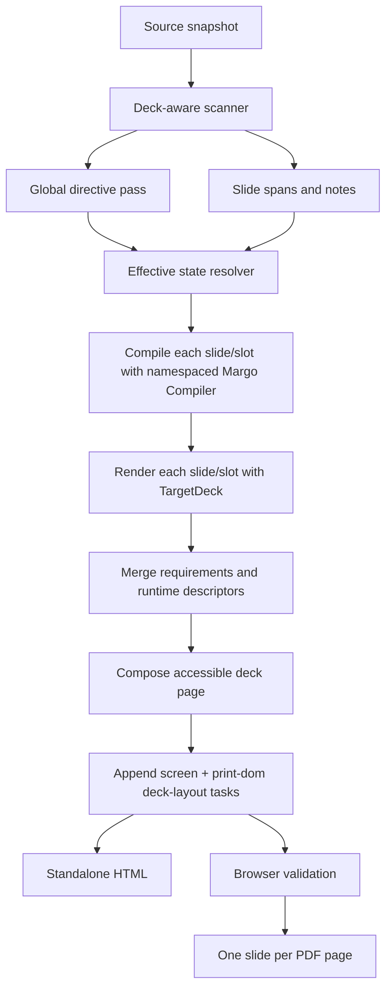

# Margo Slide Decks v0.0.1

**Status:** Revised draft — awaiting round 7 adversarial review
**Date:** 2026-08-19
**Scope:** Stable, versioned **Margo Marpit-compatible profile v0.0.1** slide
authoring, HTML presentation, and PDF export through Margo's existing compiler
and runtime. This is a conformance profile, not a claim that every Marpit or
Marp Core feature is accepted.
**Out of scope:** arbitrary document-authored CSS, experimental inline-SVG
slides, multiple or filtered backgrounds, presenter UI, fullscreen, transitions,
fragments, PPTX, and remote browser acquisition.

## 1. Context

Margo already has an experimental `deck` package and `margo deck` command. The
current implementation provides:

- exact `---` slide splitting outside fenced code blocks;
- optional title and description frontmatter;
- compilation of each slide with `margo.TargetDeck`;
- complete standalone HTML with Previous, Next, Print, ArrowLeft, ArrowRight,
  Home, and End controls;
- print CSS that emits one section per page;
- PDF export through the existing Margo PDF pipeline;
- composed Mermaid runtime descriptors across slides;
- optional Goshtoso Charts when the supplied compiler registers the charts
  extension.

The implementation is deliberately marked experimental. It does not implement
the accepted Margo Marpit-compatible profile: typed directives, inherited and
spot state, presenter notes, layout presets, 16:9/4:3/custom geometry, or
browser-owned deck overflow validation.

This design finishes that profile without introducing Marpit or another
JavaScript Markdown implementation as a dependency. Marpit remains the
versioned authoring reference. Margo remains the parser, semantic renderer,
policy authority, runtime, and exporter.

## 2. Product contract

Margo decks are importable-library functionality first and CLI functionality
second. The same source and configuration must produce equivalent semantic HTML
through both paths.

The stable authoring contract consists of:

1. ordinary Margo Markdown content;
2. explicit deck activation;
3. exact slide separators or `headingDivider`;
4. the closed Margo Marpit-compatible v0.0.1 directive set;
5. a closed Margo layout-class catalog;
6. Margo's existing themes, extensions, policy, and runtime;
7. standalone HTML presentation;
8. PDF with the same slide geometry and one slide per page;
9. terminal overflow validation before CLI publication.

Deck activation is explicit in either of two ways:

- a caller invokes `deck.Parse`, `deck.Render`, or `margo deck`; or
- frontmatter contains `marp: true`, which `deck.Detect` exposes to a host that
  performs automatic routing.

`marp: true` does not silently change `margo.Compiler.Render`. The root compiler
continues treating ordinary Markdown as one ordinary document. This keeps the
core API unsurprising and makes deck routing a host decision.

When a caller already selected the deck API or command, `marp: true` is optional.
If present, it must be boolean and true. `marp: false` under explicit deck
activation is rejected as contradictory configuration.

## 3. Compatibility boundary

### 3.0 Profile and deliberate divergences

The reference matrix is Marpit `main` documentation as of 2026-08-19 plus Marp
Core's documented `size` extension. Margo implements only the rows marked
**accepted**; every other row has a stable diagnostic and is not silently
interpreted as a different feature.

| Reference behavior | v0.0.1 behavior | Diagnostic/fixture |
| --- | --- | --- |
| Scalar `headingDivider: N` | **Accepted:** inclusive upper-bound semantics; headings H1 through HN start a slide, while H(N+1)–H6 remain content. | `heading-divider-scalar.md` |
| Array `headingDivider: [N...]` | **Accepted:** exact-level semantics; only listed levels start a slide. | `heading-divider-exact.md` |
| Top-level CommonMark thematic breaks outside protected regions | **Accepted:** every valid CommonMark `hr` spelling, with CommonMark Setext H2 precedence, normalized to one slide break. | `slide-rulers.md` |
| Global/local/spot directives | **Accepted:** only the closed tables below. | `directive-corpus.md` |
| `size` | **Accepted as a Margo/Marp Core extension**, not Marpit core. | `size-extension.md` |
| `colorMode` | **Accepted Margo extension:** explicit `light` or `dark` token family. | Section 4.2 token matrix |
| Margo themes/classes | **Accepted:** only the three built-in Margo catalogs below; arbitrary Marp theme classes are rejected. | Section 4.2 visual matrix + computed-style fixtures |
| Repeated non-inline background images | **Accepted:** last valid background wins, matching Marpit's non-inline projection. | `background-last-wins.md` |
| Multiple/vertical/filter/inline-SVG backgrounds | **Deferred:** no projection in v0.0.1. | `deck.image_feature_unsupported` |
| Directive-comment notes | **Accepted:** grammar below; malformed recognized directives error, ordinary comments remain notes. | `directive-comment-boundary.md` |

The existing `docs/GOSHTOSO_MARKDOWN_DESIGN.md` note rule is superseded for
deck-mode input by section 3.3 below; ordinary non-deck Markdown keeps its
existing rule. Its deck-mode native-engine fallback statement
(`docs/GOSHTOSO_MARKDOWN_DESIGN.md:949-951`) is also superseded: v0.0.1 deck
validation requires the Chromium-compatible browser profile and never treats
the native engine as visually validated. Ordinary non-deck PDF behavior is
unchanged.

### 3.1 Global directives

The v0.0.1 profile supports these global directives in opening YAML frontmatter
or directive comments:

| Directive | Accepted value | Meaning |
| --- | --- | --- |
| `theme` | `modern`, `goshtoso`, or `minimal` | Theme for every slide. Last global value wins. |
| `lang` | BCP 47-style language tag | Default language for every slide. |
| `colorMode` | `light` or `dark` | Built-in theme token family. |
| `headingDivider` | integer 1–6 or unique list of integers 1–6 | Scalar starts slides at H1 through HN; array starts slides at exactly the listed levels. |
| `size` | `16:9`, `4:3`, or bounded custom dimensions | Deck geometry. One geometry per deck. |
| `style` | any | Recognized and rejected as `deck.directive_unsupported`. |

The legacy `$` global prefix is not supported. It produces a migration
diagnostic explaining the unprefixed form. `style` is intentionally recognized
only to fail closed; document-authored CSS is never emitted.

### 3.2 Local directives

Local directives apply to the slide where declared and all following slides:

| Directive | Accepted value |
| --- | --- |
| `paginate` | `true`, `false`, `hold`, `skip`, or `none` (restore default) |
| `header` | bounded inline Markdown or `none` |
| `footer` | bounded inline Markdown or `none` |
| `class` | one or more names from the exact selected-theme catalog below, or `none` |
| `color` | one `ColorToken` from the finite palette below, or `none` |
| `backgroundColor` | one `ColorToken` from the finite palette below, or `none` |
| `backgroundImage` | one policy-validated local asset reference, enumerated gradient token, or `none` |
| `backgroundPosition` | one of `center`, `top`, `bottom`, `left`, `right`, `top-left`, `top-right`, `bottom-left`, `bottom-right`, or `none` |
| `backgroundRepeat` | `no-repeat`, `repeat`, `repeat-x`, `repeat-y`, or `none` |
| `backgroundSize` | `cover`, `contain`, `auto`, or `none` |
| `backgroundDecorative` | boolean or `none`; default `false` for local image assets and `true` for gradient tokens |
| `backgroundAlt` | bounded plain text or `none`; required for non-decorative local assets |

The finite `ColorToken` palette is `surface`, `surface-alt`, `ink`,
`ink-muted`, `accent`, `accent-strong`, `positive`, `warning`, `negative`,
`info`, and `transparent`. Gradient tokens are `gradient-blue`,
`gradient-violet`, `gradient-sunset`, and `gradient-forest`. Positions,
repeat, and sizing are lookup values, never arbitrary CSS fragments. Hex,
RGB/HSL, gradients, percentages, lengths, variables, and `url()` values in
these directives are rejected with `deck.color_invalid` or
`deck.background_invalid`.

Prefixing a local name with `_` makes it a spot directive. Spot state applies
only to the slide where declared and does not change inherited state. A slide's
effective state is:

```text
theme defaults
  -> latest inherited local values
  -> current slide local values
  -> current slide spot values
```

Every inheritable directive has an explicit clear value. YAML `null`/`~` and
the string `none` (where the table names it) clear the inherited value and
restore the theme default: `class: none`, `header: none`, `footer: none`,
`color: none`, `backgroundColor: none`, and `backgroundImage: none` are valid
clears. `backgroundPosition: none`, `backgroundRepeat: none`,
`backgroundSize: none`, and `backgroundAlt: none` restore their defaults.
`paginate: none` restores the theme pagination default. A spot clear affects
only that slide. There is no implicit reset at a slide boundary.

Background source and its accessibility metadata are one typed
`BackgroundState` projection. Assigning a new `backgroundImage` atomically
starts a new projection: it clears the prior `backgroundAlt`, restores the
source-specific decorative default, and restores position/repeat/size defaults
unless those fields occur in the same directive mapping or on the same slide
after the new source. Assigning `backgroundImage: none` clears the whole
projection. An image asset with `backgroundDecorative: false` must receive a
fresh `backgroundAlt`; stale metadata is never reused for a new source.

Presentation authority is explicit. The precedence is

```text
RenderOption override
  -> non-zero RenderInput.Theme/ColorMode (including CLI values)
  -> valid frontmatter/directive `theme`/`colorMode`
  -> modern + light defaults
```

Two explicit API layers that disagree fail with `deck.presentation_conflict`;
a lower-precedence source value is overridden by a host/API choice and is not
silently merged. `ColorMode` is always `light` or `dark`; there is no
environment-dependent `auto` mode. The six theme/mode token rows and their
light/dark projections are frozen in section 4.2 and included in the
fingerprint.

Global directives are deck-wide even when encountered after the first slide.
They are resolved in a first pass before local state is projected. Repeated
values are parsed and validated before resolution; **any invalid recognized
occurrence is terminal**, even when a later valid value exists. Among valid
occurrences, the final value wins for global, inherited local, and spot state.

### 3.3 Presenter notes

Directive comments have this exact grammar: after trimming the HTML comment
body, the body must be one YAML mapping whose keys are recognized global/local
names (with an optional leading `_` for spot state), and whose values contain no
anchors, aliases, tags, or nested mappings except the documented `size` mapping.
The scanner parses the complete comment as one mapping; a recognized key with
malformed YAML is an error, not a note. HTML comments containing no recognized
key are presenter notes. Comments inside fenced code, inline code, or YAML
frontmatter are protected and remain ordinary source content. Notes are removed
from visible Markdown and stored in source order on the owning slide. The
public slide model returns defensive copies of notes.

The structural comments `layout: NAME`, `slot: NAME`, and `/layout` are a
separate scanner grammar used only by section 4.1. They are neither directives
nor notes; malformed or out-of-order structural comments produce the layout
diagnostics in section 11.

Presenter notes are metadata only in v0.0.1. Standalone HTML may embed them in a
non-rendered JSON payload for host inspection, but Margo provides no presenter
view, second window, timer, or remote control.

Recognized directive comments are not notes. Malformed comments that appear to
start a recognized directive fail with a positioned diagnostic rather than
falling back to a note.

### 3.4 Slide separators and heading dividers

The deck scanner classifies candidate lines with Goldmark/CommonMark block
context before splitting. A top-level line with zero through three leading
spaces matching the thematic-break grammar (three or more identical `-`, `_`,
or `*` markers separated only by spaces or tabs) separates slides, except when
CommonMark classifies the line as a Setext H2 underline for the preceding
paragraph (`Title` followed by `---`, including 0–3 leading spaces). Setext
classification wins that ambiguity. Four or more leading spaces, list/blockquote
containers, and indented code remain ordinary Markdown. Existing CRLF and
tilde-fence behavior is preserved.

When scalar `headingDivider: N` is active, headings at levels 1 through N start
slides; deeper headings remain content. When an array is active, only headings
at one of the listed levels start slides. Explicit separators and heading
dividers may coexist. Empty slides are rejected after all splitting and
directive removal.

## 4. Layout and geometry

### 4.1 Built-in layout catalog and authoring contract

The `deck/` package is the single owner of the catalog, normalized layout model,
generated class names, and CSS for all built-in themes. Themes may change
tokens and typography but may not change the structural catalog in v0.0.1.
The default layout has no class. The exact shared catalog is:

| Class | Purpose |
| --- | --- |
| `lead` | Centered opening or closing slide. |
| `section` | Section divider. |
| `chapter` | Numbered chapter divider. |
| `quote` | Prominent quotation or statement. |
| `columns` | Balanced two-column content. |
| `sidebar` | Two-thirds content plus one-third rail. |
| `compare` | Symmetric A/B comparison. |
| `metrics` | Three or four KPI cards. |
| `timeline` | Horizontal three-to-six-step sequence. |
| `demo` | Code and result side by side. |
| `invert` | Inverted color scheme. |

`lead`, `section`, `chapter`, `quote`, and `invert` are style-only classes and
do not change child structure. `columns`, `sidebar`, `compare`, `metrics`,
`timeline`, and `demo` are structural classes and require the marker syntax
below. Exactly one structural class is allowed; `invert` may be added to it.
All other combinations fail with `deck.class_combination_invalid`.

Structural source syntax is ordinary Markdown plus recognized HTML comments:

```markdown
<!-- _class: columns -->
<!-- layout: columns -->
<!-- slot: left -->
## Left
Content
<!-- slot: right -->
## Right
Content
<!-- /layout -->
```

The class and layout marker must agree. Slot names and cardinalities are fixed:

Slide splitting (explicit ruler and `headingDivider`) runs before layout block
parsing. A layout block may not cross a slide boundary; a marker split across
slides is `deck.layout_invalid`.

| Structural class | Required slots and count |
| --- | --- |
| `columns` | `left`, `right`, exactly 2, both non-empty |
| `sidebar` | `main`, `rail`, exactly 2, both non-empty |
| `compare` | `left`, `right`, exactly 2, both non-empty |
| `metrics` | `metric-1` through `metric-3` or `metric-4`, exactly 3 or 4, all non-empty |
| `timeline` | `step-1` through `step-3`..`step-6`, exactly 3–6, all non-empty and source ordered |
| `demo` | `code`, `result`, exactly 2, both non-empty |

Missing, duplicate, empty, out-of-range, nested, or mismatched markers fail
with `deck.layout_slots_required`, `deck.slot_invalid`, or
`deck.layout_invalid`; there is no heuristic fallback. Unmarked content with a
style-only class remains a normal slide.

Every structural slide emits this normalized DOM shape (slot content is the
same `TargetDeck` semantic HTML used by ordinary rendering):

```html
<section class="margo-deck__slide margo-deck__slide--columns" id="slide-0001">
  <div class="margo-layout margo-layout--columns">
    <div class="margo-layout__slot margo-layout__slot--left">...</div>
    <div class="margo-layout__slot margo-layout__slot--right">...</div>
  </div>
</section>
```

`timeline` uses an ordered list with `li` slots; all other structural layouts
use `div` slots. Source order is DOM, reading, and keyboard order. CSS must not
reorder slots. A `metrics` layout has `role="group"` and an accessible label
from its first heading, otherwise the localized `metrics` label. Themes must
implement this exact DOM/class contract. The positive and negative fixtures
listed in section 14 prove source-to-model-to-DOM behavior for every class.

The built-in themes are exactly `modern`, `goshtoso`, and `minimal`. Each
supports the full catalog above, the no-class default, and `invert` plus one
structural class. Their token/typography mappings are owned by `deck/` and are
frozen in section 4.2; no arbitrary registered Marp theme name or author CSS is
accepted.

The v0.0.1 token values are frozen so independent implementations can agree:

| Theme/mode | surface | surface-alt | ink | ink-muted | accent | accent-strong | positive | warning | negative | info |
| --- | --- | --- | --- | --- | --- | --- | --- | --- | --- | --- |
| `modern/light` | `#ffffff` | `#f3f4f6` | `#111827` | `#4b5563` | `#0f766e` | `#115e59` | `#166534` | `#92400e` | `#b91c1c` | `#1d4ed8` |
| `modern/dark` | `#111827` | `#1f2937` | `#f9fafb` | `#d1d5db` | `#5eead4` | `#99f6e4` | `#86efac` | `#fde68a` | `#fca5a5` | `#93c5fd` |
| `goshtoso/light` | `#ffffff` | `#f1f5f9` | `#0f172a` | `#475569` | `#0e7490` | `#155e75` | `#166534` | `#92400e` | `#b91c1c` | `#1d4ed8` |
| `goshtoso/dark` | `#0f172a` | `#1e293b` | `#f8fafc` | `#cbd5e1` | `#67e8f9` | `#22d3ee` | `#86efac` | `#fde68a` | `#fca5a5` | `#93c5fd` |
| `minimal/light` | `#ffffff` | `#fafafa` | `#000000` | `#404040` | `#1f2937` | `#111827` | `#14532d` | `#854d0e` | `#991b1b` | `#1e3a8a` |
| `minimal/dark` | `#000000` | `#171717` | `#fafafa` | `#d4d4d4` | `#a3a3a3` | `#e5e5e5` | `#86efac` | `#fde68a` | `#fca5a5` | `#93c5fd` |

The allowed contrast matrix is also frozen: `ink`, `ink-muted`, `accent-strong`,
`positive`, `warning`, `negative`, and `info` may be foreground on `surface` or
`surface-alt`; `surface` or `surface-alt` may be foreground on any of those
seven accent/status tokens. `accent` is a background-only token and may pair
with `surface`/`surface-alt` foreground. `transparent` inherits the nearest
surface and cannot be selected as foreground. Every listed pair is tested at
normal and large-text thresholds; any unlisted pair fails
`deck.contrast_invalid`.
The fixture generator computes WCAG relative luminance for every allowed
foreground/background direction in all six theme/mode rows and records the
ratio to three decimal places; prose values are never trusted as the proof.
The current frozen minima are `modern/light 4.973`, `modern/dark 7.734`,
`goshtoso/light 4.891`, `goshtoso/dark 7.708`, `minimal/light 6.564`, and
`minimal/dark 7.107`.

### 4.2 Normative visual token and grid matrix

This section is the visual source of truth; generated computed-style fixtures
must reproduce it rather than define new behavior. All dimensions are
logical CSS pixels at 96 DPI. The shared spacing scale is 8/16/24/32/48/64;
themes may select only the values listed here.

| Theme | Font stacks (body / heading / code) | Body / H1 / H2 / H3 sizes and line heights | Canvas padding (x/y) | Header / footer zones | Card radius / border |
| --- | --- | --- | --- | --- | --- |
| `modern` | `Margo Sans` / `Margo Sans` / `Margo Mono` | 24/1.35; 64/1.05; 40/1.10; 28/1.20 | 64 / 56 | 32px / 24px, 16px content gap | 20px / 1px |
| `goshtoso` | `Margo Sans` / `Margo Sans` / `Margo Mono` | 22/1.40; 60/1.05; 38/1.12; 26/1.22 | 56 / 48 | 32px / 24px, 16px content gap | 12px / 1px |
| `minimal` | `Margo Sans` / `Margo Serif` / `Margo Mono` | 22/1.40; 58/1.05; 36/1.15; 26/1.25 | 72 / 64 | 28px / 20px, 16px content gap | 0px / 1px |

Canonical screen and PDF validation load these exact versioned faces from
`deck/assets`: `Margo Sans` weights 400/600/700/800, `Margo Serif` weights
400/600/700, and `Margo Mono` weights 400/600. The asset lock records each WOFF2
SHA-256, upstream version, and SPDX/OFL license provenance; its aggregate lock
digest populates `margo.RuntimeValidationRequest.ExpectedFontBundleDigest`.
The expected and observed values use the same `margo-font-bundle/v1` digest
preimage. Start with the UTF-8 bytes `margo-font-bundle/v1` followed by NUL.
For each required `(family, weight)` in theme-row order (body family, then
heading family if new, then code family if new; weights ascending within each
family), append UTF-8 family, NUL, ASCII decimal weight, NUL, an unsigned
big-endian 64-bit byte length, and the exact raw WOFF2 bytes. The per-file
SHA-256, upstream version, and license metadata remain in the lock for audit
but are not digest inputs. The validator reads the same required face set and
raw bytes, in the same order and framing, so the two values are comparable.
Known-answer fixture: entries `(Margo Sans,400,[00 01 02])`,
`(Margo Sans,700,[03 04 05])`, `(Margo Mono,400,[06 07])` produce a 98-byte
preimage and digest
`ca7de7d8ae3ee43e4984afd2b18a81825ab383bfd379d2d93b986d4c5d59aaa1`.
A missing required face is `deck.fonts_unavailable`. System fallback is
permitted only for interactive, non-canonical viewing, and artifacts from
different platform/font-bundle profiles are intentionally distinct.

The content grid excludes the header/footer zones and uses the theme padding.
Structural grids are exact: `columns` and `compare` are `1fr 1fr` with a
32px gap; `sidebar` is `2fr 1fr` with a 32px gap; `metrics` is three or four
equal tracks with a 24px gap; `timeline` is three through six equal tracks with
a 24px gap and a 2px center rule; `demo` is `1fr 1fr` with a 32px gap. Slot
padding is 24px for modern/goshtoso and 16px for minimal. Cards use the theme
surface-alt token, the frozen radius/border above, and 24px internal padding
(16px for minimal). No layout may add an unlisted gap or reorder content.

Style-only classes are normative: `lead` centers one content group both axes;
`section` uses H1 plus a 4px accent rule; `quote` uses a 4px accent left border,
32px inset, and italic body; `chapter` displays a 1-based chapter number from
the source-order count of slides carrying `chapter`, with the accessible label
`Chapter N`; `invert` swaps the selected mode's surface/ink roles, keeps
accent/status pairs from the contrast matrix, and preserves all grid metrics.
Header and footer render inside their reserved zones; controls render outside
the logical canvas. These values are asserted by computed-style tests and
approved 16:9/4:3 screen and print reference renders for every theme/layout.

The catalog plus native Markdown and background behavior covers the approved
visual set: cover, standard content, section/chapter, quote, chrome, columns,
sidebar, comparison, metrics, timeline, code preview, full-bleed background,
split media, gradient, table, code, Mermaid, chart, inline image, and notes.

Document authors cannot register classes or CSS. Host-owned custom deck themes
and class registration are deferred until Margo has a separate trusted theme
package contract. This v0.0.1 boundary avoids treating unvalidated CSS as data.

### 4.3 Deck sizes

The default deck size is `16:9`, represented as 1280 × 720 CSS pixels. `4:3` is
960 × 720 CSS pixels. Custom dimensions use this frontmatter shape:

```yaml
size:
  width: 1280
  height: 800
  unit: px
```

Accepted units are static absolute CSS units: `px`, `mm`, `cm`, `in`, `pt`,
`pc`, and `Q`. Width and height must be finite and convert to 320–7680 logical
CSS pixels each, with an aspect ratio between 1:4 and 4:1. Viewport units,
percentages, calculations, variables, mixed units, zero, negative, NaN, and
infinite values are rejected.

One geometry applies to the whole deck. A local or spot `size` directive is
invalid. The normalized public types are:

```go
type DeckUnit string // px, mm, cm, in, pt, pc, Q
type DeckGeometry struct {
    Preset string // "16:9", "4:3", or "custom"
    Width  float64
    Height float64
    Unit   DeckUnit
}
```

Exactly one geometry source is permitted. Precedence and legacy conflict rules
are:

```text
explicit new Go API or `--slide-*` CLI option
  -> frontmatter/global `size`
  -> legacy `margo.page` or old `--page-size` mapping (one deprecation cycle)
  -> 16:9 default
```

If new and legacy sources are both explicitly set to different geometry, the
command fails with `cli.deck_geometry_conflict`; if they agree, the new source
wins and a deprecation warning is emitted. `margo.page` is never merged with a
deck size. The old `--page-size` accepts only A4/Letter and maps to the
corresponding named fallback. Width and height are finite positive values within
resource limits; custom units are converted to logical CSS pixels at 96 DPI.
Legacy `--orientation`/`margo.page.orientation` applies only to that named
A4/Letter fallback. Supplying it with a custom `--slide-size` is a geometry
conflict because custom width and height already encode orientation.

Margins default to zero on all sides. Explicit Go API or CLI margins retain the
existing independent-side semantics. PDF document defaults remain unchanged.

### 4.4 PDF page contract

The generic PDF page contract gains an optional custom absolute size while
preserving A4 and Letter compatibility. The implementation may add a public
`pdf.CustomPageSize` and `PageConfig.Custom` field with this frozen shape:

```go
type CustomPageSize struct {
    WidthMM  Millimeters `json:"widthMm"`
    HeightMM Millimeters `json:"heightMm"`
}
type PageConfig struct {
    Size          PageSize            `json:"size"`
    Orientation   Orientation         `json:"orientation"`
    Custom        *CustomPageSize     `json:"custom,omitempty"`
    Margins       Margins             `json:"margins"`
    ImageOverflow ImageOverflowPolicy `json:"imageOverflow,omitempty"`
}
```

`Custom == nil` is the zero/legacy state; `Custom != nil` requires finite
positive millimetres and `Size == ""`, `Orientation == ""`. Named A4/Letter
requires `Custom == nil` and keeps existing orientation defaults. Exactly one
source defines geometry:

- named `A4` or `Letter`; or
- explicit absolute width and height.

Deck `16:9`, `4:3`, and custom sizes resolve to explicit PDF width and height.
The Chromium engine emits matching `@page size` CSS and continues using
`PreferCSSPageSize`. Orientation is meaningful only for A4 and Letter. Explicit
deck dimensions already encode orientation.

The CLI adds deck-specific `--slide-size 16:9|4:3|custom`, `--slide-width`,
`--slide-height`, and `--slide-unit`. Existing paper-oriented deck flags remain
accepted for one deprecation cycle and map to A4 or Letter deck geometry.

### 4.5 Responsive stage and measurement coordinates

Standalone HTML contains a visual stage around the logical canvas:

```html
<div class="margo-deck-stage">
  <article class="margo-deck" data-margo-width="1280" data-margo-height="720">
    ...sections...
  </article>
  <nav class="margo-deck-controls">...</nav>
</div>
```

The article is always the logical canvas width/height. The stage reserves
controls outside that canvas. The controls reservation is exactly 48px high
plus a 16px gap, so `availableHeight = stageHeight - 64px`. It uses
`scale = min(availableWidth / logicalWidth, availableHeight / logicalHeight)`
with origin centered and no upscale above `1.5`. `ResizeObserver` recomputes a
scale quantized to 1/64; orientation and zoom changes follow the same path.
Letterboxing is intentional. Print media disables the transform, restores the
exact logical dimensions, hides controls, and applies the PDF media box. There
are no scale animations when `prefers-reduced-motion` is set.

Interactive hosts may have any available width/height, but only the pinned CLI
validator profile in section 9 contributes canonical evidence. Host viewport
changes therefore alter presentation scale, not document or artifact identity.

Overflow is measured in one coordinate system: logical, pre-transform CSS
pixels. For a descendant rectangle `r` and its slide rectangle `s`, the
normalized edges are `(r.left - s.left) / scale`, `(r.top - s.top) / scale`,
`(r.right - s.left) / scale`, and `(r.bottom - s.top) / scale`, then quantized
to 1/64. Stage origin is therefore removed before scaling; client/scroll/content
box values are never mixed with transformed values. The runtime reports both
screen and print measurements and uses the same 1/64 tolerance in each space.

## 5. Image and background behavior

The profile supports:

- ordinary Margo inline images and captions;
- a single full-slide background image;
- `cover`, `contain`, or `auto` sizing;
- left or right split backgrounds with the fixed `38%` split token;
- local colors and safe gradients through typed directives.

The Marpit image forms `![bg]`, `![bg left]`, `![bg right]`, and
`![bg left:38%]` are recognized structurally in deck mode. They resolve through
Margo's `AssetRef`, local-image materialization, and resource policy. They never
construct CSS by concatenating source text.

The following Marpit features require experimental inline-SVG slide behavior
and are deferred:

- multiple backgrounds;
- vertical background mosaics;
- image filters on advanced backgrounds;
- arbitrary figure captions on background layers.

Using those forms produces `deck.image_feature_unsupported` with a migration
hint. Repeated non-inline background declarations that are otherwise valid use
last-valid-wins semantics; multiple-layer forms remain rejected.

Gradient tokens are decorative by default (`aria-hidden="true"`). A local image
asset is informative by default and therefore requires `backgroundAlt`, unless
the author explicitly sets `backgroundDecorative: true`; Margo then emits
`aria-hidden="true"`. An informative background emits `role="img"` plus the
bounded alternative, and a slide may never rely on a background alone for
meaning. Missing alternatives fail with `deck.background_alt_required`.

## 6. Margo feature parity

Each slide (and each structural slot) is compiled by the caller-supplied
immutable `margo.Compiler` and rendered with `margo.TargetDeck`. The deck
package does not maintain a second Markdown renderer. Every compilation uses a
render-wide allocator with deterministic namespace `slide-NNNN` or
`slide-NNNN-slot-NAME`:

```go
type RenderIDAllocator interface {
    Allocate(kind, sourceKey string) string
    Resolve(kind, sourceKey string) (string, bool)
}
```

The compiler receives this allocator through an exported immutable render
option, and every extension render session receives the same allocator in its
render context. It owns headings, footnotes, table IDs, Mermaid caption/source
IDs, chart IDs, `id`/`for` attributes, `aria-*` references, and fragment hrefs.
The `(kind, sourceKey)` pair is globally typed and unique within one slide or
slot. Allocation is idempotent for a repeated pair and injective across
distinct pairs; `Resolve` accepts the same kind and key and returns exactly the
allocated ID. An extension opts in through the explicit
`NamespacedIDsV1` render-session capability; one that cannot declare that
capability is rejected in deck mode with `deck.extension_id_unsafe`. Arbitrary
registered extensions are not a bypass.
The deck package never string-rewrites arbitrary HTML after rendering.

Every root feature compatible with `TargetDeck` therefore remains available:

- CommonMark headings, paragraphs, lists, quotes, links, and images;
- GFM tables, strikethrough, task lists, and autolinks;
- footnotes and deterministic heading IDs;
- fenced code blocks and Margo's code adapter;
- Mermaid using the pinned restrictive runtime;
- any registered extension fence that declares render-wide ID allocator
  support; an unsafe extension fails closed in deck mode;
- sanitized `margo-html-v1` under effective host policy;
- natural iframe author syntax and the deck target's configured projection.

Goshtoso Charts remain optional at the Go package boundary. A caller obtains
charts by supplying a compiler configured with `charts.Extension`. The Margo
CLI already creates that compiler and therefore supports all current v1 chart
families inside decks:

- bar;
- line;
- pie;
- doughnut;
- scatter;
- static authoring mode (interactive charts are reserved for standalone HTML,
  sites, and standalone PDF);
- semantic exact-data fallback tables;
- print visibility controlled by the existing chart print option. `margo check --target deck` rejects an interactive chart before rendering.

The deck package must not import `github.com/araihu/margo/charts`. It merges the
requirements and runtime descriptors returned by the supplied compiler. During
PDF projection, interactive charts settle to their existing printable static
representation.

Root-feature parity is guaranteed within a slide or slot. Cross-slide and
cross-slot footnote definitions, reference definitions, and fragment links are
rejected with `deck.cross_slide_reference` or `deck.cross_slot_reference`
rather than producing duplicate IDs or dangling backlinks. Same-slide/slot
links are rebased to the namespace and remain functional. Deck orchestration
remaps source coordinates from slide-local offsets to the original file and
adds `/slides/<zero-based-index>` to the diagnostic pointer. Feature failures
otherwise retain their existing diagnostic code.

## 7. Parse and render architecture



Parsing uses a deck-aware line scanner around the existing Goldmark pipeline.
The scanner owns only constructs that must be recognized before normal Markdown:
opening frontmatter, separators, directive comments, presenter notes,
`headingDivider`, and deck background image syntax. Slide Markdown remains
ordinary Margo input.

The immutable public model contains:

- original source name;
- normalized deck metadata;
- effective presentation geometry;
- ordered slides;
- each slide's stable ordinal and ID;
- original source span;
- Markdown snapshot after deck-only syntax removal;
- presenter-note snapshots;
- effective local directive state.

The normalized directive state is a typed `DirectiveState` containing only enum
tokens, bounded strings, validated `AssetRef`s, and the `DeckGeometry` value.
Its canonical serializer is length-prefixed UTF-8 with sorted map keys and
explicit enum names; generated theme CSS is selected from finite lookup tables
keyed by these values. No source string is interpolated into a style attribute,
stylesheet, class name, URL, or script. Parser tests include hostile CSS-like
values and assert both rejection and absence from emitted HTML/CSS.

All byte slices, notes, class lists, maps, and diagnostics returned by public
methods are defensive copies.

`deck.Render` retains its current call shape and adds variadic render options:

```go
func Render(
    ctx context.Context,
    compiler *margo.Compiler,
    input RenderInput,
    options ...RenderOption,
) (*Result, error)
```

Existing callers compile unchanged. Options provide explicit metadata and
geometry/presentation/validation-request overrides. `WithTheme`,
`WithColorMode`, `WithGeometry`, and `WithValidationRequest` each set one
immutable override; a zero option means absent, and two differing explicit
options fail with `deck.presentation_conflict` or `deck.geometry_conflict`.
`WithValidationRequest` may override only viewport width/height, device scale,
zoom, and registered browser profile. Its `ExpectedFontBundleDigest` field is
not author-controlled: an empty value is filled from the selected theme's
immutable asset lock, and any non-empty value must equal that derived digest or
render fails with `deck.validator_profile_mismatch`. `Render` resolves this
request before compiling slides, and `Result.RuntimeDescriptor(instance)`
carries the resolved request into the immutable descriptor and every
mode-bound `deck-layout` task input hash. Existing callers receive the
canonical default profile. They do not grant host-policy capabilities.

## 8. HTML semantics and presentation runtime

The document structure is:

```html
<html lang="pt-BR">
  <body>
    <div class="margo-deck-stage">
      <article class="margo-deck">
        <section class="margo-deck__slide"></section>
      </article>
      <nav class="margo-deck-controls"></nav>
    </div>
  </body>
</html>
```

The deck `lang` directive propagates to `<html lang>` and every slide section.
Control and slide labels resolve exact BCP 47 tag, then language subtag, then
English (`en`) fallback. v0.0.1 ships `pt-BR`, `pt`, and `en` label tables; the
fallback is deterministic and is covered by DOM fixtures.

Every section has:

- stable `slide-NNNN` ID;
- zero-based `data-margo-slide` index;
- `role="region"`;
- localized `aria-label="Slide N of M"`;
- `tabindex="-1"`;
- effective registered classes;
- typed data attributes needed by theme CSS;
- optional semantic `header`, `footer`, and pagination output;
- no inline style derived from untrusted source text.

All foreground/background token pairs are checked against the built-in contrast
table before rendering. Normal text must be at least 4.5:1 and large text at
least 3:1. An invalid pair fails with `deck.contrast_invalid`; no accepted
author input can claim an inaccessible arbitrary color combination. Focusable
controls have a visible focus indicator, remain keyboard reachable, and never
depend on visual order differing from DOM order.

The existing Previous, Next, Print, ArrowLeft, ArrowRight, Home, and End
behavior remains. Controls expose localized labels and disabled states. The
runtime respects `prefers-reduced-motion`; v0.0.1 adds no transitions.

Printing reveals every slide and suppresses controls. Screen restoration after
print returns to the same active slide and focus state.

## 9. Runtime layout validation

`Result.RuntimeDescriptor(instance)` composes every slide runtime descriptor,
binds the validation request resolved during `Render`, and appends two immutable
mode-bound tasks:

- `ri-00000042:deck-layout-screen:00000000:0000000000000000000000000000000000000000000000000000000000000000`, kind `deck-layout-screen`;
- `ri-00000042:deck-layout-print-dom:00000000:1111111111111111111111111111111111111111111111111111111111111111`, kind `deck-layout-print-dom`.

Both depend on all Mermaid and other visual tasks from all slides. A
profile-specific render produces a profile-specific descriptor; callers cannot
mutate the descriptor after construction. `Result.ScreenRuntimeDescriptor`
creates an advisory screen-only descriptor for the embedded HTML runtime; it is
never used for the CLI publication gate.

Task IDs use Margo's existing four-component grammar
`<renderInstance>:<kind>:<8-decimal-ordinal>:<64-lowercase-input-sha256>`;
the examples above use fixture digests and the implementation derives the final
IDs through the existing projection/rebasing helper when descriptors are
composed.

```go
func (r *Result) RuntimeDescriptor(instance margo.RenderInstanceID) (margo.RuntimeDescriptor, error)
func (r *Result) ScreenRuntimeDescriptor(instance margo.RenderInstanceID) (margo.RuntimeDescriptor, error)
```

The public validation seams are:

```go
// The mode is an internal discriminator taken from the task kind; it is not a
// public validator argument.
type validationMode string // "screen" or "print-dom"

// Root-owned, profile-neutral types live in package margo, not package deck.
const RuntimeProtocolV2 = "margo-runtime/v2"

type RuntimeValidationRequest struct {
    ViewportWidth          uint    `json:"viewportWidth"`
    ViewportHeight         uint    `json:"viewportHeight"`
    DeviceScaleFactor      float64 `json:"deviceScaleFactor"`
    Zoom                   float64 `json:"zoom"`
    BrowserProfile         string  `json:"browserProfile"`
    ExpectedFontBundleDigest string `json:"expectedFontBundleDigest"`
}
type RuntimeValidationIdentity struct {
    BrowserProfile   string `json:"browserProfile"`
    EngineName       string `json:"engineName"`
    EngineVersion    string `json:"engineVersion"`
    PlatformProfile  string `json:"platformProfile"`
    FontBundleDigest string `json:"fontBundleDigest"`
}

type LayoutValidator interface {
    Validate(context.Context, []byte, margo.RuntimeDescriptor) (margo.RuntimeReport, error)
}
type PDFArtifactValidator interface {
    Validate(context.Context, []byte, DeckGeometry, int) (PDFArtifactReport, error)
}
type PDFMediaBoxMicrometers struct {
    Index              int   `json:"index"`
    LeftMicrometers    int64 `json:"leftMicrometers"`
    BottomMicrometers  int64 `json:"bottomMicrometers"`
    RightMicrometers   int64 `json:"rightMicrometers"`
    TopMicrometers     int64 `json:"topMicrometers"`
}
type PDFArtifactReport struct {
    PageCount             int                       `json:"pageCount"`
    MediaBoxesMicrometers []PDFMediaBoxMicrometers `json:"mediaBoxesMicrometers"`
    EvidenceSHA256        string                    `json:"evidenceSHA256"`
    EvidenceBytes         int64                     `json:"evidenceBytes"`
    Valid                 bool                      `json:"valid"`
}
```

Deck uses the root-owned `margo.RuntimeValidationRequest` and never embeds a
deck-local profile type in root wire types. Profile-bound deck descriptors and
reports use protocol `margo-runtime/v2`; ordinary non-deck descriptors remain
`margo-runtime/v1`. The root package adds `RuntimeProtocolV2` and accepts the
following exact field sets with strict unknown-field rejection:

- A v2 descriptor has the existing `protocol`, `documentFingerprint`,
  `renderInstanceID`, and `tasks` fields plus one non-null
  `validationRequest`. It never contains `validationIdentity`.
- A v2 report has the existing report fields plus one `validationIdentity` on
  success. It never contains `validationRequest`. A failed report may omit the
  identity only when it contains a terminal error diagnostic; if present, the
  identity is still validated. v1 rejects both v2 fields.
- `RuntimeValidationRequest` fields are all required and validated (positive
  viewport, finite positive device scale and zoom, registered browser profile,
  and a lowercase 64-hex expected font digest). Identity fields are all
  non-empty; `FontBundleDigest` is lowercase 64-hex and
  `BrowserProfile` is the profile actually used by the validator.
- `ParseRuntimeDescriptor` and `ParseRuntimeReport` reject unknown fields,
  clone nested request/identity values defensively, and validate the protocol
  branch before returning. `ValidateRuntimeDescriptor` and
  `ValidateRuntimeReport` apply the same rules to in-memory values.
- `ValidateRuntimeReport(descriptor, executionID, report)` authenticates a
  report through descriptor identity and the complete task set. It does not
  compare a request copied into the report (there is none): the descriptor's
  request is bound by every task input hash. For a ready v2 report it also
  requires `report.ValidationIdentity.BrowserProfile` to equal
  `descriptor.ValidationRequest.BrowserProfile` and
  `report.ValidationIdentity.FontBundleDigest` to equal
  `descriptor.ValidationRequest.ExpectedFontBundleDigest`; a font-byte
  mismatch is terminal `deck.font_bundle_mismatch`, while a browser/platform
  profile mismatch or missing identity is terminal
  `deck.validator_profile_mismatch` in the deck projection. A failed v2
  report with a terminal diagnostic may omit identity.

The complete profile descriptor fixture is:

```json
{"documentFingerprint":"2222222222222222222222222222222222222222222222222222222222222222","protocol":"margo-runtime/v2","renderInstanceID":"ri-00000042","tasks":[{"dependsOn":[],"id":"ri-00000042:deck-layout-screen:00000000:0000000000000000000000000000000000000000000000000000000000000000","inputSHA256":"0000000000000000000000000000000000000000000000000000000000000000","kind":"deck-layout-screen"},{"dependsOn":[],"id":"ri-00000042:deck-layout-print-dom:00000000:1111111111111111111111111111111111111111111111111111111111111111","inputSHA256":"1111111111111111111111111111111111111111111111111111111111111111","kind":"deck-layout-print-dom"}],"validationRequest":{"browserProfile":"chromium-deck-v1","deviceScaleFactor":1,"expectedFontBundleDigest":"0123456789abcdef0123456789abcdef0123456789abcdef0123456789abcdef","viewportHeight":900,"viewportWidth":1440,"zoom":1}}
```

The complete successful profile report fixture is separate and contains only
the observed identity (the request is authenticated through the descriptor and
the task input hashes):

```json
{"blockedRequests":[],"diagnostic":null,"documentFingerprint":"2222222222222222222222222222222222222222222222222222222222222222","executionID":"exec-00000001","fontChecks":[],"layout":{"scrollHeight":720,"scrollWidth":1280},"protocol":"margo-runtime/v2","renderInstanceID":"ri-00000042","status":"ready","tasks":[{"errorCode":"","id":"ri-00000042:deck-layout-screen:00000000:0000000000000000000000000000000000000000000000000000000000000000","inputSHA256":"0000000000000000000000000000000000000000000000000000000000000000","kind":"deck-layout-screen","outputBytes":591,"outputSHA256":"7607ff18b557f266204e5aca736720a81e759c4bf41fcfe54c624b327bc8daff","status":"succeeded"},{"errorCode":"","id":"ri-00000042:deck-layout-print-dom:00000000:1111111111111111111111111111111111111111111111111111111111111111","inputSHA256":"1111111111111111111111111111111111111111111111111111111111111111","kind":"deck-layout-print-dom","outputBytes":589,"outputSHA256":"d21e69d21eb21880fdbb82775e881f768fd27144c4aff4eba6872db225f5c79f","status":"succeeded"}],"validationIdentity":{"browserProfile":"chromium-deck-v1","engineName":"Chromium","engineVersion":"123.0.0.0","fontBundleDigest":"0123456789abcdef0123456789abcdef0123456789abcdef0123456789abcdef","platformProfile":"darwin-arm64"}}
```

The root structs expose these exact optional pointers:

```go
type RuntimeDescriptor struct {
    // existing identity and tasks...
    ValidationRequest *RuntimeValidationRequest `json:"validationRequest,omitempty"`
}
type RuntimeReport struct {
    // existing identity, tasks, layout, and diagnostic...
    ValidationIdentity *RuntimeValidationIdentity `json:"validationIdentity,omitempty"`
}
```

`RuntimeDescriptor.validationRequest` is required for v2 deck descriptors and
is included in every task input preimage. `RuntimeReport.validationIdentity` is
required for a successful v2 report and is populated from observed browser,
platform, and font bytes by the validator; it is not caller-supplied
configuration. Root parsing rejects unknown v2 fields, rejects v1 descriptors
that contain either field, clones both values defensively, and
`ValidateRuntimeReport` requires every descriptor task plus the profile checks
above. The profile-neutral root types avoid an import cycle while keeping the
deck projection able to emit `deck.validator_profile_mismatch`.

The full CLI `LayoutValidator.Validate` call executes both mode-bound tasks in
descriptor order and returns one terminal root report containing both task
entries. It has no mode argument, so one task cannot legitimately produce two
mode outputs. `ScreenRuntimeDescriptor` contains only the screen task and may
be validated separately for embedded advisory behavior; its report is not
composed into the full CLI report. A descriptor with a task kind that does not
match its canonical payload mode fails `deck.validation_mode_mismatch`.

For the full descriptor, task IDs are generated as
`<renderInstance>:<kind>:<ordinal>:<inputSHA256>`, where `ordinal` is the
zero-based eight-decimal ordinal within that task kind and the final digest is
byte-for-byte the task's `InputSHA256`. Thus the two canonical fixture tasks
use ordinal `00000000` independently and have the valid four-component IDs
shown above. Dependency task IDs retain the existing root grammar; the two
deck-layout tasks depend on the sorted IDs of all dependency tasks.

`Render` returns HTML and the descriptor and never claims visual validity. The
library reuses the existing root `margo.RuntimeReport` identity, task, and
diagnostic validation for screen/print DOM claims; it does not define a parallel
runtime-report type. Existing `RuntimeTaskReport.OutputSHA256` and
`OutputBytes` carry task evidence. A separate `PDFArtifactValidator` report
carries PDF page/media-box evidence. A missing browser returns
`deck.validator_unavailable` (CLI projects this as
`cli.deck_validator_unavailable`) and never falls back to a claimed-valid
report.

`PDFArtifactValidator` converts PDF points to micrometres with
`micrometres = round(points * 25.4 / 72 * 1000)`, so one unit is 0.001mm. It
accepts an absolute difference of at most 10 micrometres (0.01mm) for each of
the four `MediaBox` edges (`left`, `bottom`, `right`, and `top`). v0.0.1
requires every page box to use origin `(0,0)` and compares all four edges;
width and height are derived from right-left and top-bottom. Page count is an
exact integer comparison. The hashed evidence body is a separate,
non-recursive canonical JSON payload containing only version, slideCount,
expected four-edge geometry, and sorted observed page boxes:

```json
{"expected":{"bottomMicrometers":0,"leftMicrometers":0,"rightMicrometers":338667,"topMicrometers":190500},"pages":[{"bottomMicrometers":0,"index":0,"leftMicrometers":0,"rightMicrometers":338667,"topMicrometers":190500}],"slideCount":1,"version":1}
```

For this one-page 1280×720 CSS-pixel fixture, the UTF-8 body is 247 bytes and
has SHA-256
`f503f15c13c8e0c405731c71bc65c6b0d5f4f80403076c6536f868a8bec55867`.
`EvidenceSHA256` and `EvidenceBytes` cover exactly those body bytes and are
stored only in `PDFArtifactReport`; they are never included in the hashed body.

The v0.0.1 validator registry contains exactly the browser profile
`chromium-deck-v1` and platform profiles `darwin-arm64` and
`linux-amd64`; another browser or host profile is unsupported for canonical
CLI evidence. The canonical CLI `RuntimeValidationRequest` is fixed at
1440 × 900 CSS pixels, device-scale-factor 1, zoom 1, and browser profile
`chromium-deck-v1`.
The observed identity additionally includes the actual engine build, host
platform profile, and non-empty font-bundle SHA-256. The validator MUST compare
that observed font digest with `ExpectedFontBundleDigest` before marking either
layout task succeeded; a mismatch emits `deck.font_bundle_mismatch`, leaves the
task without output evidence, and makes the root report terminally failed. The
request is part of the descriptor/task input digest; the observed identity is
part of the validated root report and evidence projection.
The validator derives `FontBundleDigest` by hashing the loaded versioned WOFF2
bytes and derives engine/platform fields from the running browser/host; neither
value is accepted from deck source or a caller assertion.
Other viewport sizes are interactive UX tests, not canonical artifact evidence;
determinism is promised within the exact browser/platform/font-bundle profile,
not across profiles.

`LayoutValidator` reads the request from the supplied immutable descriptor; it
cannot provide a second request at validation time. A browser/platform profile
mismatch or a missing ready-report identity is
`deck.validator_profile_mismatch`; an observed-versus-expected font-byte
mismatch is `deck.font_bundle_mismatch`. Either failure fails root runtime
identity validation.

The deck-layout input digest covers:

- deck document fingerprint;
- selected theme and theme-asset digest;
- normalized geometry and padding;
- ordered slide IDs;
- mode (`screen` or `print-dom`);
- effective classes and presentation directives;
- validation request (viewport, device scale, zoom, browser profile, and the
  derived expected font-bundle digest);
- overflow tolerance version.

After dependencies, fonts, and images settle, the browser validates each slide
in logical, pre-transform CSS pixels. For every slide it measures:

- client width and height;
- scroll width and height;
- content-box bounds;
- quantized union of visible descendant bounding boxes.

Any excess beyond 1/64 CSS pixel is `deck.overflow`. Hidden note payloads,
presentation controls, and deliberately clipped background layers are excluded
from the measured content set.

A successful mode-bound `deck-layout` task output is canonical JSON (sorted object keys, no
whitespace) with this mode-specific shape; every numeric geometry value is
quantized to 1/64:

```json
{"logicalCanvas":{"height":720,"width":1280},"mode":"screen","slides":[{"id":"slide-0001","metrics":{"clientHeight":720,"clientWidth":1280,"contentHeight":720,"contentWidth":1280,"descendantUnion":{"bottom":720,"left":0,"right":1280,"top":0},"scrollHeight":720,"scrollWidth":1280}}],"stage":{"controlsReserved":64,"originX":0,"originY":13,"scale":1.125},"validationRequest":{"browserProfile":"chromium-deck-v1","deviceScaleFactor":1,"expectedFontBundleDigest":"0123456789abcdef0123456789abcdef0123456789abcdef0123456789abcdef","viewportHeight":900,"viewportWidth":1440,"zoom":1},"version":1}
```

The UTF-8 byte length and SHA-256 of this exact serialization populate the root
`margo.RuntimeTaskReport.OutputBytes` and `OutputSHA256` fields. A failure
produces no output digest, sets the root report to failed, and includes a stable
terminal diagnostic naming every overflowing slide.

The print task uses the same envelope with `mode:"print-dom"`, scale `1`, and
origin `0,0`; the screen and print payloads therefore have distinct task IDs,
input hashes, and output evidence under root runtime validation.

The Chromium engine learns the mode-bound `deck-layout` task kinds and executes tasks in
descriptor dependency order. The exact CLI browser/export lifecycle is:

1. Navigate to the standalone HTML without allowing external network access.
2. Execute all dependency tasks; await fonts, images, Mermaid, charts, and
   other visual tasks.
3. Keep one slide visible, apply the pinned `RuntimeValidationRequest`, compute the
   screen stage scale, and validate every slide in logical coordinates. Complete
   the `deck-layout-screen` task.
4. Call `margoPrepareDeckPrint`, reveal every slide, switch to print media,
   disable stage transforms, await fonts/images again, and validate print DOM
   geometry for every slide. Complete the separate `deck-layout-print-dom` task.
5. Export PDF with `PreferCSSPageSize`; the exporter-owned
   `PDFArtifactValidator` parses the bytes and requires page count to equal the
   slide count and each media box to equal normalized geometry.
6. Restore screen media, the active slide, and focus. The root v2 report must
   contain both mode-bound task entries and the observed validation identity;
   there is no ad hoc combined report. Unknown task kinds remain terminal
   failures.

The embedded runtime can run only the host-viewport `mode="screen"` check when
HTML is opened. It sets `data-margo-screen-runtime="failed"` and displays a
non-dismissible accessible diagnostic on screen overflow or dependency failure;
it does not claim print DOM validity, PDF page count, or media-box validity.
This embedded check reads the actual `window.innerWidth`/`innerHeight` and is
explicitly noncanonical: it does not invoke `LayoutValidator`, does not
rewrite `ScreenRuntimeDescriptor`, and does not compare the host viewport with
the pinned request used by CLI evidence. `ScreenRuntimeDescriptor` is for a
host integration that supplies its own pinned request to the validator; its
report remains advisory and is never composed into the full CLI report.
Only the CLI/browser exporter can make those print/PDF claims.

`margo deck` buffers HTML and PDF, validates both before publishing bytes, and
only then writes stdout or replaces a destination. Publication is atomic: no
destination is replaced when parsing, rendering, runtime, resource loading,
screen overflow, print DOM overflow, PDF page-count/media-box validation, or
export fails. HTML stdout is therefore also gated; there is no partial
successful document on validation failure.

## 10. Determinism and fingerprints

The deck document fingerprint uses a versioned canonical preimage containing:

- exact source snapshot hash and canonical base URL;
- normalized frontmatter and directive projection;
- ordered slide Markdown and note hashes;
- effective slide states;
- exported `Compiler.ConfigurationFingerprint()` value;
- selected theme, color mode, geometry, and theme-asset hashes;
- layout-catalog version;
- deck compatibility-profile version.

Runtime execution IDs, browser version, generated Mermaid SVG, output path, and
timestamps are not document-fingerprint inputs. They remain artifact or export
provenance. The requested viewport profile is included in the task digest; the
observed engine/platform/font identity is runtime evidence, not a semantic
document-fingerprint input.

The implementation must expose the compiler configuration fingerprint without
making private state reachable (an exported accessor or immutable child
fingerprint is acceptable). The selected built-in theme likewise exposes a
stable catalog/token/asset digest. These accessors, `fingerprint.go`, and the
theme catalog are part of the allowed implementation boundary. A fixture renders
identical source with two compiler/theme configurations and asserts distinct
document fingerprints and identical fingerprints on repeated runs.

Equivalent LF and CRLF sources are not byte-equivalent documents and therefore
retain distinct source fingerprints. Their semantic HTML may be equivalent.

## 11. Diagnostics

Deck-owned errors use positioned, stable codes:

| Code | Condition |
| --- | --- |
| `deck.frontmatter_invalid` | Malformed or wrongly typed frontmatter. |
| `deck.activation_conflict` | Explicit deck activation combined with `marp: false`. |
| `deck.slide_empty` | Empty slide after deck syntax removal. |
| `deck.fence_unclosed` | Unterminated fenced code block. |
| `deck.directive_invalid` | Malformed or wrongly typed recognized directive. |
| `deck.directive_comment_invalid` | Directive comment is not one complete allowed YAML mapping. |
| `deck.directive_unsupported` | Recognized compatibility syntax intentionally excluded. |
| `deck.presentation_conflict` | Two explicit API/CLI presentation sources disagree. |
| `deck.theme_invalid` | Theme is outside the three built-in deck themes. |
| `deck.color_mode_invalid` | Color mode is not `light` or `dark`. |
| `deck.class_unsupported` | Class absent from selected theme catalog. |
| `deck.class_combination_invalid` | Individually valid classes form an unsupported combination. |
| `deck.layout_slots_required` | Structural class is missing its required layout marker or slots. |
| `deck.layout_invalid` | Layout marker is nested, mismatched, or otherwise malformed. |
| `deck.slot_invalid` | Slot is duplicate, empty, unknown, or outside its cardinality range. |
| `deck.color_invalid` | Color outside the bounded grammar. |
| `deck.contrast_invalid` | Effective foreground/background token pair fails WCAG AA threshold. |
| `deck.background_invalid` | Unsafe or malformed background declaration. |
| `deck.background_alt_required` | Non-decorative local background lacks `backgroundAlt`. |
| `deck.image_feature_unsupported` | Advanced image feature outside v0.0.1. |
| `deck.fonts_unavailable` | A required versioned theme font face is unavailable before validation. |
| `deck.font_bundle_mismatch` | Observed loaded WOFF2 bundle digest differs from the immutable expected digest. |
| `deck.size_invalid` | Invalid, mixed, or out-of-range geometry. |
| `deck.geometry_conflict` | Library/API receives more than one differing explicit geometry source. |
| `cli.deck_geometry_conflict` | New geometry and legacy page geometry are both explicit and differ. |
| `deck.cross_slide_reference` | Reference definition or fragment crosses slide boundary. |
| `deck.cross_slot_reference` | Reference definition or fragment crosses structural slot boundary. |
| `deck.extension_id_unsafe` | Registered extension cannot use the deck render-wide ID allocator. |
| `deck.compiler_required` | Nil compiler. |
| `deck.validator_unavailable` | Library validator is unavailable; no visual-validity claim is made. |
| `deck.validator_profile_mismatch` | Validator profile differs from the immutable runtime descriptor profile. |
| `deck.validation_mode_mismatch` | Validator mode does not match the selected mode-bound task. |
| `cli.deck_validator_unavailable` | Required browser validator is unavailable; no valid artifact is emitted. |
| `deck.overflow` | Browser-measured content exceeds slide content box. |

Nested Margo errors retain their original codes. Their source position is
remapped to the original deck source. JSON diagnostics use the existing CLI
projection unchanged.

## 12. Security and resource limits

Deck directives never widen host policy. In particular:

- `backgroundImage` cannot authorize remote resources;
- a deck class cannot authorize HTML or script;
- presenter notes cannot execute or render;
- `marp: true` grants no capability;
- theme and color choice grants no policy capability;
- iframe behavior follows the deck projection in host policy;
- raw HTML remains denied or sanitized by `margo-html-v1`;
- external chart or Mermaid assets remain disallowed;
- browser discovery never downloads an engine.

Limits cover source bytes, slide count, directives per slide, note bytes,
header/footer bytes, class count, geometry, background reference bytes, AST
nodes, extension fences, chart points, generated HTML, and final artifact bytes.
Limit errors occur before unbounded allocation or browser work.

## 13. CLI contract

The stable command remains:

```text
margo deck INPUT
  [--format html|pdf]
  [--output PATH|-]
  [--force]
  [--engine auto|chromium|native]
  [--engine-path PATH]
  [--page-size A4|Letter]                 # legacy, one deprecation cycle
  [--orientation portrait|landscape]      # legacy with --page-size only
  [--slide-size 16:9|4:3|custom]
  [--slide-width VALUE]
  [--slide-height VALUE]
  [--slide-unit px|mm|cm|in|pt|pc|Q]
  [--margin-top MM]
  [--margin-right MM]
  [--margin-bottom MM]
  [--margin-left MM]
  [--image-overflow limit|allow]
  [--print-chart-data]
  [--policy FILE]
  [--diagnostics text|json]
```

HTML remains the default format. PDF requires explicit output. HTML and PDF use
the same validator and geometry. Explicit CLI values override frontmatter. For
deck mode `--engine=native` is rejected with
`cli.deck_validator_unavailable`; `auto` may select only an installed
Chromium-compatible validator. `--slide-width` and `--slide-height` are valid
only with `--slide-size custom`, and `--slide-unit` is required for custom
dimensions. New `--slide-*` and legacy `--page-size` may coexist only when they
resolve to the same geometry, as specified in section 4.3.

The CLI compiler registers Goshtoso Charts exactly as the HTML and PDF commands
do. No deck-specific chart implementation is introduced.

## 14. Test strategy

### 14.1 Parser and model

- frontmatter types and `marp` activation;
- every top-level CommonMark thematic-break spelling, CRLF, inline-code
  protection, and backtick/tilde fences;
- 0/1/2/3 leading-space thematic breaks versus 4-space, list, and blockquote
  negatives;
- Setext H2 positive fixtures (`Title` plus 0–3-space `---`) proving block
  context beats slide splitting;
- scalar H1-through-HN and array exact-level `headingDivider` behavior,
  including coexistence with separators;
- global last-value resolution;
- inherited local and spot directive precedence;
- explicit `none`/YAML-null resets for class, chrome, pagination, colors, and
  background bundles (including image-A/image-B accessibility metadata);
- complete directive-comment YAML grammar, malformed-versus-note boundary, and
  structural layout comments;
- invalid-then-valid and valid-then-invalid recognized directives both fail
  closed;
- theme/color-mode source/API precedence and light/dark token projection;
- exhaustive computed contrast ratios for all allowed token directions;
- source-span and diagnostic remapping;
- defensive copies and concurrent reads;
- bounded input and slide-count failures;
- fuzz tests for scanner termination and panic freedom.

The compatibility corpus contains positive and negative source fixtures for every
row in section 3.0, including scalar versus array `headingDivider`, theme/class
divergence, repeated backgrounds, nested/non-top-level rulers, malformed comments, and
`size` extension mapping.

### 14.2 Layout and security

- every built-in class and permitted combination;
- positive and negative source-to-normalized-model-to-DOM fixtures for every
  structural layout, including exact slot counts, invalid shapes, and source
  reading order;
- all three built-in theme catalogs and their token/typography mappings;
- unknown and confusable class rejection;
- finite color/gradient/background grammars, contrast-pair rejection, and
  informative-background `backgroundAlt` requirements;
- local asset resolution and remote denial;
- 16:9, 4:3, custom dimensions, and invalid units;
- explicit new/legacy override precedence and geometry conflict diagnostics;
- stage scale/origin at narrow, equal, wide, zoomed, resized, portrait, and
  custom-aspect viewports, with pre/post-transform normalized measurements;
- unsupported CSS, inline SVG, multiple backgrounds, filters, and fragments;
- raw HTML and iframe host-policy matrices for `TargetDeck`.

### 14.3 Renderer parity

One integration deck exercises every root feature:

- headings, lists, quotes, links, task lists, footnotes, and strikethrough;
- namespaced heading/footnote IDs and same-slide fragment links;
- render-wide IDs for repeated tables, Mermaid diagrams, charts, and extensions;
- rejected cross-slide and cross-slot references;
- table sorting and exact semantic markup;
- code blocks;
- PNG, JPEG, WebP, GIF, and SVG images with captions;
- every supported pinned Mermaid family;
- all chart families in the static deck projection;
- sanitized HTML and each iframe deck projection.

The fixture proves the deck path uses the same renderer output and requirements
as ordinary Margo rendering where target semantics match.

### 14.4 Runtime and browser

- dependency ordering places both mode-bound deck-layout tasks after every
  Mermaid task;
- full CLI descriptors contain both exact mode-bound task IDs and root report
  validation rejects either missing task;
- success output uses canonical quantized metrics;
- screen and print measurements use the same logical coordinate space;
- overflow on each side and descendant-union overflow fail visibly;
- CLI print-only overflow and extra/missing PDF pages fail visibly;
- allowed background clipping does not fail;
- fonts, images, Mermaid, and printable charts settle before both measurements;
- missing required theme fonts fail before canonical measurement;
- font-bundle v1 known-answer preimage, stable face ordering/framing, and
  observed/expected digest mismatch (`deck.font_bundle_mismatch`) versus
  browser/platform profile mismatch (`deck.validator_profile_mismatch`);
- no-browser/native-engine validation failure and HTML-stdout gating;
- pinned validator viewport/device-scale/zoom/browser profile in canonical
  reports; embedded screen-only versus CLI print/PDF report separation;
- profile-bound descriptors for two viewport/font profiles with distinct task
  input hashes and root runtime identity validation;
- v1 ordinary runtime descriptors remain wire-compatible, while v2 deck
  descriptors require strict `validationRequest`/`validationIdentity` fields;
- keyboard controls, focus, disabled states, status text, and reduced motion;
- `<html>`/section `lang` propagation and exact/fallback localized labels;
- semantic reading order for all structural layouts;
- computed-style assertions for the normative typography, spacing, header/footer
  zones, grids, card surfaces, `invert`, and chapter numbering matrix;
- beforeprint/afterprint restoration;
- blocked request, timeout, forged report, missing task, and unknown task kind;
- no network requests in checked fixtures.

### 14.5 PDF and CLI

- exact 16:9, 4:3, and custom PDF media boxes;
- representative 16:9 and 4:3 screen/print visual fixtures for each theme and
  structural layout;
- one page object per slide;
- zero default margins and independent explicit margins;
- HTML/PDF geometry parity;
- A4/Letter compatibility mapping;
- atomic output on every terminal failure;
- stdin/stdout, force, text diagnostics, and JSON diagnostics;
- static chart print projections in decks and interactive chart raster capture in
  standalone PDF;
- PDF point-to-millimetre conversion, 0.001mm quantization, 0.01mm tolerance,
  exact page count, and evidence byte/digest fields;
- deterministic repeated artifacts under the same accepted engine profile.

### 14.6 Repository gates

Fresh completion evidence includes:

```sh
GOWORK=off go test ./... -count=1
GOWORK=off go test -race ./deck ./cmd/margo ./pdf/... -count=1
GOWORK=off go vet ./...
GOWORK=off go mod verify
git diff --check
```

Checked browser fixtures run with an explicitly recorded installed Chromium
version and zero external network requests.

The fingerprint suite proves compiler configuration and theme-asset changes
alter the preimage, while repeated renders with the same immutable inputs remain
byte- and digest-stable.

## 15. Implementation boundaries

Expected changes are limited to:

- `deck/` model, scanner, directives, layout, geometry, rendering, runtime, CSS,
  JavaScript, and tests;
- root compiler fingerprint/heading-ID namespace accessors, extension render
  context, and profile-bound runtime descriptor/report fields in `compiler.go`,
  `render.go`, `fingerprint.go`, `runtime_projection.go`, and
  `runtime_report.go`, plus the built-in theme/mode catalog and asset digest in
  `theme.go`;
- `pdf/` custom absolute page geometry;
- `pdf/chromium/` deck-layout execution, print preparation, and validation;
- `cmd/margo/` deck flags, validation, charts parity, and tests;
- document metadata/schema references needed for deck preferences;
- showcase, README, compatibility matrix, and browser fixtures.

The work does not refactor the site/SSG subsystem, replace Goldmark, introduce a
Node runtime, change ordinary HTML/PDF semantics, or add unrelated Goshtoso
components.

## 16. Acceptance criteria

The feature is complete only when:

1. the public `deck` package implements the closed directive, note, class,
   geometry, and diagnostic contracts;
2. existing deck callers continue compiling;
3. every compatible Margo feature, including extensions that satisfy the
   render-wide ID contract, renders inside decks through the supplied compiler;
4. the CLI registers all current chart families;
5. HTML and PDF preserve the same slide geometry;
6. PDF contains exactly one page per slide;
7. runtime evidence includes dependency-correct screen and print-dom
   deck-layout tasks;
8. screen and print DOM validation are separate from exporter-owned PDF
   page/media-box validation, and any failure prevents CLI publication;
9. document-authored CSS and experimental inline-SVG features fail closed;
10. the pinned validator profile makes canonical reports deterministic while
   interactive host resizing remains supported;
11. compatibility and unsupported-feature documentation match actual behavior;
12. local, race, vet, module-verification, diff, browser, visual, and PDF gates
   pass;
13. no commit, push, PR, merge, tag, release, or publication is inferred from
    passing gates.

## 17. References

- [Marpit directives](https://marpit.marp.app/directives)
- [Marpit image syntax](https://marpit.marp.app/image-syntax)
- [Marpit theme CSS](https://marpit.marp.app/theme-css)
- [Marp Core themes](https://github.com/marp-team/marp-core/blob/main/themes/README.md)
- Existing Margo design contract in `docs/GOSHTOSO_MARKDOWN_DESIGN.md`
