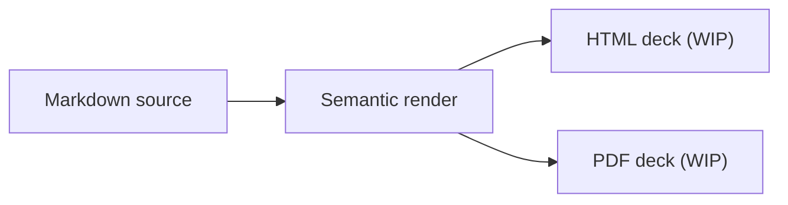

# Presentation decks

The deck projection is a work in progress. It shares the Markdown compiler and
metadata model with Margo's other outputs, but slide geometry, navigation, and
end-to-end publication are not feature-complete yet. This page shows the
intended output surface while the implementation is being finished.

> Work in progress: use [PDF documents](pdf.md) for production paginated output
> while the deck pipeline is completed.

## Intended output surface

```sh
# Experimental deck projection: HTML is the default.
margo deck talk.md --format html --output talk.html

# Experimental PDF deck projection.
margo deck talk.md --format pdf --output talk.pdf
```

Deck defaults are HTML, automatic installed-engine discovery, A4, portrait,
and zero margins. PDF deck links use the same default relative-link policy as
the document PDF command.

## A focused projection

The deck renderer consumes the same Markdown compiler and metadata model, then
adds slide geometry and presentation navigation. That keeps the authoring
choice separate from the final delivery format:



Use [PDF documents](pdf.md) when the primary artifact is a paginated document.
Treat the deck path as experimental until slide and publication support is
complete.
