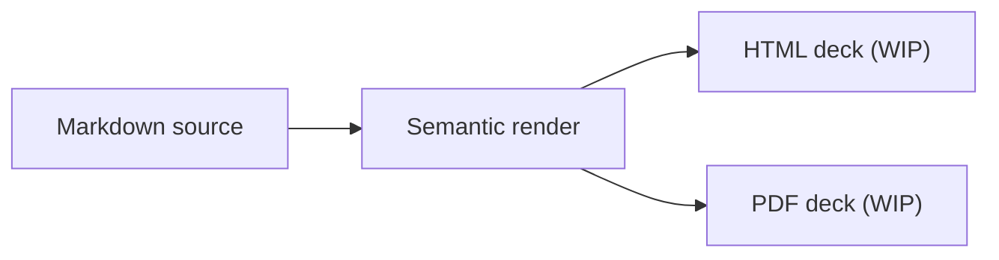

# Presentation decks

Deck output is experimental. It uses Margo's Markdown compiler and metadata
model, then projects the document as an HTML or PDF presentation. Expect the
deck contract to change before it becomes a stable publication path.

> For a stable paginated document, use [PDF documents](pdf.md).

## Render a deck

```sh
# Experimental deck projection: HTML is the default.
margo deck talk.md --format html --output talk.html

# Experimental PDF deck projection.
margo deck talk.md --format pdf --output talk.pdf
```

Deck defaults are HTML, automatic installed-engine discovery, A4, portrait,
and zero margins. PDF deck links use the same default relative-link policy as
the document PDF command.

## One experimental projection

The deck renderer adds slide geometry and presentation navigation after
compilation:



Use [PDF documents](pdf.md) when the primary artifact is a paginated document.
Choose decks only when the experimental presentation behavior is acceptable.
