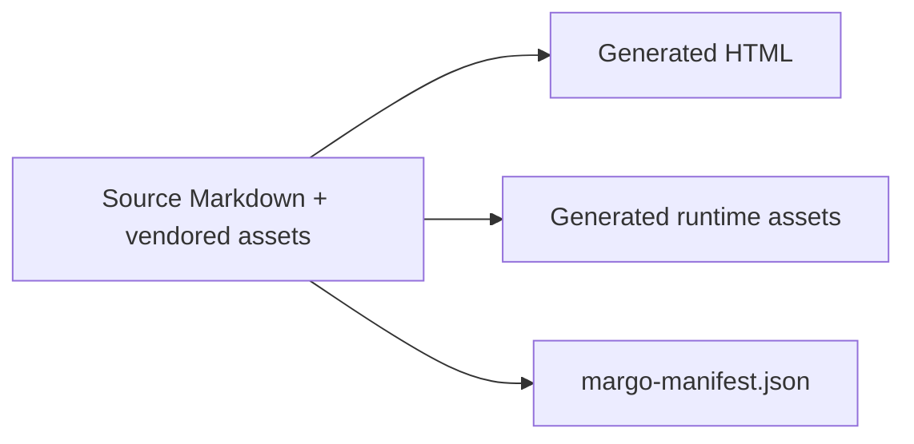

# Deterministic artifacts

A site build produces an inspectable artifact set. Margo sorts routes, validates
references, packages local assets, and records exact artifact digests in a
manifest.

## Inspect the result

```sh
margo site ./content --output-dir ./dist --assets local --diagnostics json
cat ./dist/margo-manifest.json
```

The manifest records site and layout identity, route mappings, and each
generated artifact's digest. Compare manifests and generated bytes to confirm
that two builds from the same inputs match.

## Local means local



This showcase uses `offline: true` and `assets: local`. Goshtoso shell CSS,
JavaScript, brand artwork, Margo dependencies, and social metadata are staged
in the output instead of fetched by generated pages.

## Boundaries stay visible

Deterministic artifacts prove what the local build produced. Deployment,
release, and publication remain separate lifecycle actions.
