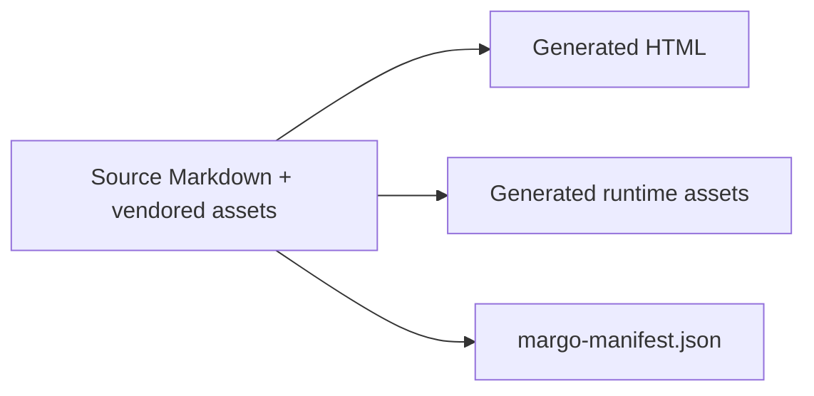

# Deterministic artifacts

Margo treats a publication as a set of inspectable artifacts rather than an
opaque side effect. Site builds sort routes, validate references, package local
assets, and emit a manifest containing exact artifact digests.

## Inspect the result

```sh
margo site ./content --output-dir ./dist --assets local --diagnostics json
cat ./dist/margo-manifest.json
```

The manifest records the site identity, layout identity, route mappings, and
the digest of each generated artifact. A repeated build from the same inputs
can therefore be compared byte-for-byte.

## Local means local



This showcase uses `offline: true` and `assets: local`. Its Goshtoso shell CSS,
JavaScript, brand artwork, Margo dependencies, and social metadata are staged
into the output instead of being fetched by the generated pages.

## Boundaries stay visible

Deterministic artifacts are evidence of a successful local build. They do not
silently imply that a provider deployment, release, or publication happened;
those lifecycle actions remain outside the builder.
