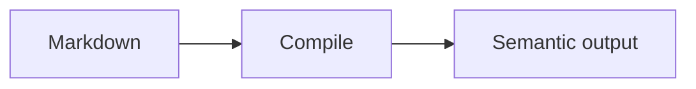

# Mermaid fence

Use a `mermaid` fence for diagrams. Margo assigns deterministic IDs, applies a
known Mermaid runtime, and sanitizes the resulting SVG before publication.

## Source

````markdown

````

## Result


## Options

The fence body is Mermaid syntax. Choose the diagram family in the first line
(`flowchart`, `sequenceDiagram`, and others supported by the pinned runtime).
Margo owns deterministic IDs and SVG sanitization; arbitrary runtime
configuration is not accepted in the document body.
