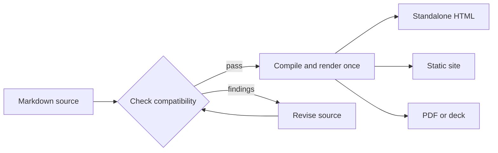

# Margo

Publish one Markdown source in the format your project needs.

Margo compiles ordinary Markdown into a semantic document, then projects it to
standalone HTML, linked sites, PDFs, or experimental presentation decks. Use the
CLI for a publishing workflow, or import the Go module when your application
owns composition and delivery.

**Choose a starting path:** [Start with the CLI](cli/index.md) for a publishing
workflow, or [embed the Go module](module/index.md) when your application owns
composition and delivery.


## One source, several projections



One compiled document can feed several outputs. The host still owns its frame,
metadata, assets, routes, and publication destination. Mermaid keeps its source
and accessible fallback beside the rendered diagram.

## A quick tour of the outputs

| Output | Best for | Typical command |
| --- | --- | --- |
| Markdown | Versioned authoring source | `margo check guide.md` |
| HTML | One browser-ready document | `margo html guide.md --output guide.html` |
| Site | Linked pages with validated routes | `margo site ./docs --output-dir ./dist` |
| PDF | A paginated document | `margo pdf guide.md --output guide.pdf` |
| Deck | Experimental presentation projection | `margo deck talk.md --format html --output talk.html` |

Run `margo serve ./docs --open` while editing. It provides loopback preview and
live reload; it is not a production server.

## Markdown stays expressive

Margo keeps common authoring constructs in the source: headings, links, tables,
code, images, Mermaid, and optional charts. A chart fence can produce a static
SVG plus an exact-data table, so the values remain available without browser
JavaScript:

```goshtosochart
schemaVersion: 1
type: line
renderer: static
title: Weekly signal
categories: [Mon, Tue, Wed, Thu]
series:
  - name: Requests
    values: [12, 18, 16, 24]
```

The charts extension supports `bar`, `line`, `pie`, `doughnut`, and `scatter`.
Static SVG is the default; interactive controls remain optional. PDF output can
include the exact chart data for print readers.

## Trust boundaries stay visible

Checks report invalid links, images, policy fields, heading structure, and
engine requirements with a stable diagnostic and a next action. Raw HTML and
iframe embeds require explicit host policy; a document cannot grant itself
capabilities through frontmatter.

Configured builds can run `offline: true` with local assets. Margo sorts routes,
validates references, records artifact digests, and keeps deployment, release,
and publication as separate lifecycle actions.

## Good fit

- Teams keeping Markdown in Git while publishing several projections.
- Go applications that need a compiler with host-owned navigation and assets.
- Documentation sites that value deterministic, inspectable output.

## Not a fit

- A hosted CMS, collaborative editor, or production web server.
- A workflow that needs Margo to download browsers or deploy generated files.
- A presentation system that requires a stable deck contract today; deck output
  remains experimental.

## Choose your next step

If Margo fits your workflow, [start with the CLI guide](cli/index.md) for
commands, configuration, policies, and operational boundaries. If your Go
application owns composition and delivery, [continue with the Module guide](module/index.md).
