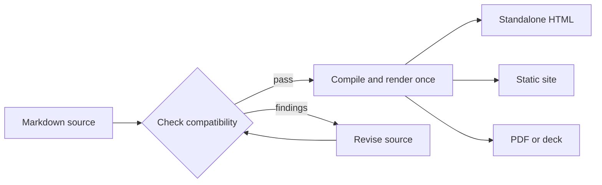

# Margo

Publish one Markdown source in the format your project needs.

Margo compiles ordinary Markdown into one semantic document, then projects it to
HTML, linked sites, PDFs, or experimental decks. Pick the boundary that matches
who owns composition and delivery.

- [Publish with the CLI — check, preview, and build from a standalone workflow](cli/index.md)
- [Embed the Go module — keep composition and delivery inside your application](module/index.md)


## One source, several projections



Compile once, then choose the projection. The host still owns its frame,
metadata, assets, routes, and publication destination.

## A quick tour of the outputs

| Output | Best for | Typical command |
| --- | --- | --- |
| HTML | One browser-ready document | `margo html guide.md --output guide.html` |
| Site | Linked pages with validated routes | `margo site ./docs --output-dir ./dist` |
| PDF | A paginated document | `margo pdf guide.md --output guide.pdf` |
| Deck | Experimental presentation projection | `margo deck talk.md --format html --output talk.html` |

Run `margo serve ./docs --open` while editing. It provides loopback preview and
live reload; it is not a production server.

## Markdown stays expressive

Headings, links, tables, code, images, Mermaid, and optional Goshtoso charts stay
in Markdown. A chart fence produces static SVG plus an exact-data table, keeping
the values available without browser JavaScript:

```goshtosochart
schemaVersion: 1
type: line
renderer: static
title: Weekly signal
categories: [Mon, Tue, Wed, Thu]
series:
  - name: Requests
    values: [12, 18, 16, 24]
```

Static SVG is the default; interactive controls remain optional. PDF output can
include the exact chart data for print readers.

## Trust boundaries stay visible

Checks report invalid links, images, policy fields, heading structure, and
engine requirements with a stable diagnostic and a next action. Raw HTML and
iframe embeds require host policy; a document cannot grant itself capabilities.
Offline builds keep assets local, while deployment and release remain separate
lifecycle actions.

## Is Margo a fit?

### Good fit

- Teams keeping Markdown in Git while publishing several projections.
- Go applications that need a compiler with host-owned navigation and assets.
- Documentation sites that value deterministic, inspectable output.

### Not a fit

- A hosted CMS, collaborative editor, or production web server.
- A workflow that needs Margo to download browsers or deploy generated files.
- A presentation system that requires a stable deck contract today; deck output
  remains experimental.

## Choose your next step

- [Start with the CLI guide — commands, configuration, and operational boundaries](cli/index.md)
- [Continue with the Module guide — compiler APIs and host-owned composition](module/index.md)
