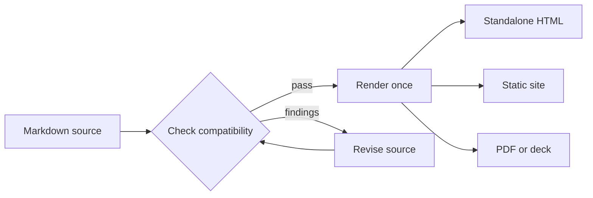

# Mermaid diagrams

Mermaid lets a document describe relationships as text and show them as a
diagram in the browser. Margo keeps the diagram tied to the Markdown source,
so the visual remains inspectable instead of becoming a detached image.

## A publishing flow



The rendered figure is paired with its Mermaid source and an accessible text
description. Readers can follow the flow visually, inspect the source, or use
the text fallback when the runtime is unavailable.

## The same source, different projections

```sh
margo check guide.md
margo html guide.md --output guide.html
margo site docs --output-dir public
```

The Mermaid fence stays in the document while the output boundary decides
whether the result is a standalone page, a linked site, a PDF, or a deck.
That makes diagrams useful in a feature tour and in a real publishing
workflow.

## Why it belongs in the document

- The source stays versionable beside the prose it explains.
- The browser can render a visual diagram without asking the author to export
  an image first.
- The source disclosure and accessible description keep the relationship
  readable beyond the canvas.

Mermaid is ordinary authoring input; privileged HTML and iframe behavior still
belongs to the explicit policy surface.
