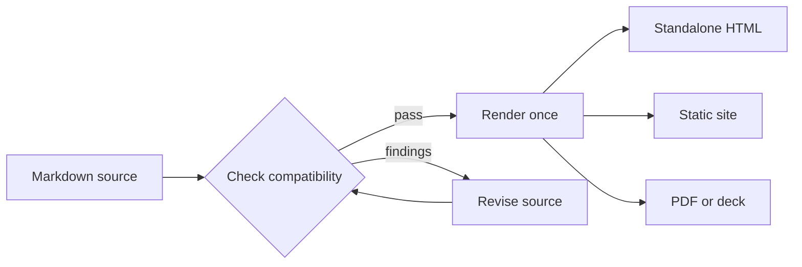

# Mermaid diagrams

Describe a diagram as Mermaid source inside Markdown. Margo keeps the source,
rendered figure, and accessible description together in the document.

## A publishing flow



Readers can follow the rendered flow, inspect its source, or use the text
description when the browser runtime is unavailable.

## Choose an output

```sh
margo check guide.md
margo html guide.md --output guide.html
margo site docs --output-dir public
```

The Mermaid fence stays with the document when Margo renders standalone HTML, a
linked site, a PDF, or an experimental deck.

## What stays available

- The source stays versionable beside the prose it explains.
- The browser can render a visual diagram without asking the author to export
  an image first.
- The source disclosure and accessible description keep the relationship
  readable beyond the canvas.

Mermaid is ordinary authoring input. Raw HTML and iframe behavior remain behind
the explicit policy surface.
