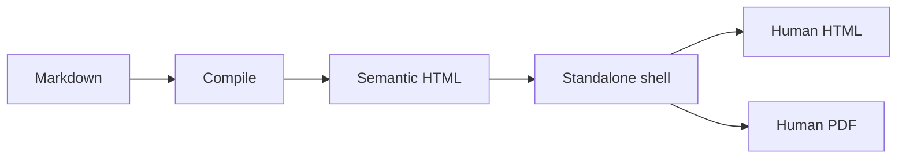

# Margo full feature set

This document is the optimistic product contract used for human review. It is
intentionally broader than the smallest unit of implementation. Small focused
Markdown slices remain the first debugging surface; this document catches
composition and pagination regressions after those slices pass.

## Document shell

Margo compiles Markdown into a standalone Goshtoso document with:

- deterministic heading IDs and semantic HTML;
- embedded CSS and theme tokens, with no CDN requirement;
- private output by default, with public metadata only when an authority record
  is supplied by the caller;
- bounded output, strict frontmatter, and fail-closed unsafe HTML handling.

The shell must remain useful when opened from `file://` and when printed by a
locked PDF engine. It must not invent a canonical URL, load remote fonts, or
depend on a runtime fetch merely to display the document.

## Rich Markdown

### Text and links

Paragraphs support **strong emphasis**, *emphasis*, ~~strike-through~~,
`inline code`, safe [HTTPS links](https://example.com), and automatic links such
as https://example.com/docs. Unsafe destinations must be rejected before output.

### Lists and quotes

- first unordered item;
- second item with a nested list:
  1. nested ordered item;
  2. another nested item;
- task list values remain readable in HTML and PDF.

1. compile the source;
2. render the semantic result;
3. wrap the result in the standalone shell;
4. export the same document to PDF without changing its content model.

> A human reviewer should understand the document without inspecting the
> generated source. Accessibility text and visible structure are part of the
> product, not a separate afterthought.

## Tables

Tables support long labels, aligned numeric values, deterministic row order,
client-only sorting, and an accessible alternative. Sorting controls must not
turn into network requests when the table is declared client-only.

| Capability | HTML | PDF | Notes |
| --- | --- | --- | --- |
| semantic table | yes | yes | preserves headers and row order |
| client sorting | yes | source order | print restores source order |
| accessible alternative | yes | yes | canonical row text remains bounded |
| long labels | yes | yes | wraps without changing cell boundaries |

## Code and syntax highlighting

Code blocks use server-side highlighting and keep copy controls available in
HTML while omitting interactive controls from print output.

~~~go
compiler := margo.New(margo.WithHostPolicy(margo.Policy{
    RawHTML: margo.RawHTMLDeny,
    OutputBytes: margo.MaxOutputBytes,
}))
document, err := compiler.Compile(ctx, source)
result, err := compiler.Render(ctx, document)
standalone, err := margo.RenderStandalone(result)
~~~

~~~bash
GOWORK=off GOFLAGS=-mod=readonly go test ./... -count=1
~~~

## Charts and extensions

The chart extension is optional. When installed, chart fences render SVG plus a
bounded, ordered text/table alternative. When absent, a chart fence fails with
a stable diagnostic before the first output byte rather than silently becoming
an empty block.

The optimistic chart composition used by the final document is represented
below as source text until the charts module is accepted:

~~~text
```goshtosochart
type: bar
title: Monthly signups
rows:
  - [January, 120]
  - [February, 185]
  - [March, 240]
```
~~~

The same contract applies to line, pie or doughnut, and scatter families. Every
family must preserve supplied order in its accessible alternative and expose
the effective root output policy to its renderer.

## Mermaid and runtime readiness

Mermaid diagrams use the locked browser runtime, deterministic IDs, blocked
network requests, font checks, layout stability, and a terminal runtime report.
The PDF engine accepts a document only after the report matches protocol,
document fingerprint, render instance, execution ID, tasks, assets, and ready
status.

~~~text

~~~

## Page composition

The same page model carries title, description, brand header, footer,
watermark, page number, A4 or Letter size, portrait or landscape orientation,
and bounded margins. Header and footer content remain part of the core HTML;
platform engines do not invent proprietary templates.

### Long content and pagination

This section intentionally adds enough prose to expose page breaks in the PDF.
The first page should establish hierarchy. Tables should not lose their header
when split. Code should remain legible. A heading should not be stranded at the
bottom of a page. Repeated rendering should keep the same HTML bytes even when
PDF bytes differ between engines.

## Static decks

The same source can be mapped to a Marp-compatible deck when the caller selects
the deck output. Deck generation keeps slide boundaries explicit, preserves
speaker notes, rejects unsupported overflow, and reports the exact Marp and
browser provenance used for preview. A deck is another projection of the
compiled document; it does not mutate the HTML or PDF source.

## CLI and artifact mapping

The CLI reads one Markdown input and writes only explicit destinations. Native
HTML is the default output. PDF requires an explicit installed engine when the
caller does not accept the native platform default. Missing engines fail before
staging, with no download and no silent fallback. Batch mapping uses supplied
paths only; it never discovers files by globbing.

Each output carries a document fingerprint, artifact fingerprint, byte digest,
compiler configuration, theme, assets, engine name and version, and terminal
runtime projection. Execution IDs route live runs but do not change the stable
artifact fingerprint.

## Accessibility and social metadata

Charts, tables, and diagrams expose bounded text alternatives with deterministic
ordering. Headings, captions, table headers, links, and code labels remain
usable in a screen reader and in extracted PDF text.

Public social metadata is emitted only with an authorized CanonicalOrigin
record, route-specific evidence, and a verified preview image. Private output
omits canonical and social URL tags. The renderer never guesses a production
hostname from the local file path.

## Release and evidence boundary

The external Goshtoso Table handoff is a release ceremony, not a prerequisite
for local HTML/PDF iteration. It remains at the end of the backlog. No tag,
release, public URL, or `release/table-handoff.json` is invented by Margo.

For each focused slice and for this full document, human review records:

- source file and exact SHA-256;
- generated HTML path, byte count, and SHA-256;
- generated PDF path, byte count, PDF version, page count, and extracted text;
- engine path/version and whether network was denied;
- focused test result and any known unsupported extension.

The final release gate consumes the same evidence, plus the independently
authorized Table handoff and public authority record.
