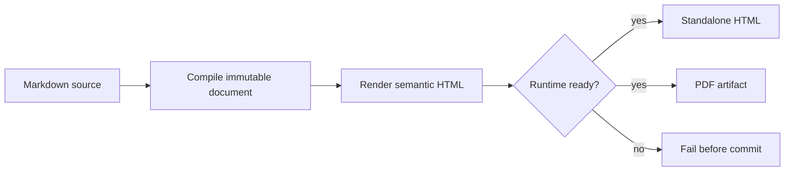
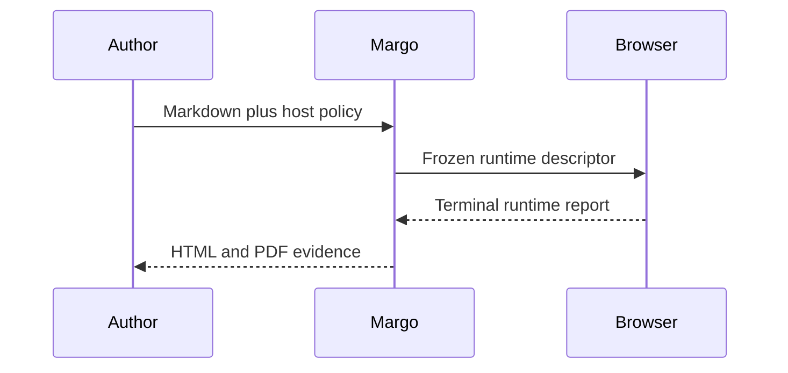
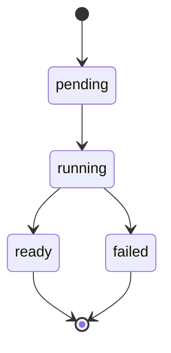

# Margo full feature set

This is Margo's optimistic, human-facing integration benchmark. Small Markdown
slices diagnose one behavior at a time; this long document exercises their
composition, visual rhythm, browser behavior, and pagination together. A green
benchmark never replaces focused tests, but a visually broken benchmark blocks
the human release decision.

**Benchmark status:** optimistic, exhaustive, offline-first, and intentionally
hostile to shallow renderers. *Default theme:* `modern`. ~~Short showcase~~
full integration corpus.


> **Reading contract.** A reviewer should understand output without inspecting
> HTML source. Headings, lists, tables, figures, notes, diagrams, headers,
> footers, and page furniture are product behavior.

---

## 1. Document anatomy and navigation

The generated document carries an automatic table of contents before this
article. Every entry points to a deterministic heading ID. Repeated heading
labels remain distinct, deep headings preserve hierarchy, and links work from
both `file://` HTML and printed PDF bookmarks.

### Heading level three

Level three starts a focused feature group.

#### Heading level four

Level four names a narrower behavior.

##### Heading level five

Level five remains visually subordinate without becoming unreadably small.

###### Heading level six

Level six is the deepest supported section and still participates in semantic
document structure.

### Repeated heading

First repeated heading verifies deterministic IDs.

### Repeated heading

Second repeated heading must receive a collision suffix.

## 2. Inline CommonMark and GFM

Ordinary text includes **strong emphasis**, *emphasis*, ***combined strong and
emphasis***, ~~strikethrough~~, `inline code`, and a code span containing a
literal backtick: ``use `code` inside``. Backslash escapes preserve \*literal
asterisks\*, \[literal brackets\], and a literal hash \# without creating new
structure.

Smart typography stays authored: “quoted text”, an em dash —, an en dash –,
ellipsis …, non-breaking concepts such as Margo v0.0.1, accents in Português,
日本語, and restrained symbols ✓ § ¶. HTML entities remain text: &amp;, &lt;, and
&copy;.

An [inline HTTPS link](https://example.com/margo "Margo example"), a
[reference-style link][reference], a bare autolink https://example.com/docs,
an angle autolink <https://example.com/spec>, and an email link
<reviewer@example.com> all remain keyboard reachable. Unsafe destinations have
their own negative slices and never enter this successful artifact.

[reference]: https://example.com/reference "Reference destination"

This line ends with a backslash for a hard break.\
This sentence follows the hard break.
This source newline is only a soft break and must not create a second paragraph.

The next paragraph proves thematic separation without inventing a card.

***

## 3. List families

### Tight unordered lists and marker variants

- hyphen item one
- hyphen item two
  - nested hyphen child
  - second nested child

* asterisk item one
* asterisk item two

+ plus item one
+ plus item two

### Ordered, restarted, and mixed lists

1. compile immutable source;
2. render semantic content;
3. assemble the Goshtoso document;
4. validate runtime readiness;
5. export HTML and PDF from the same document identity.

3. this list intentionally starts at three;
4. the emitted `start` attribute must preserve that author choice;
5. numbering continues without normalization to one.

1. outer ordered step
   - unordered evidence item
   - another evidence item
     1. nested ordered proof
     2. second nested proof
2. final outer step

### Task lists

- [x] parse strict frontmatter
- [x] preserve deterministic headings
- [ ] execute every browser runtime task
- [ ] compare visual evidence before release
  - [x] inspect narrow HTML
  - [ ] inspect every generated PDF page

### Loose list with paragraphs

- First loose item has a paragraph long enough to wrap across several lines.
  It tests paragraph spacing inside list items and must not collapse into the
  following item.

- Second loose item contains a quote.

  > Nested evidence belongs to the item and keeps its quote boundary.

- Third loose item contains code:

      GOWORK=off GOFLAGS=-mod=readonly go test ./... -count=1

## 4. Quotations, definitions, and disclosure

> Margo treats readable structure as output, not decoration.
>
> A block quote may contain multiple paragraphs, **inline emphasis**, and a
> nested quote.
>
> > The nested quote must remain visually and semantically subordinate.
>
> 1. quoted ordered evidence;
> 2. second quoted item.

The sanitized HTML profile exercises useful CommonMark-adjacent semantics:

<dl>
  <dt>Margo</dt>
  <dd>Markdown compilation and artifact orchestration for Goshtoso.</dd>
  <dt>Optimistic benchmark</dt>
  <dd>A broad human integration corpus, never a substitute for focused tests.</dd>
</dl>

<details open>
  <summary>Visible disclosure rendered from approved raw HTML</summary>
  <p>The allowlisted fragment proves <mark>highlighting</mark>, keyboard notation
  <kbd>Ctrl</kbd> + <kbd>P</kbd>, <abbr title="Portable Document Format">PDF</abbr>,
  H<sub>2</sub>O, and x<sup>2</sup> without scripts, styles, or event handlers.</p>
</details>

---

## 5. Images and figures

Markdown images exercise alternative text, local offline resources, intrinsic
aspect ratio, responsive sizing, print scaling, and optional titles. Missing or
unsafe image cases belong to negative slices; the benchmark uses real assets.


The landscape preview must fit the reading measure without stretching. The
compact SVG mark above must remain sharp. Together they cover raster and vector
image paths, meaningful alternative text, and figure-like narrative context.

## 6. Tables

### Alignment, wrapping, and source order

| Capability | HTML | PDF | Evidence |
| :--- | :---: | ---: | --- |
| semantic headers | yes | yes | native table structure and scoped headings |
| client sorting | yes | source order | print restores original row order |
| long labels | yes | yes | cells wrap without changing boundaries |
| escaped pipe | `a \| b` | `a \| b` | delimiter remains content |
| Unicode | São Paulo | 東京 | text survives HTML and extraction |

### Dense numeric table

| Month | Requests | Success rate | p95 latency |
| --- | ---: | ---: | ---: |
| January | 12,400 | 99.91% | 184 ms |
| February | 18,520 | 99.94% | 173 ms |
| March | 24,080 | 99.97% | 161 ms |
| April | 31,240 | 99.98% | 158 ms |
| May | 42,900 | 99.99% | 149 ms |

Tables use Goshtoso's public Table API. Sorting never becomes an HTMX request
when frontmatter selects `client`; print output remains deterministic.

## 7. Code and literal text

Inline literals, indented blocks, fenced blocks, long lines, syntax labels, and
characters that resemble HTML all exercise escaping and Chroma integration.

    package main

    import "fmt"

    func main() { fmt.Println("indented CommonMark code block") }

```go
compiler := margo.New(margo.WithHostPolicy(margo.Policy{
    RawHTML:     margo.RawHTMLSanitized,
    OutputBytes: margo.MaxOutputBytes,
}))
document, err := compiler.Compile(ctx, source)
if err != nil {
    return err
}
result, err := compiler.Render(ctx, document)
```

```bash
GOWORK=off GOFLAGS=-mod=readonly go test ./... -count=1
git diff --check
```

```json
{
  "schemaVersion": "margo-runtime/v1",
  "status": "ready",
  "blockedRequests": []
}
```

```yaml
goshtoso:
  theme: modern
  security:
    rawHTML: sanitized
    mermaid: strict
```

~~~html
<p>This code is escaped and displayed; it is not inserted as markup.</p>
~~~

The long unbroken literal below must scroll in HTML and remain bounded in PDF:

```text
margo/document/fingerprint/v1:0123456789abcdef0123456789abcdef0123456789abcdef0123456789abcdef
```

## 8. Footnotes and cross references

Footnotes preserve reading order and backlinks. The first note documents the
benchmark purpose.[^benchmark] A repeated reference uses the same note again
without duplicating its definition.[^benchmark] A second note contains richer
inline content.[^policy]

[^benchmark]: Focused slices isolate defects; this corpus catches composition,
    pagination, and integration regressions after those slices pass.

[^policy]: Policy evidence includes **bold text**, `code`, and a safe
    [reference](https://example.com/policy).

## 9. Mermaid diagrams

These are real `mermaid` fences. Compile creates strict runtime tasks; accepted
browser execution replaces each task with normalized, validated, scoped SVG.
Configuration directives, remote resources, and document-controlled Mermaid
themes remain forbidden.

### Flowchart



### Sequence diagram



### State diagram



## 10. Document furniture

The standalone shell surrounds this article with:

- a branded header containing the Margo mark and document identity;
- automatic table of contents;
- a restrained backdrop that never competes with content;
- visible status stamps for version and optimistic-review state;
- a watermark for preview classification;
- a footer with source, theme, and artifact intent;
- print page size, margins, running header/footer, and page numbers.

Furniture is host-owned trusted composition. Markdown cannot inject headers,
footers, stamps, or a backdrop through raw HTML.

## 11. Long-form pagination stress

### Page-break behavior

This section deliberately extends the document across many pages. A heading
must not be stranded at the bottom of a page. Paragraphs may split only where
the engine preserves readable lines. Lists should keep markers with their text,
tables should repeat headers where supported, code should avoid clipped lines,
and images should scale rather than overflow.

Margo's first audience is a human reviewing an artifact. The HTML version is
the inspectable source of truth for browser rendering; PDF is a projection of
the same compiled document. Their typography and hierarchy should agree even
when pagination introduces page boundaries that HTML does not have.

### Composition under density

Dense evidence works best as stable rows and sections, not a gallery of generic
cards. The benchmark alternates prose, lists, tables, figures, code, and
diagrams so spacing bugs cannot hide inside a single repeated component. Theme
tokens provide the baseline; `document.css` owns only Margo-specific reading and
print adjustments.

### Repeated rendering

Two renders of the same source and compiler configuration must preserve stable
semantic HTML and document fingerprints. Execution IDs route live work but do
not alter stable artifact identity. Runtime output, engine choice, page size,
and render instance remain explicit provenance inputs.

### Accessibility under pagination

Extracted PDF text should preserve heading order, list labels, table values,
image alternatives where the engine exposes them, footnote content, and the
textual meaning of diagrams. Color never carries status alone. Interactive
controls disappear or become inert in print without removing their content.

### Failure is visible

An extension error, readiness timeout, blocked request, font failure, output
limit, or unsafe input never yields a plausible partial artifact. Margo records
a stable diagnostic and commits no destination bytes. Optimistic means the
document describes the intended complete experience; it does not mean failures
are hidden.

### Portable review

Reviewers can open the HTML from disk with no CDN, remote font, or runtime fetch
needed for document chrome. PDF generation uses an explicit installed engine.
The artifact report records engine path, version, network denial, page count,
byte count, and digest.

### Final visual pass

Inspect narrow and wide HTML, then every PDF page. Verify TOC links, header,
footer, watermark, stamps, backdrop, vector and raster images, list nesting,
task states, footnote backlinks, table boundaries, code overflow, and each
Mermaid family. Console errors, missing assets, clipped content, empty pages,
and accidental remote requests are release blockers.

## 12. Optional projections and release boundary

Charts, decks, native PDF engines, Chromium PDF, and CLI output mapping are
optional projections over the same immutable document. The exhaustive Markdown
corpus exercises core syntax and Mermaid tasks now; focused extension corpora
own chart schemas, Marpit directives, platform engines, and fault injection.

The external Goshtoso Table handoff remains a final release ceremony. Local
HTML/PDF development does not invent `release/table-handoff.json`, public tags,
canonical origins, or deployment evidence. Public metadata appears only after
an authorized origin record exists.

### Human acceptance record

For this benchmark, record:

1. source path, bytes, and SHA-256;
2. HTML path, bytes, SHA-256, and console result;
3. PDF path, bytes, PDF version, page count, and extracted-text result;
4. exact engine path/version and network-denial evidence;
5. viewport, theme, color mode, and page matrix inspected;
6. known unsupported projections, never silently replaced.

The benchmark is complete only when its output is useful to a human and its
feature matrix is enforced by tests.
