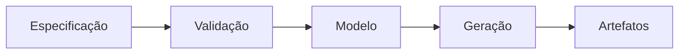

<!-- markdownlint-disable MD013 -->

# Proposta: interface pública v1 do gerador SDK

Este documento sintético representa uma proposta técnica longa escrita em
Markdown comum. Ele combina hierarquia, tabelas, listas, código, Mermaid e
links sem depender de uma linguagem particular do renderizador.

## Objetivos

- Manter uma interface pequena e previsível.
- Separar descoberta, geração e publicação.
- Produzir diagnósticos que indiquem arquivo, linha e correção.
- Preservar execução offline e determinística.

## Visão geral



O fluxo completo não realiza descoberta de rede durante a geração. Consulte a
[documentação pública](https://example.com/docs) para o contrato conceitual.

## Interface de entrada

| Campo | Tipo | Obrigatório | Observação |
| --- | --- | --- | --- |
| `schema` | `string` | sim | Identidade imutável do contrato |
| `source` | `[]byte` | sim | Conteúdo limitado antes da análise |
| `target` | `string` | sim | Linguagem e plataforma de saída |
| `options` | `map` | não | Preferências sem autoridade de segurança |

```go
type Request struct {
	Schema  string
	Source  []byte
	Target  string
	Options map[string]string
}
```

## Validação

O validador acumula problemas independentes quando isso é seguro e interrompe
o processamento quando a identidade ou os limites básicos são inválidos.

1. Conferir a versão do contrato.
2. Aplicar limites de bytes e profundidade.
3. Validar a forma estrutural.
4. Normalizar nomes e caminhos.
5. Produzir um modelo imutável.

> Uma entrada aceita deve produzir o mesmo modelo em execuções equivalentes.
> Dados externos não participam dessa decisão.

## Modelo intermediário

| Entidade | Responsabilidade | Persistência |
| --- | --- | --- |
| Pacote | Agrupar tipos públicos | Durante a execução |
| Tipo | Descrever dados | Durante a execução |
| Operação | Descrever comportamento | Durante a execução |
| Artefato | Registrar bytes finais | Após geração |

### Identidades

Cada estágio recebe uma identidade derivada de entradas canônicas. A identidade
do artefato muda quando os bytes finais mudam, mesmo que a origem permaneça a
mesma.

```text
source -> normalized model -> render plan -> artifact bytes
```

## Geração

Geradores recebem somente o modelo validado. Eles não reabrem arquivos de
origem nem consultam serviços remotos. A ordenação de mapas é definida antes da
serialização.

```go
func Generate(ctx context.Context, request Request) (Result, error) {
	model, err := Validate(request)
	if err != nil {
		return Result{}, err
	}
	return render(model)
}
```

## Diagnósticos

| Código | Condição | Ação recomendada |
| --- | --- | --- |
| `input.version` | Versão desconhecida | Atualizar a versão declarada |
| `input.limit` | Limite excedido | Reduzir a entrada ou ajustar o host |
| `model.name` | Nome inválido | Usar identificador portátil |
| `output.collision` | Caminhos colidem | Renomear um símbolo |

Diagnósticos são dados públicos estáveis; mensagens humanas podem ganhar mais
contexto sem alterar o código.

## Compatibilidade

Mudanças aditivas preservam consumidores antigos quando campos novos possuem
comportamento menos autoritativo por omissão. Mudanças destrutivas exigem uma
nova versão do contrato.

### Matriz de alvos

| Alvo | Formato | Execução | Publicação |
| --- | --- | --- | --- |
| Go | arquivos `.go` | local | responsabilidade do host |
| TypeScript | arquivos `.ts` | local | responsabilidade do host |
| JSON | documento canônico | local | responsabilidade do host |

## Segurança e privacidade

- Nenhuma credencial entra no modelo.
- Caminhos são normalizados antes de qualquer escrita.
- Saídas são preparadas em memória antes da publicação.
- Links permanecem links; não são transformados por descoberta automática.
- Limites explícitos evitam trabalho sem fronteira.

## Plano de adoção

1. Publicar o schema junto da biblioteca.
2. Adicionar exemplos pequenos e executáveis.
3. Migrar um consumidor externo em ambiente isolado.
4. Comparar bytes e diagnósticos entre execuções.
5. Autorizar publicação somente após revisão humana.

## Questões futuras

Recursos de descoberta remota, plugins genéricos e publicação automática ficam
fora deste contrato. Eles podem ser extensões explícitas do host no futuro,
sem mudar o significado de Markdown comum.

## Conclusão

A interface proposta favorece contratos pequenos, resultados reproduzíveis e
responsabilidades visíveis. O documento continua portátil: outro processador
Markdown ainda consegue apresentar seu conteúdo principal.

<!-- markdownlint-enable MD013 -->
