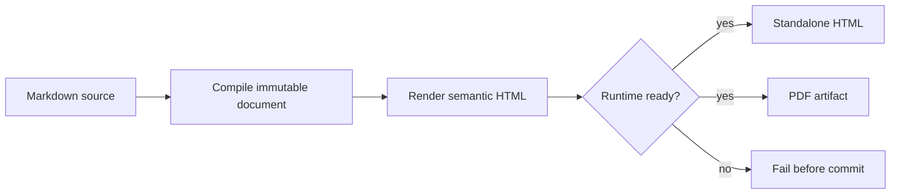
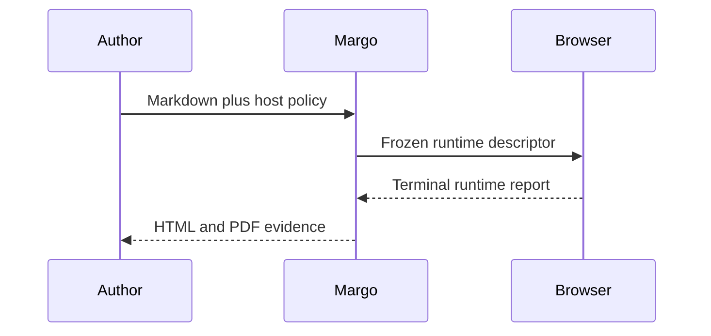

# Mermaid profile boundary

This slice reads like a small acceptance test. Rejected SVG stays visible as
literal evidence. Only the final Mermaid fences become executable runtime tasks.

## Edge cases first

Every pinned negative vector must fail before Margo commits SVG bytes.

| Vector | Required diagnostic |
| --- | --- |
| `script` | `mermaid.svg_element_forbidden` |
| `foreign-object` | `mermaid.svg_element_forbidden` |
| `event-handler` | `mermaid.svg_attribute_forbidden` |
| `external-link` | `mermaid.svg_reference_forbidden` |
| `unknown-namespace` | `mermaid.svg_namespace_forbidden` |
| `unknown-element` | `mermaid.svg_element_forbidden` |
| `unknown-attribute` | `mermaid.svg_attribute_forbidden` |
| `css-body` | `mermaid.svg_css_forbidden` |
| `css-attribute-selector` | `mermaid.svg_css_forbidden` |
| `css-universal-selector` | `mermaid.svg_css_forbidden` |
| `css-sibling-selector` | `mermaid.svg_css_forbidden` |
| `css-pseudo` | `mermaid.svg_css_forbidden` |
| `css-custom-property` | `mermaid.svg_css_forbidden` |
| `css-at-rule` | `mermaid.svg_css_forbidden` |
| `css-unknown-property` | `mermaid.svg_css_forbidden` |
| `css-forbidden-function` | `mermaid.svg_css_value_forbidden` |
| `cross-svg-url` | `mermaid.svg_reference_forbidden` |
| `invalid-opacity` | `mermaid.svg_css_value_forbidden` |
| `invalid-data-points` | `mermaid.svg_attribute_forbidden` |
| `invalid-length-unit` | `mermaid.svg_css_value_forbidden` |
| `unrooted-id` | `mermaid.svg_id_forbidden` |

Boundary cases outside the fixed negative-vector manifest remain explicit:

- profile fingerprint mismatch returns `mermaid.profile_mismatch`;
- unsupported diagram family returns `mermaid.svg_family_unsupported`;
- byte limit, element limit, attribute limit, CSS rule limit, and selector-byte limit
  return `mermaid.svg_resource_limit`;
- `stroke-width="1pt"` is valid because `pt` belongs to the typed profile;
- `stroke-width="1cm"` is invalid because `cm` is absent from that profile;
- `data-points` accepts only canonical base64 ASCII JSON containing finite
  `{x,y}` points; malformed or non-canonical content fails closed.

These snippets are literal XML, not executable Mermaid input:

```xml
<path id="margo-edge" stroke-width="1pt" data-points="W3sieCI6MSwieSI6Mn1d" />
<path id="margo-edge" stroke-width="1cm" />
```

## Happy path after boundary




